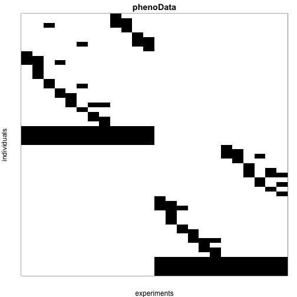
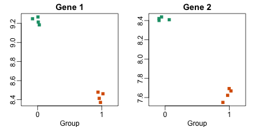
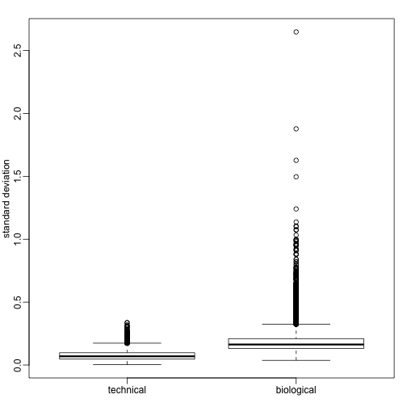

# Introduction

In the following sections we will cover inference in the context of genomics experiments. We apply some of the concepts we have covered in previous sections including t-tests and multiple comparisons. Here we introduce a concept that is particularly important in the analysis of genomics data: the distinction between biological and technical variability. 
 
In general, the variability we observe across biological units, such as individuals, within a population is referred to as _biological_. We refer to the variability we observe across measurements of the same biological unit, such a aliquots from the same biological sample, as _technical_. Because newly developed measurement technologies are common in genomics, technical replicates are used many times to assess experimental data. By generating measurements from samples that are designed to be the same, we are able to measure and assess technical variability. We also use the terminology _biological replicates_ and _technical replicates_ to refer to samples from which we can measure biological and technical variability respectively.

It is important not to confuse biological and technical variability when performing statistical inference as the interpretation is quite different. For example, when analyzing data from technical replicates, the population is just the one sample from which these come from as opposed to more general population such as healthy humans or control mice. Here we explore this concept with a experiment that was designed to include both technical and biological replicates.


# Pooling experiment data

The dataset we will study includes data from gene expression arrays. In this experiment, RNA was extracted from 12 randomly selected mice from two strains. All 24 samples were hybridized to microarrays but we also formed pools, including two pools from with the RNA from all twelve mice from each of the two strains. Other pools were also created, as we will see below, but we will ignore these here.

We will need the following library which you need to install if you have not done so already:

```r
library(devtools)
install_github("genomicsclass/maPooling")
```

 We can see the experimental design using the `pData` function. Each row represents a sample and the column are the mice. A 1 in cell $$i,j$$ indicates that RNA from mouse $$j$$ was included in sample $$i$$. The strain can be identified from the row names (this is not a recommended approach, you can add additional variables to the phenoData to make strain information explicit.)
 

```r
library(Biobase)
library(maPooling)
data(maPooling)
head(pData(maPooling))
```

```
##          a2 a3 a4 a5 a6 a7 a8 a9 a10 a11 a12 a14 b2 b3 b5 b6 b8 b9 b10 b11
## a10       0  0  0  0  0  0  0  0   1   0   0   0  0  0  0  0  0  0   0   0
## a10a11    0  0  0  0  0  0  0  0   1   1   0   0  0  0  0  0  0  0   0   0
## a10a11a4  0  0  1  0  0  0  0  0   1   1   0   0  0  0  0  0  0  0   0   0
## a11       0  0  0  0  0  0  0  0   0   1   0   0  0  0  0  0  0  0   0   0
## a12       0  0  0  0  0  0  0  0   0   0   1   0  0  0  0  0  0  0   0   0
## a12a14    0  0  0  0  0  0  0  0   0   0   1   1  0  0  0  0  0  0   0   0
##          b12 b13 b14 b15
## a10        0   0   0   0
## a10a11     0   0   0   0
## a10a11a4   0   0   0   0
## a11        0   0   0   0
## a12        0   0   0   0
## a12a14     0   0   0   0
```

Below we create an image to illustrate which mice were included in which samples:

```r
library(rafalib)
mypar()
flipt <- function(m) t(m[nrow(m):1,])
myimage <- function(m,...) {
  image(flipt(m),xaxt="n",yaxt="n",...)
  }

myimage(as.matrix(pData(maPooling)),col=c("white","black"),
        xlab="experiments",
        ylab="individuals",
        main="phenoData")
```



Note that ultimately we are interested in detecting genes that are differentially expressed between the two strains of mice which we will refer to as strain 0 and 1. We can apply tests to the technical replicates of  pooled samples or the data from 12 individual mice. We can identify these pooled samples because all mice from each strain were represented in these samples and thus the sum of the rows of experimental design matrix add up to 12:

```r
data(maPooling)
pd=pData(maPooling)
pooled=which(rowSums(pd)==12)
```

We can determine the strain from the column names:

```r
factor(as.numeric(grepl("b",names(pooled))))
```

```
## [1] 0 0 0 0 1 1 1 1
## Levels: 0 1
```

If we compare the mean expression between groups for each gene we find several showing consistent differences. Here are two examples: 


```r
###look at 2 pre-selected samples for illustration
i=11425;j=11878
pooled_y=exprs(maPooling[,pooled])
pooled_g=factor(as.numeric(grepl("b",names(pooled))))
mypar(1,2)
stripchart(split(pooled_y[i,],pooled_g),vertical=TRUE,method="jitter",col=c(1,2),main="Gene 1",xlab="Group",pch=15)
stripchart(split(pooled_y[j,],pooled_g),vertical=TRUE,method="jitter",col=c(1,2),main="Gene 2",xlab="Group",pch=15)
```



Note that if we compute a t-test from these values we obtain highly significant results

```r
library(genefilter)
```

```
## 
## Attaching package: 'genefilter'
```

```
## The following object is masked from 'package:base':
## 
##     anyNA
```

```r
pooled_tt=rowttests(pooled_y,pooled_g)
pooled_tt$p.value[i]
```

```
## [1] 2.075617e-07
```

```r
pooled_tt$p.value[j]
```

```
## [1] 3.400476e-07
```
But would these results hold up if we selected another 24 mice? Note that the equation for the t-test we presented in the previous section include the population standard deviations. Are these quantities measured here? Note that what is being replicated here is the experimental protocol. We have created four _technical replicates_ for each pooled sample. Gene 1 may be a highly variable gene within strain of mice while  Gene 2 a stable one, but we have no way of seeing this. 

We also have microarray data for each individual mouse. For each strain we have 12 _biological replicates_. We can find them by looking for rows with just one 1.


```r
individuals=which(rowSums(pd)==1)
```
It turns out that some technical replicates were included for some individual mice so we remove them to illustrate an analysis with only biological replicates:


```r
##remove replicates
individuals=individuals[-grep("tr",names(individuals))]
y=exprs(maPooling)[,individuals]
g=factor(as.numeric(grepl("b",names(individuals))))
```

We can compute the sample variance for each gene and compare to the standard deviation obtained with the technical replicates.

```r
technicalsd <- rowSds(pooled_y[,pooled_g==0])
biologicalsd <- rowSds(y[,g==0])
LIM=range(c(technicalsd,biologicalsd))
mypar(1,1)
boxplot(technicalsd,biologicalsd,names=c("technical","biological"),ylab="standard deviation")
```



Note the biological variance is much larger than the technical variance. And also that the variability of variances is also for biological variance. Here are the two genes we showed above but now for each individual mouse 


```r
mypar(1,2)
stripchart(split(y[i,],g),vertical=TRUE,method="jitter",col=c(1,2),xlab="Gene 1",pch=15)
points(c(1,2),tapply(y[i,],g,mean),pch=4,cex=1.5)
stripchart(split(y[j,],g),vertical=TRUE,method="jitter",col=c(1,2),xlab="Gene 2",pch=15)
points(c(1,2),tapply(y[j,],g,mean),pch=4,cex=1.5)
```


Now the p-values tell a different story

```r
library(genefilter)
tt=rowttests(y,g)
tt$p.value[i]
```

```
## [1] 0.0898726
```

```r
tt$p.value[j]
```

```
## [1] 1.979172e-07
```

Which of these two genes do we feel more confident reporting as being differentially expressed? If another investigator takes another random sample of mice and tries the same experiment, which gene do you think will be identified? Measuring biological variability is essential if we want our conclusions to be about the strain of mice in general as opposed to the specific mice we have. 

An analysis with biological replicates has as a population these two strains of mice. An analysis with technical replicates has as a population the twelve mice we selected and the variability is related to the measurement technology. In science we typically are concerned with populations. As a very practical example, note that if another lab performs this experiment they will have another set of twelve mice and thus inferences about populations are more likely to be reproducible.
