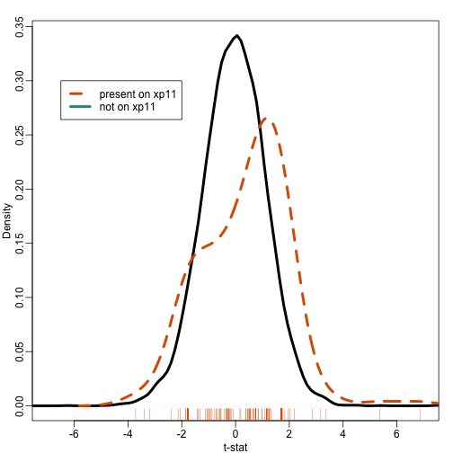
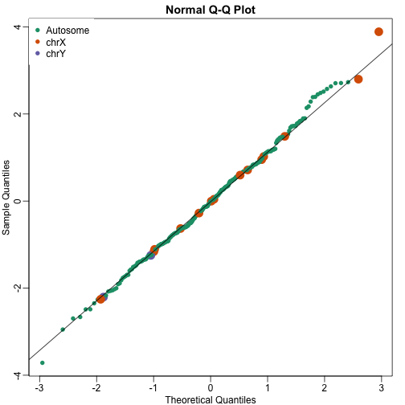
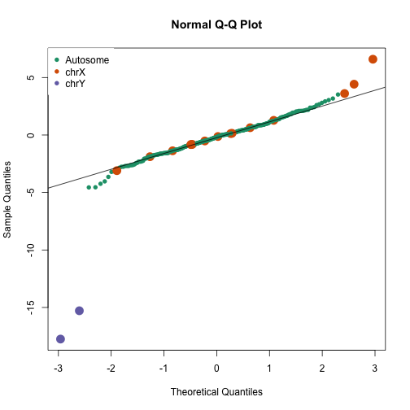
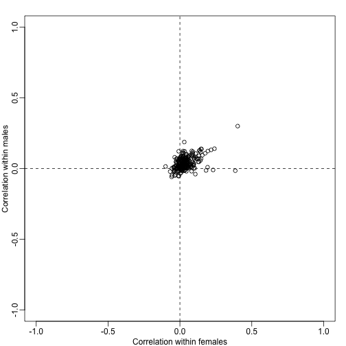
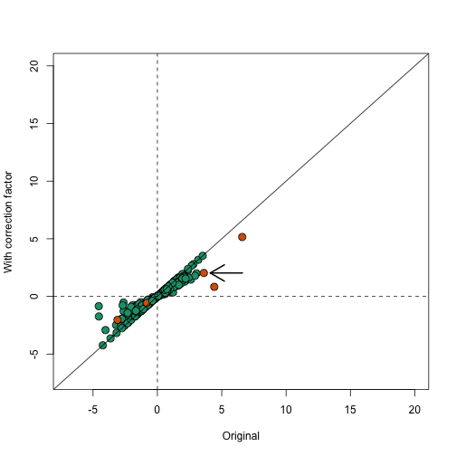

<a name="genesetanalysis"></a>

# Introduction

In these units we learn the statistics behind gene set analysis. Throughout the unit you should keep three important steps in mind that are all important yet can be kept separated from each other. These are

- The gene sets considered
- The statistic used to summarize each gene set
- The approach to assessing uncertainty

We will cover each of these three topics in separate units. 

<a name="dataprep"></a>

## Preparing data and gene set database

For this unit you will need the following library


```r
source("http://www.bioconductor.org/biocLite.R")
biocLite("GSEABase")
```

We will need these packages:


```r
library(rafalib)
library(GSEABase)
library(GSE5859Subset)
library(sva)
library(limma)
library(matrixStats)
```

Our example is based on the following package which is available from the class github repo:


```r
library(devtools)
install_github("genomicsclass/GSE5859Subset")
```

<a name="batch"></a>

We constructed this data to include batch effect so we 
correct for them using SVA:


```r
library(GSE5859Subset)
data(GSE5859Subset)
library(sva)
library(limma)
library(matrixStats)
library(rafalib)
X = sampleInfo$group
mod<-model.matrix(~X)
svafit <- sva(geneExpression,mod)
```

```
## Number of significant surrogate variables is:  5 
## Iteration (out of 5 ):1  2  3  4  5
```

```r
svaX<-model.matrix(~X+svafit$sv)
lmfit <- lmFit(geneExpression,svaX)
tt<-lmfit$coef[,2]*sqrt(lmfit$df.residual)/(2*lmfit$sigma)
pval<-2*(1-pt(abs(tt),lmfit$df.residual[1]))
qval <- p.adjust(pval,"BH")
```

Note that all we really need for this unit is score for each gene and a candidate list of differentially expressed genes. The details of how we obtain them are not relevant to the of the unit. To illustrate we will pretend we don't know a-priori the relationship between group membership and gene expression. 

<a name="selectByFDR"></a>

Let's begin by constructing a list of candidate genes with an FDR of 25%. This gives us a list of 23 genes. What biology can we learn? Given that we know that genes work together, it makes sense to study groups of genes instead of individual ones. In general, this is the idea behind _gene set analysis_. 

<a name="MSIGDB"></a>

There are various resources on the web that provide gene sets. Most of these have been curated and are composed of genes with something in common. A typical way of grouping them is by pathways (e.g. [KEGG](http://www.genome.jp/kegg/))
or biological function (e.g. [Gene Ontology](http://www.geneontology.org/)). A great resource with many curated gene sets can be found here: 

<http://www.broadinstitute.org/gsea/msigdb/index.jsp>
 
In this example we will use a gene set grouping genes by sections of the chromosome. The first step is to download the database. You can download the file from [here](http://software.broadinstitute.org/gsea/msigdb/download_file.jsp?filePath=/resources/msigdb/6.1/c1.all.v6.1.entrez.gmt)
(you will have to register)

Once you download the file, you can read it in with the following command

```r
gsets <- getGmt("c1.all.v6.1.entrez.gmt") ##must provide correct path to file
```

This object has 326 gene sets. Each gene set contains the ENTREZ IDs for the genes in each gene set

```r
length(gsets)
```

```
## [1] 326
```

```r
head(names(gsets))
```

```
## [1] "chr5q23"  "chr16q24" "chr8q24"  "chr13q11" "chr7p21"  "chr10q23"
```

```r
gsets[["chryq11"]]
```

```
## setName: chryq11 
## geneIds: 728512, 392597, ..., 360027 (total: 204)
## geneIdType: Null
## collectionType: Null 
## details: use 'details(object)'
```
and we can access the ENTREZ ids in the following way:

```r
head(geneIds(gsets[["chryq11"]]))
```

```
## [1] "728512" "392597" "9086"   "359796" "83864"  "425057"
```

<a name="identifierMapping"></a>

Now to apply this to our data we have to map these IDS to Affymetrix IDs. We will write a simple function that takes a Expression Set and 


```r
mapGMT2Affy <- function(object,gsets){
  ann<-annotation(object)
  dbname<-paste(ann,"db",sep=".")
  require(dbname,character.only=TRUE)
  gns<-featureNames(object)

  ##This call may generate warnings
  map<-select(get(dbname), keys=gns,columns=c("ENTREZID", "PROBEID"))
  map<-split(map[,1],map[,2])
  indexes<-sapply(gsets,function(ids){
    gns2<-unlist(map[geneIds(ids)])
    match(gns2,gns)
    })
  names(indexes)<-names(gsets)
  return(indexes)
}
##create an Expression Set
rownames(sampleInfo)<- colnames(geneExpression)
e=ExpressionSet(assay=geneExpression,
                phenoData=AnnotatedDataFrame(sampleInfo),
                annotation="hgfocus")
##can safely ignore the warning
gsids <- mapGMT2Affy(e,gsets) 
```

```
## 'select()' returned 1:many mapping between keys and columns
```

<a name="chisq"></a>

## Approaches based on association tests

Now we can now ask if differentially expressed genes are enriched in a given gene set. So how do we do this? The simplest approach is to  apply a chi-square test for independence that we learned in a previous units. Let's do this for one of the Y chromosome gene sets: 


```r
tab <- table(ingenset=1:nrow(e) %in% gsids[["chryq11"]],signif=qval<0.05)
tab
```

```
##         signif
## ingenset FALSE TRUE
##    FALSE  8769    9
##    TRUE     11    4
```

```r
chisq.test(tab)$p.val
```

```
## Warning in chisq.test(tab): Chi-squared approximation may be incorrect
```

```
## [1] 5.264033e-121
```

Because we are comparing men to women so it is not surprising the genes on the Y chromosome are enriched for differential expression. However, with only 13 reaching significance (4 of the on Y), this method is not practical for finding other gene sets that may be biologically interesting in some way. For example, are X chromosome gene sets of interest? Note that some genes escape X inactivation and thus should have more gene expression in females. 

A problem here is that an FDR of 0.25 is an arbitrary cutoff. Why not 0.05 or 0.10? Where do we draw the cutoff?


```r
library(rafalib)
mypar(1,1)
qs<-seq(0,1,len=length(tt)+1)-1/(2*length(tt));qs<-qs[-1]
qqplot(qt(qs,lmfit$df.resid),tt,ylim=c(-10,10),xlab="Theoretical quantiles",ylab="Observed") ##note we leave some of the obvious ones out
abline(0,1)
```


A summary of this approach to gene set analysis is provided by 
[Goeman and Bühlmann 2006](#foot).

<a name="summaries"></a>

## Gene set summary statistics

Most current approaches to gene sets analysis do not divide genes into differentially and non-differentially expressed. Instead, we make use of a statistic such as the t-test. To see how this is more powerful that dichotomizing the gene list, suppose we ask the question: do some genes escape X inactivation? Instead of creating a table as we did above, instead we look at the distribution of t-statistics for the first group in the X chromosome


```r
ind <- gsids[["chrxp11"]]
mypar(1,1)
plot(density(tt[-ind]),xlim=c(-7,7),main="",xlab="t-stat",sub="",lwd=4)
lines(density(tt[ind],bw=.7),col=2,lty=2,lwd=4)
rug(tt[ind],col=2)
legend(-6.5, .3, legend=c("present on xp11", "not on xp11"),
     col=c(2,1), lty=c(2,1), lwd=4)
```



Note that the distribution of the t-statistics in this gene set seems different from the distribution for all genes. So how do we quantify this observation? How do we assess uncertainty?

<a name="wilcox"></a>

The first published approach to performing gene set analysis [Virtaneva 2001](#foot) used the Wilcoxon Mann-Whitney tests discussed in a previous unit. The basic idea was to test if the difference between cases and controls was generally bigger in a given gene set compared to the rest of the genes. The Wilcoxon compares the ranks in the gene sets are generally above the median. 

Here we compute the Wilcoxon test for each gene set. We then standardize the Wilcoxon statistic to have mean 0 and standard deviation 1. Note that the central limit theorem tell us that if the gene sets are large enough and the effect size for each gene are independent of each other then these statistics will follow a normal distribution. 


```r
es <- lmfit$coef[,2]
wilcox <- t(sapply(gsids,function(i){
  if(length(i)>2){
  tmp<- wilcox.test(es[i],es[-i])  
  n1<-length(i);n2<-length(es)-n1
  z <- (tmp$stat -n1*n2/2) / sqrt(n1*n2*(n1+n2+1)/12)
  return(c(z,tmp$p.value))
  } else return(rep(NA,2))  
  }))
mypar(1,1)
cols <- rep(1,nrow(wilcox))
cols[grep("chrx",rownames(wilcox))]<-2
cols[grep("chry",rownames(wilcox))]<-3
qqnorm(wilcox[,1],col=cols,cex=ifelse(cols==1,1,2),pch=16)
qqline(wilcox[,1])
legend("topleft",c("Autosome","chrX","chrY"),pch=16,col=1:3,box.lwd=0)
```



Note that the top ten does not show the X and Y chromosomes as highly expressed as we expected. The logic for using a rank based (robust) test was that we do not want one or two very highly expressed genes to dominate the gene set analysis.  However, although low rank based tests are very useful at protecting us from false positive they come at the cost of low sensitivity (power). Below we consider less robust, yet generally more powerful approaches.

<a name="ttest"></a>

If we are interested in gene sets with distributions that shift to the left (generally more under expressed genes) or the right (generally more over expressed genes) then the simplest test we can construct simply compares the average between the two groups. A very simple summary we can construct to test for mean shifts is to average the t-statistic in gene set <http://www.ncbi.nlm.nih.gov/pubmed/?term=20048385>.  Let G be the index of genes in the gene sets and define:

$$
\bar{t}=\frac{1}{N} \sum_{i \in G} t_i
$$

Note that under the null hypothesis that the genes in the gene set are not differentially expressed, these $$t$$ have mean 0. If the t-statistics are independent of each other (later we will learn approaches that avoid this assumption) then $$\sqrt{N} \bar{t}$$ has standard deviation 1 and are approximately normal:

$$
\sqrt{N} \bar{t} \sim N(0,1)
$$

Here is a qq-plot of these summaries 

```r
avgt <- sapply(gsids,function(i) sqrt(length(i))*mean(tt[i]))
qqnorm(avgt,col=cols,cex=ifelse(cols==1,1,2),pch=16)
qqline(avgt)
legend("topleft",c("Autosome","chrX","chrY"),pch=16,col=1:3,box.lwd=0)
```



```r
avgt[order(-abs(avgt))[1:10]]
```

```
##    chryp11    chryq11    chrxq13    chr6p22   chr17p13    chrxp11 
## -17.749865 -15.287203   6.592806  -4.558008  -4.545851   4.420686 
##   chr20p13    chr4q35    chr7p22    chrxp22 
##  -4.241892  -4.033233  -3.642068   3.608926
```

Several methods are based on summaries designed to test shifts in means: for example [Tian et al 2005](http://www.ncbi.nlm.nih.gov/pubmed/16174746) , [SAFE](http://www.ncbi.nlm.nih.gov/pubmed/15647293), [ROAST](http://www.ncbi.nlm.nih.gov/pubmed/?term=20610611), [CAMERA](http://www.ncbi.nlm.nih.gov/pubmed/22638577). 

Note that we can construct other scores to test other alternative hypothesis. For example, we can test for [changes in variances](http://www.ncbi.nlm.nih.gov/pubmed/?term=20048385) and general changes in distribution [[1](http://www.ncbi.nlm.nih.gov/pubmed/12808457)], [[2](http://www.ncbi.nlm.nih.gov/pubmed/16199517)].

<a name="correl"></a>

## Hypothesis testing for gene sets

The normal approximation stated above for $$\sqrt{N} \bar{t}$$ that the t-statistics are independent and identically distributed. For example, the second equality here: 

$$
Var(\bar{t})= \frac{1}{N^2} \mbox{var}(t_1 + \dots + t_N) = \frac{1}{N^2}(\mbox{var}(t_1)+\dots+\mbox{var}(t_N)) = \frac{1}{N}
$$

assumes independence. However, even under the null we may expect gene sets to correlate. To see this we can take the average of all pairwise correlations in each gene set and see that they are not always 0:


```r
N <- sapply(gsids,length)
ind1<-which(X==0)
ind2<-which(X==1)
corrs <- t(sapply(gsids,function(ind){
  if(length(ind)>=2){
    cc1<-cor(t(geneExpression[ind,ind1]))
    cc2<-cor(t(geneExpression[ind,ind2]))
  return(c(median(cc1[lower.tri(cc1)]),
    median(cc2[lower.tri(cc2)])))
  } else return(c(NA,NA))
}))
mypar(1,1)
plot(corrs[N>10,],xlim=c(-1,1),ylim=c(-1,1),xlab="Correlation within females",ylab="Correlation within males")
abline(h=0,v=0,lty=2)
```



Note that in the case that the test statistics for the genes in a gene set have correlation $$\rho$$, the variance of the average t-statistics will be:

$$
\begin{eqnarray}
Var(\bar{t}) &=& \frac{1}{N^2} \mbox{var}( (1 \dots 1) (t_1 \dots
t_N)' ) \\
&=& \frac{1}{N^2}(1 \dots 1)
\begin{pmatrix}
1 & \rho & \dots & \rho & \rho \\
\rho & 1 & \rho & \dots  & \rho \\
\dots & \dots & \dots & \dots & \dots \\
\rho &  \rho & \dots & \rho & 1 \\
\end{pmatrix}
(1 \dots 1) ' \\
&=& \frac{1}{N^2}\{N + (N-1) N \rho \} \\
&=& \frac{1}{N}\{1 + (N-1) \rho \} \\
\end{eqnarray}
$$

Note that when $$\rho$$ is positive, the variance is inflated by $$\{1 + (N-1) \rho \}$$. Although in general we don't expect all the $$\rho$$ to be the same within a gene set, a correction factor can still be computed for each gene set that depends on the average $$\rho$$ in the gene set. The formula can been seen on page 295 [here] (http://dx.doi.org/10.1214/07-AOAS146). The formula for the correction for the Wald statistic is also included. 

These correction factor can be used to adapt the simple summary statistics described above. In fact, several methods have been published that are based on the simple mean shift approach but take correlation into account to develop summary statistics and statistical inference based on asymptotic approximations [ROAST](http://www.ncbi.nlm.nih.gov/pubmed/?term=20610611), [CAMERA](http://www.ncbi.nlm.nih.gov/pubmed/22638577). In the computer labs we will demonstrate one of these pieces of software. For simplicity, here we
create approximation based on $$\sqrt{N} \bar{t}$$ and use the correction factor. Here compare the original $$\sqrt{N} \bar{t}$$ to the corrected version:

$$
\frac{\sqrt{N}}{\sqrt{1+(N-1)\bar{r}}}\bar{t}
$$

In the plot below we notice that this correction attenuates (brings values closer to 0) the scores. Note in particular, the third highest value is now quite close to 0 and is no longer significant (see arrow). 

```r
avgcorrs <- rowMeans(corrs)
cf <- (1+(N-1)*avgcorrs)
cf[cf<1] <- 1 ## we ignore negative correlations
correctedavgt <- avgt/sqrt(cf)
parampvaliid <- 2*pnorm(-abs(avgt))
parampval<- 2*pnorm(-abs(correctedavgt))
plot(avgt,correctedavgt,bg=cols,pch=21,xlab="Original",ylab="With correction factor",xlim=c(-7,20),ylim=c(-7,20),cex=1.5)
abline(0,1)
abline(h=0,v=0,lty=2)
thirdhighest <- order(-avgt)[3]
arrows(avgt[thirdhighest]+3,correctedavgt[thirdhighest],x1=avgt[thirdhighest]+0.5,lwd=2)
```



Note that the highlighted gene set has relatively high correlation and size, which makes the correction factor large.

```r
avgcorrs[thirdhighest]
```

```
##   chrxp22 
## 0.0287052
```

```r
length(gsids[[thirdhighest]])
```

```
## [1] 76
```

```r
cf[thirdhighest]
```

```
## chrxp22 
## 3.15289
```

In this unit we have used the average t-statistic as a simple example of a summary statistic for gene sets for which we can estimate a null-hypothesis. We demonstrated how that a correction factor is needed when the genes in the gene set are not independent. Note that we used the average t-statistic as a simple illustration and that for a more rigorous treatment implementing the testing-for-mean-shifts approach you can see [SAFE](http://www.ncbi.nlm.nih.gov/pubmed/15647293), [ROAST](http://www.ncbi.nlm.nih.gov/pubmed/?term=20610611), [CAMERA](http://www.ncbi.nlm.nih.gov/pubmed/22638577).

Even after adjusting the average t-statistic with the inflation factor, the null distribution may not hold. For example, the original sample size and gene set size may be too small for the assumption that the average t-statistics are normal. In the next unit we demonstrate how we can use permutations to estimate the null distribution without parametric assumptions.

<a name="permutations"></a>

## Permutations 
When outcome of interest permits it and enough samples and are available an alternative to parametric tests is to perform gene set specific permutation test. This approach is implemented in several methods [[1](http://www.ncbi.nlm.nih.gov/pubmed/16199517)], [[2](http://www.ncbi.nlm.nih.gov/pubmed/16174746)]. For most enrichment scores one can create null distributions using permutations. For example, here we perform a permutation test for the simple average t-statistic summary:


```r
library(matrixStats)
```

```
## matrixStats v0.50.1 (2015-12-14) successfully loaded. See ?matrixStats for help.
```

```
## 
## Attaching package: 'matrixStats'
```

```
## The following object is masked from 'package:GenomicFiles':
## 
##     rowRanges
```

```
## The following object is masked from 'package:SummarizedExperiment':
## 
##     rowRanges
```

```
## The following objects are masked from 'package:genefilter':
## 
##     rowSds, rowVars
```

```
## The following objects are masked from 'package:Biobase':
## 
##     anyMissing, rowMedians
```

```r
set.seed(1)
B <- 400 ##takes a few minutes
null <- sapply(1:B,function(b){
 nullX<- sample(X)
 nullsvaX<-model.matrix(~nullX+svafit$sv) ##note that we are not recomupting the surrogate values. 
 nulllmfit <- lmFit(geneExpression,nullsvaX)
 nulltt<-nulllmfit$coef[,2]*sqrt(nulllmfit$df.residual)/(2*nulllmfit$sigma)
 nullavgt <- sapply(gsids,function(i) sqrt(length(i))*mean(nulltt[i]))
 return(nullavgt)
})
permavgt <- avgt/rowSds(null)
permpval<- rowMeans(abs(avgt) < abs(null))
```

In this case the results using permutations are very similar to the results using the parametric approach that uses the correction factor as can be seen in this comparison.


```r
plot(correctedavgt,permavgt,bg=cols,pch=21,xlab="Parametric z-score (with correction)",ylab="Permutation z-score",cex=1.5,ylim=c(-5,15),xlim=c(-5,15))
abline(0,1)
abline(h=0,v=0,lty=2)
```


We can see that the q-values are also comparable


```r
tab <- data.frame(avgt=p.adjust(signif(2*pnorm(1-abs(avgt)),2),method="BH"),
                  correctedavgt=p.adjust(signif(2*pnorm(1-abs(correctedavgt)),2),method="BH"),
                  permutations=p.adjust(permpval,method="BH"))
##include only gene sets with 10 or more genes in comparison
tab<-tab[N>=10,]
tab <- cbind(signif(tab,2),apply(tab,2,rank))
tab<-tab[order(tab[,1]),]
tab <- tab[tab[,1]< 0.25,]
tab
```

```
##             avgt correctedavgt permutations avgt correctedavgt
## chryp11  1.9e-60       1.5e-37         0.00  1.0             1
## chryq11  4.2e-44       6.3e-02         0.00  2.0             3
## chrxq13  2.4e-06       5.3e-03         0.00  3.0             2
## chr17p13 2.5e-02       1.0e+00         0.00  4.5           124
## chr6p22  2.5e-02       1.0e+00         0.77  4.5           124
## chrxp11  3.4e-02       1.0e+00         0.70  6.0           124
## chr20p13 5.6e-02       9.7e-02         0.00  7.0             4
## chr4q35  9.7e-02       1.0e+00         0.39  8.0           124
##          permutations
## chryp11             4
## chryq11             4
## chrxq13             4
## chr17p13            4
## chr6p22           114
## chrxp11            78
## chr20p13            4
## chr4q35            18
```

One limitation of the permutation test approach is that to estimate very small p-values we need many permutations. For example, to distinguish between a p-value of $$10^{-5}$$ and $$10^{-6}$$ we would need to run 1,000,000 permutations. For those interested in applying conservative multiple comparison correction (such as the Bonferonni correction), it would be necessary to run many simulations. 

Another limitation is that in more complicated designs, for example an experiment with many factor and continuous covariates, deciphering how to permute is not straight forward.

## Footnotes <a name="foot"></a>

Virtaneva K, "Expression profiling reveals fundamental biological differences in acute myeloid leukemia with isolated trisomy 8 and normal cytogenetics." PNAS 2001
<http://www.ncbi.nlm.nih.gov/pubmed/?term=11158605>

Jelle J. Goeman and Peter Bühlmann, "Analyzing gene expression data in terms of gene sets: methodological issues" Bioinformatics 2006.
<http://bioinformatics.oxfordjournals.org/content/23/8/980>


