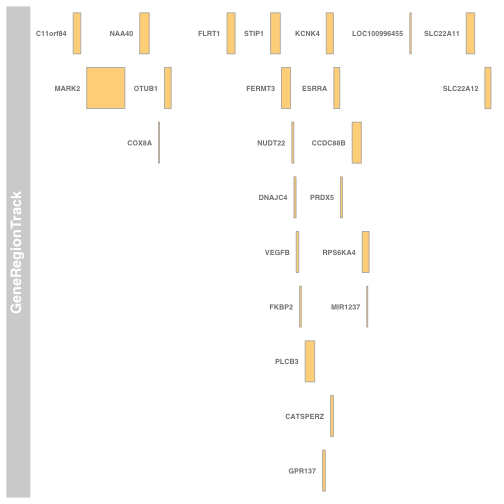
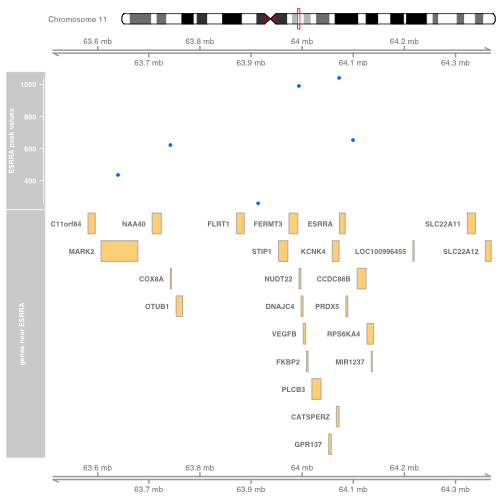

It is often of interest to display observed data in the
context of genomic reference information.  We'll examine how to 
do this with the ESRRA binding data and Gviz.

First we load up relevant data and annotation packages along with
Gviz.


```
## Now getting the GODb Object directly
```

```
## Now getting the OrgDb Object directly
```

```
## Now getting the TxDb Object directly
```

```r
library(ERBS)
library(Gviz)
library(Homo.sapiens)
library(TxDb.Hsapiens.UCSC.hg19.knownGene)
txdb = TxDb.Hsapiens.UCSC.hg19.knownGene
```

## Genes in the vicinity of ESRRA

How can we identify a slice of the human genome containing
ESRRA and some neighboring genes?  There are various approaches;
we'll start by obtaining the ENTREZ identifier.


```r
library(Homo.sapiens)
eid = select(Homo.sapiens, keys="ESRRA", keytype="SYMBOL", columns="ENTREZID")
```

```
## 'select()' returned 1:1 mapping between keys and columns
```

```r
eid
```

```
##   SYMBOL ENTREZID
## 1  ESRRA     2101
```

Now we obtain the addresses for the ESRRA gene body,
collect addresses of neighboring genes, and bind in the
symbols for these genes.


```r
allg = genes(txdb)
esrraAddr = genes(txdb, vals=list(gene_id=2101)) # redundant...
esrraNeigh = subsetByOverlaps(allg, esrraAddr+500000) 
esrraNeigh$symbol = mapIds(Homo.sapiens, keys=esrraNeigh$gene_id, keytype="ENTREZID",
  column="SYMBOL")
```

```
## 'select()' returned 1:1 mapping between keys and columns
```

A quick check on the task with Gviz:

```r
plotTracks(GeneRegionTrack(esrraNeigh, showId=TRUE))
```



## The ESRRA binding peaks in this region

We obtain the ESRRA binding data for the GM12878 EBV-transformed
B-cell and subset to events near our group of genes.

```r
data(GM12878)
sc = subsetByOverlaps(GM12878, esrraNeigh)
sc
```

```
## GRanges object with 4 ranges and 7 metadata columns:
##       seqnames               ranges strand |      name     score       col
##          <Rle>            <IRanges>  <Rle> | <numeric> <integer> <logical>
##   [1]    chr11 [64071338, 64073242]      * |         3         0      <NA>
##   [2]    chr11 [63741506, 63742754]      * |       210         0      <NA>
##   [3]    chr11 [63992515, 63994725]      * |       408         0      <NA>
##   [4]    chr11 [63639263, 63640021]      * |      2248         0      <NA>
##       signalValue    pValue    qValue      peak
##         <numeric> <numeric> <numeric> <integer>
##   [1]       69.87       310        32      1040
##   [2]       18.24    59.652  2.022276       622
##   [3]        9.04    41.001  1.910095       990
##   [4]        8.65    17.481  2.031517       436
##   -------
##   seqinfo: 93 sequences (1 circular) from hg19 genome
```

## Computing an ideogram to give context on the chromosome

This computation is slow.

```r
idxTrack = IdeogramTrack(genome="hg19", chr="chr11")
```

## Putting it all together

We start at the top with the ideogram to identify chromosome and
region on chromosome to which we are zooming with observational
and structural information.


```r
plotTracks(list(idxTrack, GenomeAxisTrack(), 
   DataTrack(sc[,7], name="ESRRA peak values"), 
   GeneRegionTrack(esrraNeigh, showId=TRUE,
         name="genes near ESRRA"), GenomeAxisTrack()))
```


