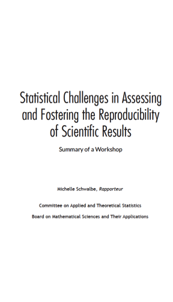
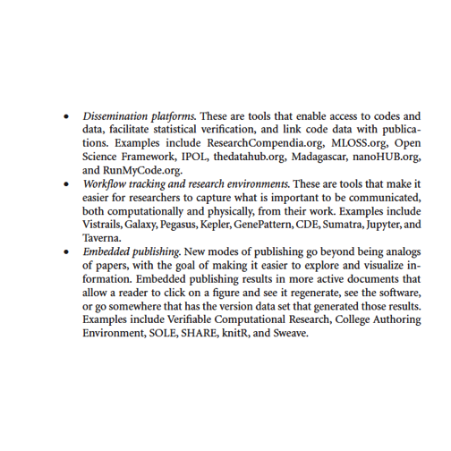
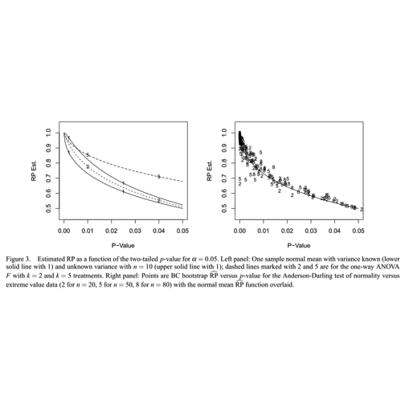
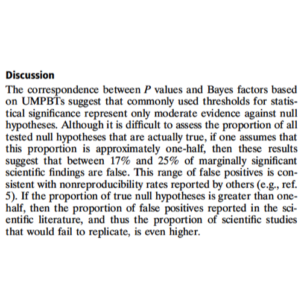
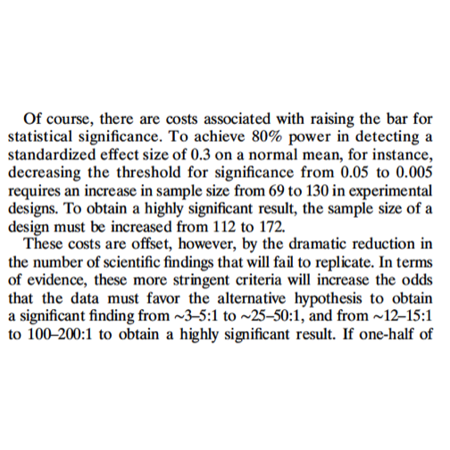

<a name="defs"></a>
## Overview

A key reason for contributing to open software and data for genome-scale
is fostering reproducibility and extensibility of important findings.
Two forms of reproducibility are

* _concrete reproducibility_: the published computational result can be exactly reproduced by independent investigators in possession of the code and data;
* _amenability to replication_: independent investigators equipped with the same experimental protocol, and comparable biological specimens and lab environment, will obtain qualitatively similar inferences.

There are many examples in modern genomic science where neither form of reproducibility is achieved, hence a burgeoning movement called "reproducible research" has had significant interaction with practitioners in genome biology.

The National Academy of Sciences has issued a [report](http://www.nap.edu/21915) on statistical and methodological concerns in the domain of reproducibility:



<a name="infrastr"></a>

A number of interesting infrastructure responses
to reproducibility problems are noted by Victoria Stodden:



<a name="statistical"></a>

She also gives a treatment of _statistical reproducibility_:


## Topics to be covered in this unit

We want to be able to foster reproducibility and extension of our
work.  To this end we will cover 

* construction of R packages for software and annotation, that
are versioned and can include formal tests for correctness of
function operation
* use of knitr to create workflow documents -- background in
notes of [Laurent Gatto](https://www.bioconductor.org/help/course-materials/2015/CSAMA2015/lab/rr-authoring.html)
* use of the [docker container discipline](http://bioconductor.org/help/docker/) to specify and
recover environments in which computations are performed

## Additional commentary

### The three themes underlying reproducibility research

1) providing **code** and **data** and **environment** to **independent parties**
to **diminish risk** of analyses that are **not reproducible**

2) fortifying **criteria of statistical soundness** of analyses (study interpretations) to **control risk** of **non-replicability** of **studies**

3) doing 1) and 2) in ways that are cost-effective

### Y. Benjamini, [NAS workshop](https://errorstatistics.files.wordpress.com/2016/02/conceptualizing-measuring-and-studying-reproducibility.pdf) p. 47

**[R]eproducibility is a property of a study, and replicability is a property of a result that can be proved only by inspecting other results of similar experiments. Therefore, the reproducibility of a result from a single study can be assured, and improving the statistical analysis can enhance its replicability.**

Upshots:

- assuring reproducibility requires technique by the investigator
- enhancing replicability requires new approaches to statistical measurement of evidence

### Additional considerations:

* Extensibility and transportability **should not** be divorced from reproducibility
    - Reproducer/reader should be able to assess effects of modifications to queries and inferences
    - This is a major motivation for Bioconductor's commitments to 
platform-independence, continuous integration, and archiving of
prior package versions

* Scalability **should not** be divorced from reproducbility
    - Will a computation that took the author days or weeks to create be checked by independent parties?
    - Does the work support a [stepwise approach to verification](https://arxiv.org/abs/1409.3531)?
        - Results are reproducible in detail for a meaningful subproblem
        - Results are reproducible in detail for a sequence of
meaningful subproblems of increasing difficulty

* **Computable documents** (rmarkdown, jupyter, ...) are important for pursuit of cost-effectiveness of reproducible research discipline


<a name="RP"></a>

## Boos: Replication probabilities are low for conventional thresholds

The left panel of this diagram illustrates a somewhat unexpected situation
with statistical testing.  The $$y$$ axis measures the replication probability
for some simple experimental designs as a function of the $$p$$-value
obtained for an initial experiment.  The solid line marked "1" traces
the relationship between the $$p$$-value and
the replication probability for a one-sample test of the null hypothesis
that the mean of a population following the normal distribution is zero.
The sample size is 10, and the significance
level is 5 percent.  The figure shows that if the initial
experiment produces a $$p$$-value of 0.025,
the probability that an identically designed experiment will achieve
a $$p$$-value no greater than 0.05 is about 70 percent.  To achieve high
probability of replication (say, greater than 90%), the initial experiment should have
a $$p$$-value less than 0.01.



Boos and Stefanski (American Statistician, 65:4, 211) provide R code
to trace the one-sample replication probability curve:

```
rp.t2 = function (pv, n, a = 0.05) 
{
    1 - pt(qt(1 - a/2, df = n - 1), df = n - 1, ncp = -qt(pv/2, 
        df = n - 1)) + pt(-qt(1 - a/2, df = n - 1), df = n - 
        1, ncp = -qt(pv/2, df = n - 1))
}
```

The upshot is that $$p$$-values are statistically variable, but their
uncertainty is not reckoned in conventional usage.  Boos and Stefanski
suggest that the order of magnitude of $$-\log p$$ is fairly reliable
but finer-grained distinctions are not.

<a name="costs"></a>

## Some material from the NAS workshop: Valen Johnson ([PNAS paper](http://www.pnas.org/content/110/48/19313.full.pdf))

In the following, UMPBT denotes 'uniformly most powerful Bayesian test'.
This is a relatively recent notion that has been described in an
[open publication by Valen Johnson](https://www.ncbi.nlm.nih.gov/pmc/articles/PMC3960084/)
Regardless of the reference to Bayesian concepts, the effects of pursuing
more stringent criteria of significance must be addressed.



## Costs of more stringent thresholds: $$N_{strong} > 1.7 \times N_{conventional}$$



## Upshots

- Statistical theory for enhancing replicability of analyses of independent experiments is substantial
- Costs of increasing replicability are non-trivial
- Preserving the reputation of advanced science may well justify the expenditure
