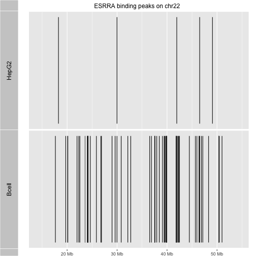

```
## Warning: replacing previous import by 'BiocGenerics::Position' when loading
## 'ggbio'
```

## What is an R package?

Conceptually, an R package is a collection of functions, data
objects, and documentation that coherently support a family
of related data analysis operations.

Concretely, an R package is a structured collection of folders,
organized and populated according to the rules of
[Writing R Extensions](http://cran.r-project.org/doc/manuals/r-release/R-exts.html).

<a name="skel"></a>

### A new software package with `package.skeleton`

We can create our own packages using `package.skeleton`.  We'll illustrate that now
with an enhancement to the ERBS package that was created for the course.
We'll create a new package that utilizes the peak data, defining
a function `juxta` that allows us to compare binding peak patterns for the two cell
types on a selected chromosome.  (I have commented out code that
uses an alternative graphics engine, for optional exploration.)

Here's a definition of `juxta`.  Add it to your R session.

```r
juxta = function (chrname="chr22", ...) 
{
    require(ERBS)
    data(HepG2)
    data(GM12878)
    require(ggbio)
    require(GenomicRanges)  # "subset" is overused, need import detail
    ap1 = autoplot(GenomicRanges::subset(HepG2, seqnames==chrname))
    ap2 = autoplot(GenomicRanges::subset(GM12878, seqnames==chrname))
    tracks(HepG2 = ap1, Bcell = ap2, ...)
# alternative code for Gviz below
#    require(Gviz)
#    ap1 = AnnotationTrack(GenomicRanges::subset(HepG2, seqnames==chrname))
#    names(ap1) = "HepG2"
#    ap2 = AnnotationTrack(GenomicRanges::subset(GM12878, seqnames==chrname))
#    names(ap2) = "B-cell"
#    ax = GenomeAxisTrack()
#    plotTracks(list(ax, ap1, ap2))
}
```

Now demonstrate it as follows.


```r
library(ERBS)
juxta("chr22", main="ESRRA binding peaks on chr22")
```



In the video we will show how to use `package.skeleton` and the Rstudio
editor to generate, document, and install this new package!  We will not
streamline the code in `juxta` to make use of inter-package
symbol transfer by properly writing the DESCRIPTION and NAMESPACE
files for the package, but leave this for an advanced course in
software development.

<a name="org"></a>

### A new annotation package with OrganismDbi

We have found the `Homo.sapiens` package to be quite convenient.
We can get gene models, symbol to GO mappings, and so on, without
remembering any more than `keytypes`, `columns`, `keys`, and `select`.
At present there is no similar resource for *S. cerevisiae*.
We can make one, following the OrganismDbi vignette.  This is
a very lightweight integrative package.


```r
library(OrganismDbi)
gd = list( join1 = c(GO.db="GOID", org.Sc.sgd.db="GO"),
           join2 = c(org.Sc.sgd.db="ENTREZID",
              TxDb.Scerevisiae.UCSC.sacCer3.sgdGene="GENEID"))
if (!file.exists("Sac.cer3")) # don't do twice...
makeOrganismPackage(pkgname="Sac.cer3",  # simplify typing!
  graphData=gd, organism="Saccharomyces cerevisiae",
  version="1.0.0", maintainer="Student <ph525x@harvardx.edu>",
  author="Student <ph525x@harvardx.edu>",
  destDir=".",
  license="Artistic-2.0")
```

At this point we have a folder structure in our
working folder that can support an installation.

```r
install.packages("Sac.cer3", repos=NULL, type="source")
library(Sac.cer3)
```

```
## Loading required package: org.Sc.sgd.db
```

```
## 
```

```
## Loading required package: TxDb.Scerevisiae.UCSC.sacCer3.sgdGene
```

```r
Sac.cer3
```

```
## OrganismDb Object:
## # Includes GODb Object:  GO.db 
## # With data about:  Gene Ontology 
## # Includes OrgDb Object:  org.Sc.sgd.db 
## # Gene data about:  Saccharomyces cerevisiae 
## # Taxonomy Id:  559292 
## # Includes TxDb Object:  TxDb.Scerevisiae.UCSC.sacCer3.sgdGene 
## # Transcriptome data about:  Saccharomyces cerevisiae 
## # Based on genome:  sacCer3 
## # The OrgDb gene id ENTREZID is mapped to the TxDb gene id GENEID .
```

```r
columns(Sac.cer3)
```

```
##  [1] "ALIAS"        "CDSCHROM"     "CDSEND"       "CDSID"       
##  [5] "CDSNAME"      "CDSSTART"     "CDSSTRAND"    "COMMON"      
##  [9] "DEFINITION"   "DESCRIPTION"  "ENSEMBL"      "ENSEMBLPROT" 
## [13] "ENSEMBLTRANS" "ENTREZID"     "ENZYME"       "EVIDENCE"    
## [17] "EVIDENCEALL"  "EXONCHROM"    "EXONEND"      "EXONID"      
## [21] "EXONNAME"     "EXONRANK"     "EXONSTART"    "EXONSTRAND"  
## [25] "GENEID"       "GENENAME"     "GO"           "GOALL"       
## [29] "GOID"         "INTERPRO"     "ONTOLOGY"     "ONTOLOGYALL" 
## [33] "ORF"          "PATH"         "PFAM"         "PMID"        
## [37] "REFSEQ"       "SGD"          "SMART"        "TERM"        
## [41] "TXCHROM"      "TXEND"        "TXID"         "TXNAME"      
## [45] "TXSTART"      "TXSTRAND"     "TXTYPE"       "UNIPROT"
```

```r
genes(Sac.cer3)
```

```
## GRanges object with 6534 ranges and 1 metadata column:
##             seqnames           ranges strand |       GENEID
##                <Rle>        <IRanges>  <Rle> | <FactorList>
##       Q0010     chrM   [ 3952,  4415]      + |        Q0010
##       Q0032     chrM   [11667, 11957]      + |        Q0032
##       Q0055     chrM   [13818, 26701]      + |        Q0055
##       Q0075     chrM   [24156, 25255]      + |        Q0075
##       Q0080     chrM   [27666, 27812]      + |        Q0080
##         ...      ...              ...    ... .          ...
##     YPR200C   chrXVI [939279, 939671]      - |      YPR200C
##     YPR201W   chrXVI [939922, 941136]      + |      YPR201W
##     YPR202W   chrXVI [943032, 944188]      + |      YPR202W
##   YPR204C-A   chrXVI [946856, 947338]      - |    YPR204C-A
##     YPR204W   chrXVI [944603, 947701]      + |      YPR204W
##   -------
##   seqinfo: 17 sequences (1 circular) from sacCer3 genome
```

