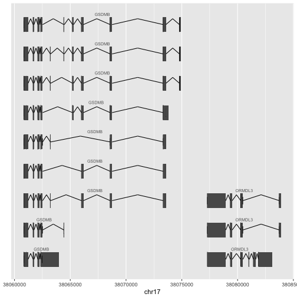
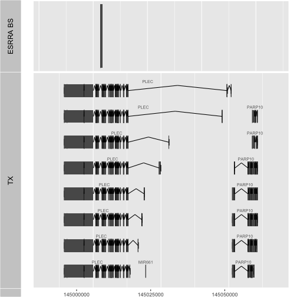
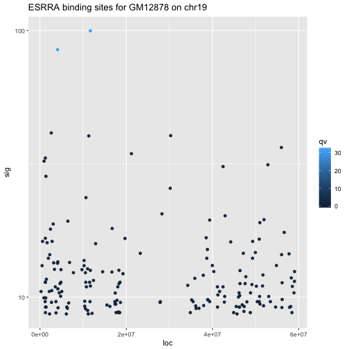

## Introduction

R's basic graphic capabilities can be effective for
communicating basic features of data and statistical models.
In the domain of genome science, many specialized visualizations
have been developed, and a number of Bioconductor packages
simplify the production of important classes of visual
representations of genomic elements and assay readouts.

In this brief overview we examine a few very basic
concepts of genomic visualization, and then sketch
two approaches to interactive graphics -- one that allows
a viewer to choose elements to view in browser interface,
and another that allows direct querying and modification
of the display.  Many of these notions will be revisited
with additional details in following lectures and screencasts.

<a name="genemods"></a>

## Gene models

### On their own

Convenient visualization of gene models
is useful, particularly when interpreting
newly discovered genomic
features or relationships.

Here is an example of how to use *[ggbio](http://bioconductor.org/packages/ggbio)*
to visualize two neigboring genes of interest in asthma genomics.
The basic process is:

- attach needed packages
- obtain GRanges for genes (conveniently organized in the `genesymbol`
data element of the *[biovizBase](http://bioconductor.org/packages/biovizBase)* package
- use ggbio's `autoplot` with the *[Homo.sapiens](http://bioconductor.org/packages/Homo.sapiens)* package
to isolate the gene models of interest
- evaluate the plot, adding a chromosome name


```r
library(ggbio)
library(Homo.sapiens)
data(genesymbol, package="biovizBase")
oo = genesymbol[c("ORMDL3", "GSDMB")]
ap1 = autoplot(Homo.sapiens, which=oo, gap.geom="chevron")
attr(ap1, "hasAxis") = TRUE
ap1 + xlab("chr17")
```



<a name="genemodsData"></a>

### With data

More compelling is the juxtaposition of experimental
data with gene model layouts.  In the following,
we obtain the GRanges for a different gene and use that
to subset the ESRRA binding sites as found in GM12878.


```r
library(ERBS)
data(GM12878)
pl = genesymbol["ATP5D"]
ap2 = autoplot(Homo.sapiens, which=pl+5000, gap.geom="chevron")
ap3 = autoplot(subsetByOverlaps(GM12878, pl+5000))
ch = as.character(seqnames(pl)[1])
tracks(`ESRRA BS`=ap3, TX=ap2, heights=c(1,3))
```


Question: How many regions are identified in GM12878 as binding sites
for ESRRA in the vicinity of ATP5D as displayed with this code?

Substitute the binding sites detected in HepG2.  How many
regions are identified as binding sites in the vicinity of ATP5D
for this cell type?

## Visualization interfaces

In this section we move beyond scripts to visualize
specific genomic elements, to produce more general tools.

- We begin with the concept of a parametrized function
that produces a display for any gene symbol.  The user
can also specify the radius around the gene to be
visualized.
- We then consider how to create an interactive tool
that runs in the browser, to display results for selected
genes without programming R directly.
- We then show how to create a dynamic interactive
display, with tooltips that can provide information about
selected points.

<a name="vizFunc"></a>

### Driving visualization with functions

The construction of tools that enable flexible visualization
is relatively easy once you know the basic layout.  We
have a much more general tool for ESRRA binding visualization
if we use a function:


```r
vizBsByGene = function(sym="ATP5D", radius=5000) {
   require(ERBS)
   require(biovizBase)
   data(GM12878)
   pl = try(genesymbol[sym])
   if (inherits(pl, "try-error")) stop("symbol not found")
   ap2 = autoplot(Homo.sapiens, which=pl+radius, gap.geom="chevron")
   ss <- subsetByOverlaps(GM12878, pl+radius)
   if (length(ss)==0) stop("no binding sites near gene")
   ap3 = autoplot(ss) 
   ch = as.character(seqnames(pl)[1])
   tracks(`ESRRA BS`=ap3, TX=ap2, heights=c(1,3)) 
}
```

Now we are providing a tool that anyone can use to
inspect the situation for a gene of interest.

```r
vizBsByGene(sym="PLEC", radius=10000)
```



<a name="vizShiny"></a>

### Interactive visualization: driving function calls with the browser 

Given a function like vizBsByGene, we can use the
*[shiny](https://CRAN.R-project.org/package=shiny)* package to create a tool
that can be used outside of R.


```r
shi1 = function() {
#
# package setup
#
 library(ggbio)
 library(shiny)
 library(biovizBase)
 library(Homo.sapiens)
 library(ERBS)
 library(GenomicRanges)
#
# acquire gene regions and binding site locations
#
 data(genesymbol)
 data(GM12878)
#
# define the plotting function
#
 vizBsByGene = function(sym="ATP5D", radius=5000) {
   pl = try(genesymbol[sym])
   if (inherits(pl, "try-error")) stop("symbol not found")
   ap2 = autoplot(Homo.sapiens, which=pl+radius, gap.geom="chevron")
   ss <- subsetByOverlaps(GM12878, pl+radius)
   if (length(ss)==0) stop("no binding sites near gene")
   ap3 = autoplot(ss) 
   ch = as.character(seqnames(pl)[1])
   tracks(`ESRRA BS`=ap3, TX=ap2, heights=c(1,3)) 
 }
#
# set up vector of gene names
#
 okg = sort(unique(names(subsetByOverlaps(genesymbol+5000, GM12878))))
#
# define the user interface
#
 ui = fluidPage(
  sidebarLayout(
   sidebarPanel(
    helpText("select gene symbol to see gene model and ESRRA binding sites found in GM12878"),
    selectInput("sym", "gene", choices=okg, selected=okg[1])
    ),
   mainPanel(
    plotOutput("vizbs")
    )
   )
  )
#
# define the server
#
 server = function(input, output) {
  output$vizbs = renderPlot({
   showNotification("deriving plot")
   vizBsByGene(sym=input$sym)
  })
 }
#
# execute, when function shi1() is evaluated
#
 shinyApp(ui=ui, server=server)
}
```

Copy this into your R session and run `shi1()`.  The computations are
slow but this interface has some advantages over manual command line interactions.
The basic components are:

- the `ui` (user interface), which defines how the
page will appear to the user and sets up basic aspects of the communication between
user, browser and R
- the `server`, which carries out the primary computations with data.

Some additional details:

- `fluidPage` defines the basic approach to structuring HTML in a page
- `sidebarLayout` is a particularly straightforward approach to isolating the interactive
element (sidebarPanel) and the data presentation (mainPanel)
- `selectInput` is a function that generates a dropdown list with selectize capabilities -- you can delete
the string in the box and start typing a new string (gene symbol) and the component will 'sift through'
choices compatible with what you type
- `plotOutput` is used to define where the selected plot will appear
- `renderPlot` defines the server-side operation of collecting data from the UI and using it to compute on
the analytical data to generate the plot

Many other components are available in the
shiny package to obtain different types of input
and generate different types of output.  It is worth knowing that the `renderPlot`
function is `reactive` -- when any data value connected to the `input` object
changes, the renderPlot function is re-evaluated, and the corresponding output
element is updated.

<a name="vizPlotly"></a>
  
### Dynamic interactive visualization: plotly for details on hover; pan and zoom 

The shiny function coded above produces an interactive interface to generate
static plots.  The `plotly` library provides facilities for creating interactive,
dynamic plots.  This works closely with the `ggplot2` package and we will
briefly introduce its key concepts.

ggplot2 is an implementation of a conceptual system due to Leland Wilkinson called
the grammar of graphics.  The details of the `grammar` are complicated.  A very
abbreviated account is as follows:

- variables in a data.frame are the main resource
- geometric primitives are catalogued: points, lines, paths, boxplots, smooths
- geometric elements have properties, these are called 'aesthetics' the graph designer
defines maps from the data variables to these aesthetics
- plotting axes may be rescaled
- multivariate data may be decomposed into facets that are separated but presented together in a structured way

See Hadley Wickham's [JCGS paper preprint](http://vita.had.co.nz/papers/layered-grammar.html) for a complete account.


As an illustration we will consider the fluctuation of signal values of the
ESRRA binding experiment over genomic coordinates of chr19.  We'll
start by setting up the data resource and its basic aesthetic bindings.


```r
gm19 = GM12878[ which(seqnames(GM12878)=="chr19") ]
gm19df = data.frame(loc=start(gm19), sig=gm19$signalValue,
           qv=gm19$qValue, tt="a\nb")
library(ggplot2)
pl = ggplot(gm19df, aes(x=loc, y=sig, colour=qv, text=tt))
```

Once this is done, we create the plot by specifying the geometric elements to
be used, and the scale modification.


```r
spl = pl + geom_point() + scale_y_log10() + 
    ggtitle("ESRRA binding sites for GM12878 on chr19")
spl
```



To make this a dynamic visualization, we load the plotly
library and invoke ggplotly.  As you move the mouse over points,
a tooltip popup is generated.  Additionally you can create a window
using the mouse to produce a zoomed view.
Rectangular or oval regions of focuse can be created using
the different modes that are started by clicking on dashed region
icons at the upper right corner of the display.


```r
library(plotly)
ggplotly(spl)
```

```
## Warning in normalizePath(f2): path[1]="./webshot8ed020646980.png": No such
## file or directory
```

```
## Warning in file(con, "rb"): cannot open file './webshot8ed020646980.png':
## No such file or directory
```

```
## Error in file(con, "rb"): cannot open the connection
```

As of December 2017, it is not possible to have plotly interoperating
with ggbio visualizations.  But there will undoubtedly be progress
in the near future
in integrating the high-level genomic visualization toolkits with
general frameworks for dynamic display.

## Summary

- *[ggbio](http://bioconductor.org/packages/ggbio)* packages a variety of genomically informative visual elements
(combinations of rectangle and chevron glyphs for gene models,
for example)
that can be used to juxtapose experimental and reference data
- *[shiny](https://CRAN.R-project.org/package=shiny)* supports the design of browser-based interfaces
to R functions and data; we demonstrated how static graphics could
be generated for user-selected gene symbol
- *[plotly](https://CRAN.R-project.org/package=plotly)* supports the design of dynamic graphics
on top of statically-defined graphs produced with *[ggplot2](https://CRAN.R-project.org/package=ggplot2)*
