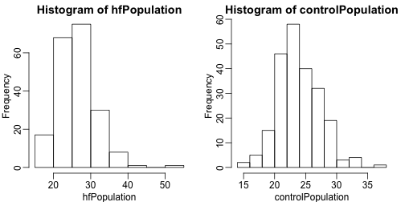
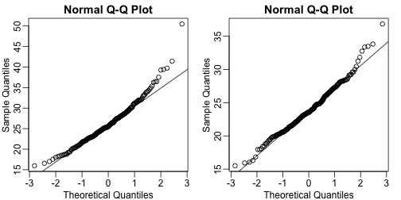

# Introduction

Below we will discuss two mathematical results, the Central Limit Theorem and the t-distribution,
which help us to calculate probabilities of observing events,
and both are often used in science to test statistical hypotheses.
They have different assumptions, but both results are similar in that through
mathematical formula, we are able to calculate exact probabilities of events, if we think that certain
assumptions about the data hold true.

# Central Limit Theorem 

The Central Limit Theorem (or CLT) is one of the most used mathematical results in science. It tells us that when the sample size is large the average $$\bar{Y}$$ of a random sample follows a normal distribution centered at the population average $$\mu_Y$$ and with standard deviation equal to the population standard deviation $$\sigma_Y$$, divided by the square root of the sample size $$N$$. 

Two important mathematical results you need to know are that if we subtract a constant from a random variable, the mean of the new random variable shifts by that constant. Mathematically, if $$X$$ is a random variable with mean $$\mu$$ and $$a$$ is a constant, the mean of $$X - a$$ is $$\mu-a$$. A similarly intuitive result holds for the standard deviation if $$X$$ is a random variable with mean $$\mu$$ and SD $$\sigma$$, and $$a$$ is a constant, then the mean and SD of $$aX$$ are $$a \mu$$ and $$|a| \sigma$$ respectively. To see how intuitive this is, imagine we subtract 10 grams from each of the mice weights, the average should also drop by that much. Similarly, we we change the units from grams to milligrams by multiplying by 1000 then the spread of the numbers becomes larger.

This implies that if we take many samples of size $$N$$ then the quantity 

$$
\frac{\bar{Y} - \mu}{\sigma_Y/\sqrt{N}}
$$

is approximated with a normal distribution centered at 0 and with standard deviation 1.

Now we are interested in the difference of two sample averages. Here again a mathematical result helps. If we have two random variables $$X$$ and $$Y$$ with means $$\mu_X$$ and $$\mu_Y$$ and variance $$\sigma_X$$ and $$\sigma_Y$$ respectively, then we have the following results. The mean of the sum $$Y$+$X$$ is the sum of the means $$\mu_Y$$ + $$\mu_X$$. Using one of the facts we mentioned earlier, this implies that the mean of $$Y$$ - $$X$$ = $$Y$$ + $$aX$$ with $$a=-1$$ which means the mean of $$Y-X$$ is $$\mu_Y$-$\mu_X$$.This is intuitive. However, the next result is perhaps not as intuitive.  If $$X$$ and $$Y$$ are independent of each other, as they are in our mouse example, then the variance (SD squared) of $$Y$+$X$$ is the sum of the variances $$\sigma_Y^2+\sigma_X^2$$. This implies that variance of the difference $$Y-X$$ is the variance of $$Y - aX$$ with a=-1 which is $$\sigma^2_Y + a^2 \sigma_X^2$$ = 
$\sigma^2_Y + \sigma_X^2$$. So the variance of the difference is also the sum of the variances. If this seems like a counter intuitive result, think that if $$X$$ and $$Y$$ are independent of each other, the sign does not really matter, it can be considered random: if $$X$$ is normal with certain variance, for example, so is $$-X$$.  Finally, another useful result is that the sum of normal variables is again normal.

All this math is very useful for the purposes of our study because we have two sample averages and are interested in the difference. Because both are normal the difference is normal as well, and the variance (the standard deviation squared) is the sum of the two variance.
Under the null hypothesis that there is no difference between the population averages, the difference between the sample averages $$\hat{Y}-\hat{X}$$, with $$\hat{X}$$ and $$\hat{Y}$$ the sample average for the two diets respectively, is approximated by a normal distribution centered at 0 (there is no difference) and with standard deviation $$\sqrt{\sigma_X^2 +\sigma_Y^2}/\sqrt{N}$$. 

This is imply that this ratio,

$$
\frac{\bar{Y}-\bar{X}}{\sqrt{\frac{\sigma_X^2}{M} + \frac{\sigma_Y^2}{N}}}
$$

is approximated by a normal distribution centered at 0 and standard deviation 1.  Using this approximation make computing p-values simple because we know the proportion of the distribution under any value. For example, only 5% values of larger than 2 (in absolute value):

```r
1-pnorm(2)+pnorm(-2)
```

```
## [1] 0.04550026
```
We don't need to buy more mouse,  12 and 12 suffices.

However, we can't claim victory just yet because  we don't know the population standard deviations: $$\sigma_X$$ and $$\sigma_Y$$. These are population parameters. But we can get around this by using the sample standard deviations, call then $$s_X$$ and $$s_Y$$. These are defined as 

$$ s_X^2 = \frac{1}{N - 1} \sum_{i=1}^M (Y_i - \bar{Y})^2  \mbox{ and } s_X^2 = \frac{1}{M  -1} \sum_{i=1}^M (X_i - \bar{X})^2$$

Note that we are dividing by $$N-1$$ and $$M-1$$. There is a theoretical reason for doing this which we won't explain now. But to get an intuition think of the case when you just have 2 numbers. The average distance to the mean is basically the 1/2 the difference between the two numbers. So you really just have information from one number. This is somewhat of a minor point, the main point is that $$s_X$$ and $$s_Y$$ serve as estimates of $$\sigma_X$$ and $$\sigma_Y$$

So we can redefine our ratio as

$$
\sqrt{N} \frac{\bar{Y}-\bar{X}}{\sqrt{s_X^2 +s_Y^2}}
$$

The CLT tells us that when $$N$$ and $$M$$ are large (rule of thumb is 30) this random variable is normally distributed with mean 0 and SD 1. Thus we can compute p-values using the function `pnorm`.

## The t-distribution

When the CLT does not apply, there another option that does not rely on large samples (what we call asymptotic results). When a the original population from which a random variable, say $$Y$$, is sampled is normally distributed with mean 0 then we can calculate the distribution of 

$$
\sqrt{N} \frac{\bar{Y}}{s_Y}
$$

Note that this is the ratio of two random variables so it is not necessarily normal. The fact that the denominator can be small by chance increases the probability of observing large values. [William Sealy Gosset](http://en.wikipedia.org/wiki/William_Sealy_Gosset), an employ of Guinness, deciphered the distribution of this random variable and published a paper under the pseudonym "student". This the distribution is called the Student's t-distribution. Later we will learn more about how this result is used.

Here we will use the mice phenotypes data as example:


```r
library(downloader)
```

```
## 
## Attaching package: 'downloader'
## 
## The following object is masked from 'package:devtools':
## 
##     source_url
```

```r
url <- "https://raw.githubusercontent.com/genomicsclass/dagdata/master/inst/extdata/mice_pheno.csv"
filename <- tempfile()
download(url,destfile=filename)
dat <- read.csv(filename)
controlPopulation <- dat[dat$Sex=="F" & dat$Diet=="chow",3]
hfPopulation <- dat[dat$Sex=="F" & dat$Diet=="hf",3]
```

It is important to keep in mind that what we are assuming to be normal here is the distribution of $$y_1,y_2,\dots,y_n$$ not the random variable $$\bar{Y}$$. Although we do not get to do this in practice, in this illustrative example we get to see this distribution for both controls and high fat diet mice:


```r
library(rafalib)
```

```
## Loading required package: RColorBrewer
```

```r
mypar2(1,2)
hist(hfPopulation)
hist(controlPopulation)
```

 

We can use qq-plots to confirm that the distribution are relatively close to being normally distributed.


```r
mypar2(1,2)
qqnorm(hfPopulation);qqline(hfPopulation)
qqnorm(controlPopulation);qqline(controlPopulation)
```

 

The larger the sample, the more forgiving the result is to the weakness of this approximation. We will later see that for this particular dataset the t-distribution works well even for  sample sizes as small as 3.

