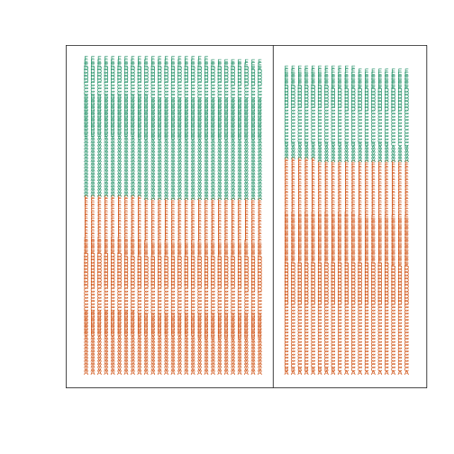
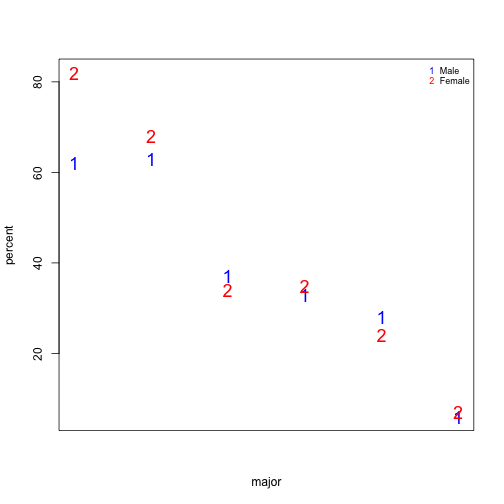
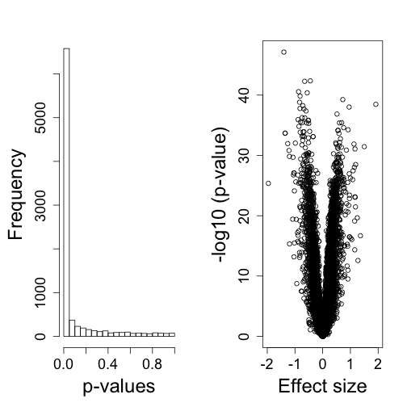
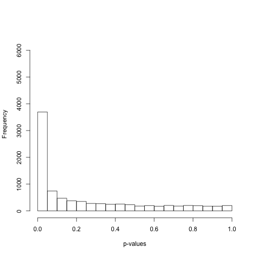
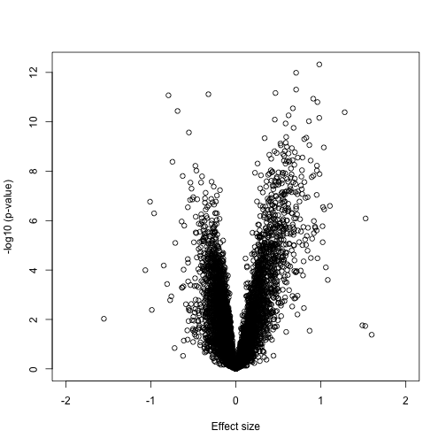

## Confounding

Admission data from Berkeley 1973 showed more men were being admitted than women: 44\% men admitted compared to 30\% women!


```r
datadir = "http://www.biostat.jhsph.edu/bstcourse/bio751/data"
dat = read.csv(file.path(datadir, "admissions.csv"))
dat$total = dat$Percent * dat$Number/100
## percent men get in
sum(dat$total[dat$Gender == 1]/sum(dat$Number[dat$Gender == 1]))
```

```
## [1] 0.4452
```

```r
## percent women get in
sum(dat$total[dat$Gender == 0]/sum(dat$Number[dat$Gender == 0]))
```

```
## [1] 0.3033
```


A chi-square test clearly rejects they hypothesis that gender and admission are independent:

```r
## let's make a 2 x 2
indexes <- list(1:6, 7:12)
tab <- matrix(NA, 2, 2, dimnames = list(c("males", "females"), c("accepted", 
    "rejected")))
for (i in 1:2) {
    ind <- indexes[[i]]
    tab[i, 1] <- sum(dat[ind, 2] * dat[ind, 3]/100)
    tab[i, 2] <- sum(dat[ind, 2] * (1 - dat[ind, 3]/100))
}
tab <- round(tab)
tab
```

```
##         accepted rejected
## males       1198     1493
## females      557     1278
```

```r
print(chisq.test(tab)$p.val)
```

```
## [1] 1.056e-21
```


But closer inspection shows a paradoxical results. Here are the percent admissions by Major:

```r
y = cbind(dat[1:6, c(1, 3)], dat[7:12, 3])
colnames(y)[2:3] = c("Male", "Female")
y
```

```
##   Major Male Female
## 1     A   62     82
## 2     B   63     68
## 3     C   37     34
## 4     D   33     35
## 5     E   28     24
## 6     F    6      7
```


#### *Homework*
1. Run the `chisq.test` in each major.


```r
y = cbind(dat[1:6, c(1, 2)], dat[7:12, 2])
colnames(y)[2:3] = c("Male", "Female")
y
```

```
##   Major Male Female
## 1     A  825    108
## 2     B  560     25
## 3     C  325    593
## 4     D  417    375
## 5     E  191    393
## 6     F  373    341
```


What's going? 

This is called _Simpson's paradox_ 
Note that males were much more likely to apply to "easy" majors. 

Male and easy majors are confounded. 

```r
y = cbind(dat[1:6, 5], dat[7:12, 5])
y = sweep(y, 2, colSums(y), "/") * 100
x = rowMeans(cbind(dat[1:6, 3], dat[7:12, 3]))
matplot(x, y, xlab = "percent that gets in the major", ylab = "percent that applies to major", 
    col = c("blue", "red"), cex = 1.5)
legend("topleft", c("Male", "Female"), col = c("blue", "red"), pch = c("1", 
    "2"), box.lty = 0)
```

 


```r
### make data for plot
library(rafalib)
```

```
## Loading required package: RColorBrewer
```

```r
mypar()
makematrix <- function(x, m, addx = 0, addy = 0) {
    n <- ceiling(length(x)/m)
    expand.grid(1:n + addx, addy + 1:m)[seq(along = x), ]
}
males <- sapply(1:6, function(i) {
    tot = dat[i, 2]
    p = dat[i, 3]/100
    x = rep(c(0, 1), round(tot * c(1 - p, p)))
})
allmales <- Reduce(c, males)
females <- sapply(7:12, function(i) {
    tot = dat[i, 2]
    p = dat[i, 3]/100
    rep(c(0, 1), round(tot * c(1 - p, p)))
})
allfemales <- Reduce(c, females)
plot(0, type = "n", xlim = c(0, 50), ylim = c(0, 100), xaxt = "n", yaxt = "n", 
    xlab = "", ylab = "")
PCH = LETTERS[rep(1:6, sapply(males, length))]
o <- order(allmales)
points(makematrix(allmales, 100), col = 2 - allmales[o], pch = PCH[o], cex = 0.6)
PCH = LETTERS[rep(1:6, sapply(females, length))]
o <- order(allfemales)
points(makematrix(allfemales, 100, 30), col = 2 - allfemales[o], pch = PCH[o], 
    cex = 0.6)
abline(v = 29)
```

 

```r
plot(0, type = "n", xlim = c(0, 80), ylim = c(0, 130), xaxt = "n", yaxt = "n", 
    xlab = "", ylab = "")
for (i in seq(along = males)) {
    points(makematrix(males[[i]], 20, 0, 22 * (i - 1)), col = 2 - sort(males[[i]]), 
        pch = LETTERS[i], cex = 0.6)
    points(makematrix(females[[i]], 20, 47, 22 * (i - 1)), col = 2 - sort(females[[i]]), 
        pch = LETTERS[i], cex = 0.6)
    if (i > 1) 
        abline(h = 22 * (i - 1) - 0.5)
}
abline(v = 45)
```

 


So if we condition or stratify by major this goes away. 

```r
y = cbind(dat[1:6, 3], dat[7:12, 3])
matplot(1:6, y, xaxt = "n", xlab = "major", ylab = "percent", col = c("blue", 
    "red"), cex = 1.5)
legend("topright", c("Male", "Female"), col = c("blue", "red"), pch = c("1", 
    "2"), box.lty = 0, cex = 0.75)
```

 


The average difference by Major is 3.5% higher for women.


```r
mean(y[, 1] - y[, 2])
```

```
## [1] -3.5
```


We see this in Baseball often:

|               | 1995           | 1996           | Combined        |
| ------------- | -------------- | -------------- | --------------- |
| Derek Jeter   | 12/48 (.250)   | 183/582 (.314) | 195/630 (.310)  |
| David Justice | 104/411 (.253) | 45/140 (.321)  | 149/551 (.270)  |

## Confounding in genomics

Here are the p-values from comparing caucasians to asians

```r
library(Biobase)
```

```
## Loading required package: BiocGenerics
## Loading required package: methods
## Loading required package: parallel
## 
## Attaching package: 'BiocGenerics'
## 
## The following objects are masked from 'package:parallel':
## 
##     clusterApply, clusterApplyLB, clusterCall, clusterEvalQ,
##     clusterExport, clusterMap, parApply, parCapply, parLapply,
##     parLapplyLB, parRapply, parSapply, parSapplyLB
## 
## The following object is masked from 'package:stats':
## 
##     xtabs
## 
## The following objects are masked from 'package:base':
## 
##     anyDuplicated, append, as.data.frame, as.vector, cbind,
##     colnames, do.call, duplicated, eval, evalq, Filter, Find, get,
##     intersect, is.unsorted, lapply, Map, mapply, match, mget,
##     order, paste, pmax, pmax.int, pmin, pmin.int, Position, rank,
##     rbind, Reduce, rep.int, rownames, sapply, setdiff, sort,
##     table, tapply, union, unique, unlist
## 
## Welcome to Bioconductor
## 
##     Vignettes contain introductory material; view with
##     'browseVignettes()'. To cite Bioconductor, see
##     'citation("Biobase")', and for packages 'citation("pkgname")'.
```

```r
library(genefilter)
```

```
## 
## Attaching package: 'genefilter'
## 
## The following object is masked from 'package:base':
## 
##     anyNA
```

```r
library(dagdata)
data(GSE5859)
eth <- factor(pData(e)$ethnicity == "CEU")
tt <- rowttests(exprs(e), eth)
HLIM <- c(0, 6500)
mypar(1, 2)
hist(tt$p.value, main = "", xlab = "p-values", nc = 20, ylim = HLIM)
plot(tt$dm, -log10(tt$p.value), xlab = "Effect size", ylab = "-log10 (p-value)", 
    xlim = c(-2, 2))
```

 

Is this is really possible?

Note the confounding

```r
year = format(pData(e)[, 2], "%Y")
table(year, pData(e)[, 1])
```

```
##       
## year   ASN CEU HAN
##   2002   0  32   0
##   2003   0  54   0
##   2004   0  13   0
##   2005  80   3   0
##   2006   2   0  24
```


##split by month
Let's compare the ASN from two June 2005 to October 2005

```r
batch <- format(pData(e)$date, "%y%m")
ind <- which(batch %in% c("0506", "0510"))
tt <- rowttests(exprs(e)[, ind], factor(batch[ind]))
hist(tt$p.value, main = "", xlab = "p-values", nc = 20, ylim = HLIM)
```

 

```r
plot(tt$dm, -log10(tt$p.value), xlab = "Effect size", ylab = "-log10 (p-value)", 
    xlim = c(-2, 2))
```

 


