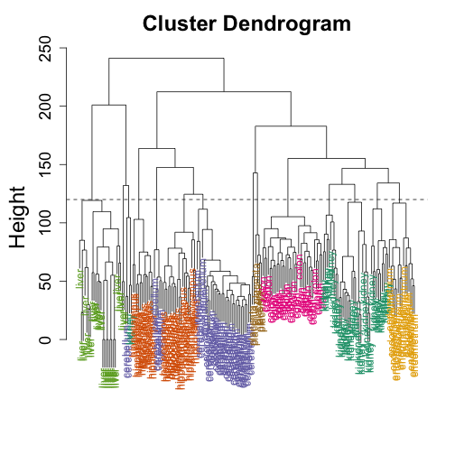
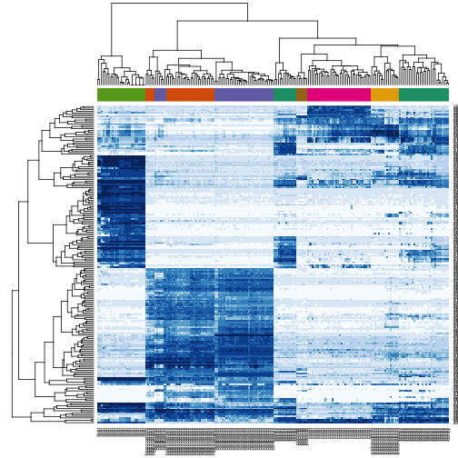
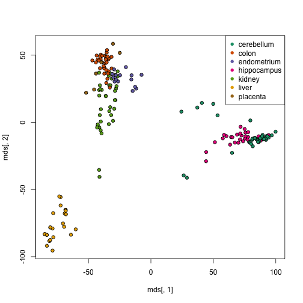
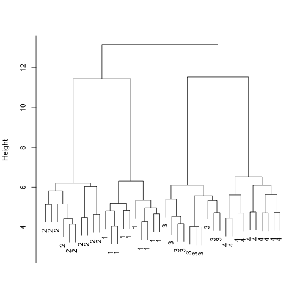
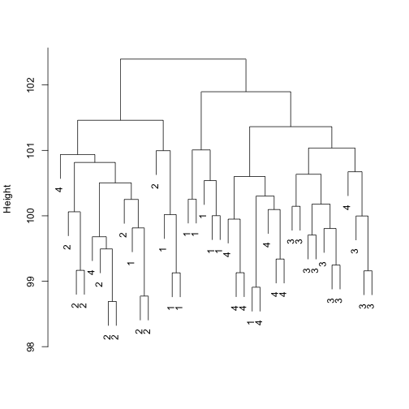
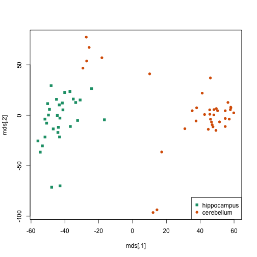
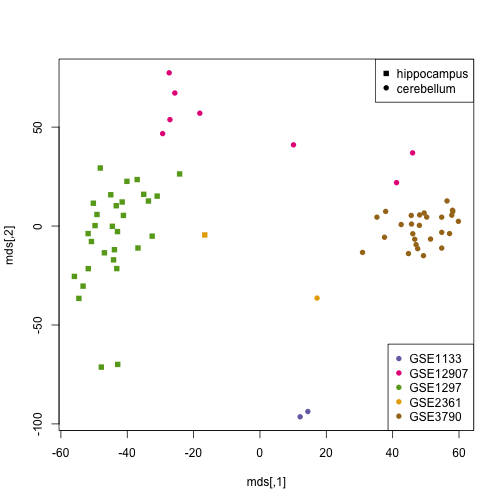
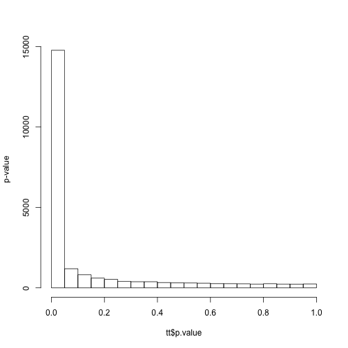
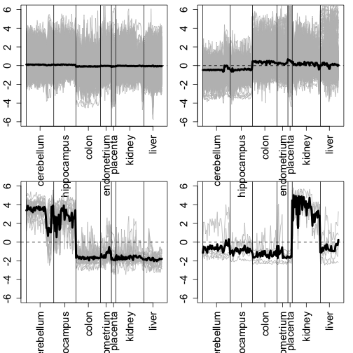
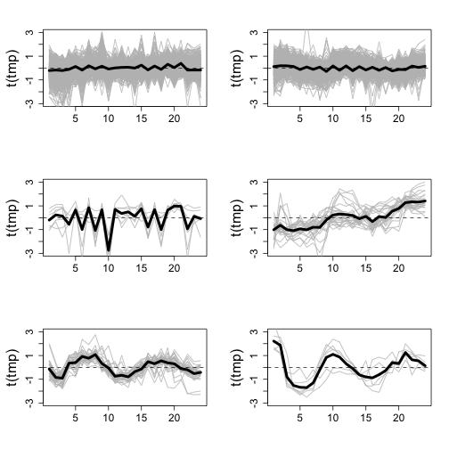

$$
d(h,i) = \sqrt{ \sum_{j=1}^{N} (X_{h,j}-X_{i,j})^2 }
$$

Here are some data

```r
library(dagdata)
data(tissuesGeneExpression)
## show matrix
mat = e[870:880, 14:19]
colnames(mat) <- tissue[14:19]
round(mat, 1)
```

```
##             kidney kidney kidney hippocampus hippocampus hippocampus
## 201342_at     10.1   10.3   10.1        10.1        10.1        10.4
## 201343_at      9.1    9.6    9.2         9.6         9.7         9.0
## 201344_at      6.2    6.3    6.2         7.6         7.8         7.0
## 201345_s_at    9.1   10.0    9.3         9.4         9.3         8.3
## 201346_at      9.0    9.5    9.2        11.4        10.7        10.1
## 201347_x_at   12.0   10.0   11.5         9.4         9.3         8.6
## 201348_at     14.0   12.3   13.9         8.2         8.2         8.2
## 201349_at     10.4    9.7   10.0         9.2         8.8         8.9
## 201350_at      9.7   10.0    9.7         9.3         9.1         9.9
## 201351_s_at    8.4    8.8    8.5         8.0         8.2         6.8
## 201352_at     10.0   10.1    9.9         9.6        10.0         8.8
```


Let's compute distance

```r
d <- dist(t(e))  ##important to take transpose
dim(d)
```

```
## NULL
```

Note that this gives us 17,766 distances, one for each pair. With these distances in place we are now in a position to _cluster_ samples that are close to each other. There are many ways to do this. One of the most used is [hierarchichal clustering](#foot). There are two main types of hierarchichal clustering: 1) top-down or divisive and 2) bottom-up or agglomerative. Both approaches require us to define a distance between two groups of samples, as opposed to two samples. This will permit us to _link_ two groups. The hclust function provides several options, but all of them depend on the distance between each pair of samples. With these definition in place, the agglomerative approach starts by defining each sample a group. The in each step it decides what two groups are the _closest_ and puts them together. This creates a "hierarchy" of groupings. Here we use the default.


```r
h <- hclust(d)
```


A dendrogram is a convient way of displaying these groupings. We start at the top with all the samples together and then add splits at the distance (shown in y-axis) were they were separated


```r
library(rafalib)
```

```
## Loading required package: RColorBrewer
```

```r
mypar()
myplclust(h, labels = tissue, lab.col = as.fumeric(tissue))
abline(h = 120, lty = 2)
```

 

Note we can also cluster genes. We compute the distance by compunting 
$$
d(j,k) = \sqrt{ \sum_{j=1}^{22,215} (X_{i,j}-X_{i,k})^2 }
$$


Note that in this particular example, a more make more sense to define the distance using the average profiles of each tissue. 

## Heatmaps
We are now ready to create heatmaps

We can't show all 20,000+ genes so we will select the genes that must change across tissue types.


```r
library(matrixStats)
```

```
## matrixStats v0.8.14 (2013-11-23) successfully loaded. See ?matrixStats for help.
```

```r
sds <- rowSds(e)
ind <- order(sds, decreasing = TRUE)[1:200]
heatmap(e[ind, ], scale = "none", col = brewer.pal(9, "Blues"), ColSideColors = palette()[as.fumeric(tissue)], 
    labCol = tissue, margin = c(4, 0))
```

 


## MDS

[Multidimensional scaling](#foot) is another technique for reducing the dimensionality of the data, in a way that tries to preserve the inter-sample distances.


```r
mds <- cmdscale(d)
cols <- as.factor(tissue)
plot(mds[, 1], mds[, 2], bg = as.numeric(cols), pch = 21)
legend("topright", levels(cols), col = seq(along = cols), pch = 16)
```

 


## Some math

Say we standardize vectors $X$ and $Y$ and then compute the distance. We will compute the square for better illustration. 
$$
\begin{eqnarray}
\frac{1}{M}\sum_{i=1}^M \left(\frac{X_i - \bar{X}}{s_X} -  \frac{Y_i - \bar{Y}}{s_Y} \right)^2 &=&
\frac{1}{M} \sum_{i=1}^M \left(\frac{X_i - \bar{X}}{s_X}\right)^2 +  \frac{1}{M} \sum_{i=1}^M \left(\frac{Y_i - \bar{Y}}{s_Y} \right)^2 - \frac{2}{M} \sum_{i=1}^M \left(\frac{X_i - \bar{X}}{s_X}\right)\left(\frac{Y_i - \bar{Y}}{s_Y}\right)\\
&=&2(1-r)
\end{eqnarray}
$$
with $r$ the correlation.

Difference in the average can drive the different. For this particular demonstration let's assume that $s_X=s_Y=1$. 

$$
\frac{1}{M}\sum_{i=1}^M (X_i - Y_i)^2 = \frac{1}{M}\sum_{i=1}^M \left( (X_i - \bar{X}) - (Y_i-\bar{Y}) - (\bar{X}-\bar{Y})\right)^2 
$$

$$
= \frac{1}{M}\sum_{i=1}^M \left( (X_i - \bar{X}) - (Y_i-\bar{Y})\right)^2 - 2(\bar{X}-\bar{Y}) \frac{1}{M}\sum_{i=1}^M \left( (X_i - \bar{X}) - (Y_i-\bar{Y})\right) + \frac{1}{M}\sum_{i=1}^M (\bar{X}-\bar{Y}) ^2
$$

$$
= 2(1-r) + \frac{1}{M}\sum_{i=1}^M (\bar{X}-\bar{Y}) ^2 
$$

$$
= 2(1-r) + (\bar{X}-\bar{Y}) ^2
$$

## K-means algorithm

The idea behind this agorithm is simple. You pick the number of clusters $K$ that you think are present. Then $K$ points are selected at random and defined as group centers. In a next step each point is assigned to a group based on the shortest distance. After this step the centers are recalculated based on means for each dimension (these are called centroids). The process is repated untile the mean cetners don't move anymore. 


```r
set.seed(1)
N = 150
centers <- rbind(c(-2, 0), c(0, 1), c(2, 0))
dat <- t(sapply(sample(3, N, replace = TRUE), function(i) centers[i, ] + rnorm(2, 
    0, 0.3)))
centroids <- dat[sample(N, 3), ]
delta <- Inf
count <- 0
# library(animation) saveGIF({ plot(dat,xlab='dimension 1',ylab='dimension
# 2',main=paste('step',count)) count<-count+1 while(delta>0.00001){
# plot(dat,xlab='dimension 1',ylab='dimension 2',main=paste('step',count))
# count<-count+1 points(centroids,pch=4,col=1:3,cex=2,lwd=2) d <-
# as.matrix(dist(rbind(centroids,dat))) d <- d[-c(1:3),1:3]
# group<-apply(d,1,which.min) points(dat,bg=group,pch=21,) newcentroids <-
# t(sapply(splitit(group),function(ind) colMeans(dat[ind,,drop=FALSE])))
# delta<-mean((centroids-newcentroids)^2) centroids<-newcentroids }
# },'kmeans.gif', interval = 0.5)
```


## How variability messes up clustering

Just like other summary statistics we have studied, the dendrogam and clusters are random variables. Random variability affects them. Because they are not univariate summaries, such as the t-statistic, reporting the associated uncertainty is not straightforwrd and rarely done in papers. This can be dangerous as it gives the false impression of being deterministic. 

To see how susceptibel clustering is to randomness we construct a simple simulation. Four groups with different expression profiles in 50 genes will be generated. To immitate a microarray we will then add 20,000 genes that are not differentially epxressed and are randomely varying. We create 10 samples from each profile.


```r
N1 = 50
profile <- matrix(rep(seq(1, 4, len = N1), 4), nrow = N1)
profile <- apply(profile, 2, sample)  ##make them different
set.seed(1)
dat <- sapply(0:39, function(i) profile[, floor(i/10) + 1] + matrix(rnorm(N1, 
    0, 0.5), nrow = N1))
group <- rep(1:4, each = 10)
d <- dist(t(dat))
plot(hclust(d), labels = group, main = "", sub = "", xlab = "")
```

 


Now add 20,000 genes that are not differentially expressed


```r
N2 = 20000
dat2 <- rbind(dat, matrix(rnorm(N2 * 40, 0, 0.5), nrow = N2))
d <- dist(t(dat2))
plot(hclust(d), labels = group, main = "", sub = "", xlab = "")
```

 


## Show the batch effect 


```r
twotissues <- c("hippocampus", "cerebellum")
ind <- which(tissue %in% twotissues)
d <- dist(t(e[, ind]))
mds <- cmdscale(d)
cols = as.fumeric(tissue[ind])
plot(mds, col = cols, pch = cols + 14)
legend("bottomright", twotissues, col = 1:2, pch = 15:16)
```

 


```r
study <- factor(tab[ind, 3])
plot(mds, col = as.numeric(study) + 2, pch = 14 + as.fumeric(tissue[ind]))
legend("bottomright", levels(study), col = 1:5 + 2, pch = 16, )
legend("topright", twotissues, pch = 15:16)
```

 


```r
ind <- which(tissue == "cerebellum" & tab[, 3] %in% c("GSE3790", "GSE12907"))
tt <- genefilter::rowttests(e[, ind], factor(tab[ind, 3]))
hist(tt$p.value, main = "", ylab = "p-value")
```

 


## More on gene correlation


```r
library(rafalib)
library(matrixStats)
library(dagdata)
data(tissuesGeneExpression)
o <- order(factor(tissue, levels = c("cerebellum", "hippocampus", "colon", "endometrium", 
    "placenta", "kidney", "liver")))
e <- e[, o]
tissue <- tissue[o]
e <- e - rowMeans(e)
sds <- rowSds(e)
set.seed(2)
rind <- sample(nrow(e), 5000)
d <- dist(e[rind, ])
h <- hclust(d)
clusters <- cutree(h, k = 4)
ind <- splitit(clusters)
vs <- which(!duplicated(tissue))  ##where to draw vertical lines dividing tissues
pos <- vs + diff(c(vs, length(tissue)))/2

## find most different from 0
mypar(2, 2, mar = c(6, 2.5, 0.6, 1.1))
for (i in ind) {
    tmp <- e[rind[i], ]
    matplot(t(tmp), type = "l", lty = 1, col = "grey", ylim = mean(e) + c(-6, 
        6), xaxt = "n")
    abline(v = vs)
    axis(side = 1, pos, unique(tissue), las = 3)
    lines(colMeans(tmp), lwd = 4)
    abline(h = mean(e), lty = 2)
}
```

 


```r
library(yeastCC)
```

```
## Loading required package: Biobase
## Loading required package: BiocGenerics
## Loading required package: parallel
## 
## Attaching package: 'BiocGenerics'
## 
## The following objects are masked from 'package:parallel':
## 
##     clusterApply, clusterApplyLB, clusterCall, clusterEvalQ,
##     clusterExport, clusterMap, parApply, parCapply, parLapply,
##     parLapplyLB, parRapply, parSapply, parSapplyLB
## 
## The following object is masked from 'package:stats':
## 
##     xtabs
## 
## The following objects are masked from 'package:base':
## 
##     anyDuplicated, append, as.data.frame, as.vector, cbind,
##     colnames, do.call, duplicated, eval, evalq, Filter, Find, get,
##     intersect, is.unsorted, lapply, Map, mapply, match, mget,
##     order, paste, pmax, pmax.int, pmin, pmin.int, Position, rank,
##     rbind, Reduce, rep.int, rownames, sapply, setdiff, sort,
##     table, tapply, union, unique, unlist
## 
## Welcome to Bioconductor
## 
##     Vignettes contain introductory material; view with
##     'browseVignettes()'. To cite Bioconductor, see
##     'citation("Biobase")', and for packages 'citation("pkgname")'.
## 
## 
## Attaching package: 'Biobase'
## 
## The following objects are masked from 'package:matrixStats':
## 
##     anyMissing, rowMedians
```

```r
library(rafalib)
data(yeastCC)
ind <- which(pData(yeastCC)$Timecourse == "cdc15")
dat <- exprs(yeastCC)[, ind]
keep <- rowSums(is.na(dat)) == 0
dat <- dat[keep, ]
d <- dist(dat)
h <- hclust(d)
cl <- cutree(h, k = 6)
ind <- splitit(cl)
mypar(3, 2)
for (i in ind) {
    tmp <- dat[i, ]
    matplot(t(tmp), type = "l", lty = 1, col = "grey", ylim = c(-3, 3))
    abline(h = 0, lty = 2)
    lines(colMeans(tmp), lwd = 4)
}
```

 


## Footnotes <a name="foot"></a>

### MDS references

Wikipedia: <http://en.wikipedia.org/wiki/Multidimensional_scaling>

- Cox, T. F. and Cox, M. A. A. (2001) Multidimensional Scaling. Second edition. Chapman and Hall.
- Gower, J. C. (1966) Some distance properties of latent root and vector methods used in multivariate analysis. Biometrika 53, 325–328.
- Torgerson, W. S. (1958). Theory and Methods of Scaling. New York: Wiley.

### Hierarchical clustering

Wikipedia: <http://en.wikipedia.org/wiki/Hierarchical_clustering>

a subset of the most recent references from `?hclust`:

- Legendre, P. and L. Legendre (2012). Numerical Ecology, 3rd English ed. Amsterdam: Elsevier Science BV.
- Murtagh, F. and Legendre, P. (2013). Ward's hierarchical agglomerative clustering method: which algorithms implement Ward's criterion? Journal of Classification (in press).
