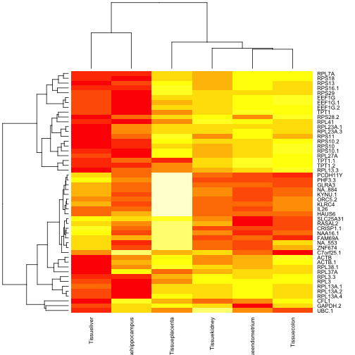
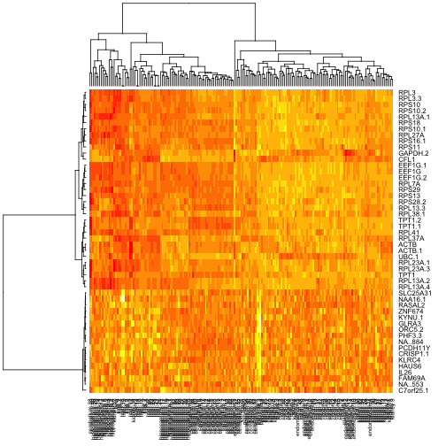

## Introduction

We looked at the code for `dfHclust` in some detail.  It makes
significant use of universal aspects of data.frame instances

* rows can represent the objects to be clustered
* columns represent the features of the objects used to compare and group them
* _rownames_ can be used to label the objects
* _colnames_ can be used to name the features

The name concepts make it easy for us to think substantively about
what is being done in the app.

When we move to the context of genome-scale data, things are a bit different.  Let's focus on expression array applications

* the volume of data is often very substantial
* assuming the objects of interest are the individual biological samples that have been arrayed, the labeling of objects can be complex
* assuming we use an ExpressionSet to manage the data, both rownames and colnames will tend to use unilluminating vocabularies such as probe set and sample identifiers

This last concern is hard to defeat in general but for the tissuesGeneExpression data there is a simple solution.
The first concern, about data volume, can be managed nicely with ExpressionSet instances through bracket-based subsetting.  

## A simple app

Let's write a function that transforms any ExpressionSet into a data.frame and then runs dfHclust.  This will be our "app" for interactively clustering data in expression experiments!


```r
library(Biobase)
library(hgu133a.db)
```

```
## 
```

```r
library(ph525x)

esHclust = function(es) {
  emat = t(exprs(es))
  rownames(emat) = sampleNames(es)
  dd = data.frame(emat)
  dfHclust(dd)
}
```

## Preparing tissue expression data for use with the app

We'll transform the matrix/data.frame data in tissuesGeneExpression package
into a conveniently annotated ExpressionSet.


```r
library(tissuesGeneExpression)
data(tissuesGeneExpression)
tgeES = ExpressionSet(e)
annotation(tgeES) = "hgu133a.db"
pData(tgeES) = tab
featureNames(tgeES) =
  make.names(mapIds(hgu133a.db, keys=featureNames(tgeES),
    keytype="PROBEID", column="SYMBOL"), unique=TRUE)
```

```
## 'select()' returned 1:many mapping between keys and columns
```

```r
sampleNames(tgeES) = make.names(tgeES$Tissue, unique=TRUE)
```

Here's code that runs the app on a small selection of genes and samples:

```r
set.seed(1234)
esHclust( tgeES[1:50, sample(1:ncol(tgeES), size=40) ] )
```

## Exploring cluster analysis for tissue differentiation

Which genes are important for distinguishing the various tissues
available in this dataset?  Can the analytical tools identified
to this point help us to identify and understand them?  Neither of
these questions is particularly clear, and the experimental designs
underlying the tissue expression sets would need to be fully
understood.  However, the following code can help identify
genes whose expression is _statistically unlikely to be constant_
over all the tissues present.  We'll collect moderated F tests for the
gene-specific null hypotheses that mean expression is constant
over all tissues.


```r
library(limma)
mm = model.matrix(~Tissue, data=pData(tgeES))
f1 = lmFit(tgeES, mm)
ef1 = eBayes(f1)
```

A heatmap of the 50 genes identified as most discriminating by
this simple F testing approach is:


```r
heatmap(ef1$coef[order(ef1$F,decreasing=TRUE)[1:50],-1], cexCol=.8)
```



This is a visualization of mean expression relative to a
reference category (cerebellum).  The same genes visualized on the
raw data:


```r
sig50 = rownames(ef1$coef[order(ef1$F,decreasing=TRUE)[1:50],])
heatmap(exprs(tgeES[sig50,]))
```



This is all very informal, using only default values for heatmap presentations.
We'll continue in this vein.  In my inspection of the heatmap of means,
I considered the following five genes to be a potential signature for
tissue differentiation:


```r
sig5 = c("IL26", "ZNF674", "UBC.1", "C7orf25.1", "RPS13")
```

In the exercises we'll see whether this is at all satisfactory.

## A machine-learning approach to assessing discriminatory capacity

This is not directly addressing visualization but it is brief and
useful for thinking about what we can do with visualization.  The
MLInterfaces package makes it easy to use various R-based
statistical learning tools with ExpressionSet instances.  We'll
use random forests to get a measure of effectiveness of the
`sig50` defined above.


```r
library(MLInterfaces)
library(randomForest)
set.seed(1234)
rf1 = MLearn(Tissue~., tgeES[sig50,], randomForestI, xvalSpec("NOTEST"))
RObject(rf1)
```

```
## 
## Call:
##  randomForest(formula = formula, data = trdata) 
##                Type of random forest: classification
##                      Number of trees: 500
## No. of variables tried at each split: 7
## 
##         OOB estimate of  error rate: 9.52%
## Confusion matrix:
##             cerebellum colon endometrium hippocampus kidney liver placenta
## cerebellum          37     0           0           0      1     0        0
## colon                0    31           1           0      1     1        0
## endometrium          0     4           9           0      2     0        0
## hippocampus          0     0           0          30      0     1        0
## kidney               0     1           0           0     36     2        0
## liver                0     0           0           0      0    26        0
## placenta             0     2           0           0      1     1        2
##             class.error
## cerebellum   0.02631579
## colon        0.08823529
## endometrium  0.40000000
## hippocampus  0.03225806
## kidney       0.07692308
## liver        0.00000000
## placenta     0.66666667
```

Here using the defaults we see that the 50 gene signature does a 
reasonable job of sorting out the tissues.  With simple modifications
to the single line of code using `MLearn` above you can assess
effects of changing the signature or the learning procedure.
