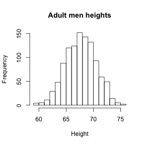
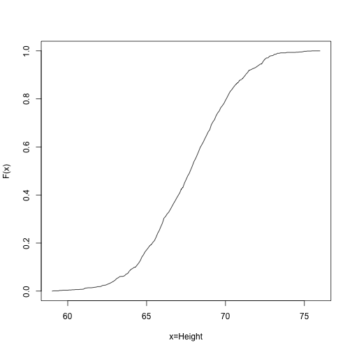
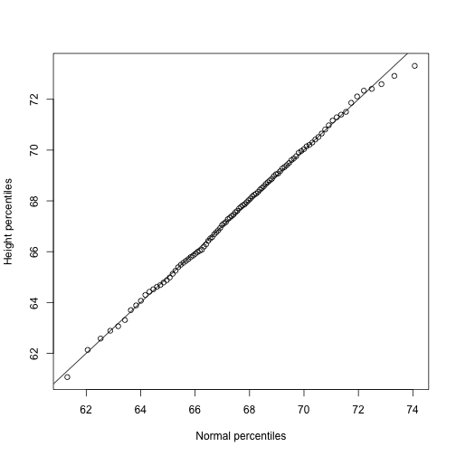
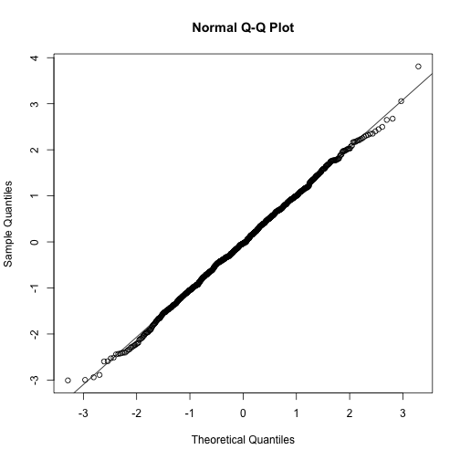
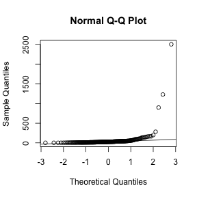
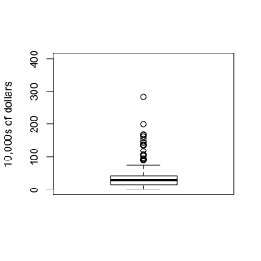

# Introduction 

Biases, systematic errors and unexpected variability are common in data from the life sciences. Failure to discover these problems often leads to flawed analyses and false discoveries. As an example, consider that experiments sometimes fail and not all data processing pipelines, such as the t.test function in R, are designed to detect these. Yet, these pipelines still give you an answer. Furthermore, it may be hard or impossible to notice an error was made just from the reported results.

Graphing data is a powerful approach to detecting these problems. We refer to this as _exploratory data analyis_ (EDA). Many important methodological contributions to existing data analysis techniques in data analysis were initiated by discoveries made via EDA. Through this book we make use of exploratory plots to motivate the analyses we choose. Here we present a general introduction to EDA using height data.

<a name="histograms"></a>
# Histograms

We can think of any given dataset as a list of numbers. Suppose you have measured the heights of all men in a population. Imagine you need to describe these numbers to someone that has no idea what these heights are, for example an alien that has never visited earth.


```r
library(UsingR)
x=father.son$fheight
```
One approach is to simply list out all the numbers for the alien to see. Here are 20 randomly selected heights of 1,078.


```r
round(sample(x,20),1)
```

```
##  [1] 70.6 70.2 71.0 67.4 62.0 70.5 69.9 67.2 64.6 69.0 68.0 72.5 66.7 70.5
## [15] 70.2 70.2 67.4 67.8 72.1 73.0
```

From scanning through these numbers we start getting a rough idea of what the entire list looks like but it is certainly inefficient. We can quickly improve on this approach by creating bins, say by rounding each value to the nearest inch, and reporting the number of individuals in each bin. A plot of these heights is called a histogram


```r
hist(x)
```

We can specify the bins and add better labels in the following way:

```r
bins <- seq(floor(min(x)),ceiling(max(x)))
hist(x,breaks=bins,xlab="Height",main="Adult men heights")
```

 

Showing this plot to the alien is much more informative than showing the numbers. Note that with this simple plot we can approximate the number of individuals in any given interval. For example, there are about 70 individuals over six feet (72 inches) tall. 


<a name="ecdf"></a>
# Empirical Cummulative Density Function

Although not as popular as the histogram for EDA, the empirical cumulative density function (CDF) shows us the same information and does not require us to define bins. For any number $x$ the empirical CDF reports the proportion of numbers in our list smaller or equal to $x$. R provides a function that has as out the empirical CDF function. Here:


```r
myCDF <- ecdf(x) 
```

we create a function called `myCDF` based on our data `x` that can then be used to generate a plot


```r
##We will evaluate the function at these values:
xs<-seq(floor(min(x)),ceiling(max(x)),0.1) 
### and then plot them:
plot(xs,myCDF(xs),type="l",xlab="x=Height",ylab="F(x)")
```

 

<a name="normaldistribution"></a>
# Normal approximation

If instead of the total numbers we report the proportions, then the histogram above can be thought of a probability distribution. The probability distribution we see above approximates one that is very common in a nature: the normal distribution also refereed to as the bell curve or Gaussian distribution. When the histogram of a list of numbers approximates the normal distribution we can use a convenient mathematical formula to approximate the proportion of individuals in any given interval

$$
\mbox{Pr}(a < x < b) = \int_a^b \frac{1}{\sqrt{2\pi\sigma^2}} \exp{\left( \frac{-(x-\mu)^2}{2 \sigma^2} \right)} \, dx
$$

Here $\mu$ and $\sigma$ are the mean and standard deviation and we can get them like this:


```r
mu <- mean(x)
popsd <- function(x) sqrt(mean((x-mean(x))^2)) 
popsd(x)
```

```
## [1] 2.743595
```

Note the `sd` function in R gives us a sample estimate of the $\sigma$ as opposed to the population $\sigma$.

If this approximation holds for our list then the population mean and variance of our list can be used in the formula above. To see this with an example remember that above we noted that 70 individuals or 6% of our population were taller than 6 feet. The normal approximation works well:

```r
1-pnorm(72,mean(x),popsd(x)) 
```

```
## [1] 0.05797647
```

A very useful characteristic of this approximation is that one only needs to know $\mu$ and $\sigma$ to describe the entire distribution. All we really have to tell our alien friend is that heights follow a normal distribution with average height 68'' and a standard deviation of 3''. From this we can compute the proportion of individuals in any interval. It is a very compact summary. 

# QQ-plot

To corroborate that the normal distribution is in fact a good approximation we can use quantile-quantile plots (QQ-plots). Quantiles are best understood by considering the special case of percentiles. The p-th percentile of a list of a distribution is defined as the number q that is bigger than p% of numbers. For example, the median 50-th percentile is the median. We can compute the percentiles for our list and for the normal distribution

```r
ps <- seq(0.01,0.99,0.01)
qs <- quantile(x,ps)
normalqs <- qnorm(ps,mean(x),popsd(x))
plot(normalqs,qs,xlab="Normal percentiles",ylab="Height percentiles")
abline(0,1) ##identity line
```

 
Note how close these values are. Also note that we can see these qqplots with less code

```r
qqnorm(x)
qqline(x) 
```

 
However, the `qqnorm` function plots against a standard normal distribution. This is why the line has slope `popsd(x)` and intercept `mean(x)`

In the example above the points match the line very well. In fact we can run Monte Carlo simulations to see that we see plots like this for data known to be normally distributed


```r
n <-1000
x <- rnorm(n)
qqnorm(x)
qqline(x)
```

 

We can also get a sense for how non-normally distributed data looks. Here we generate data from the t-distribution with different degrees of freedom. Note that the smaller the degrees of freedoms the fatter the tails.


```r
dfs <- c(3,6,12,30)
mypar2(2,2)
for(df in dfs){
  x <- rt(1000,df)
  qqnorm(x,xlab="t quantiles",main=paste0("d.f=",df),ylim=c(-6,6))
  qqline(x)
}
```

 


<a name="boxplots"></a>
# Boxplots

Data is not always normally distributed. Income is widely cited example. In these cases the average and standard deviation are not necessarily informative since one can't infer the distribution from just these two numbers. The properties described above are specific to the normal. For example, the normal distribution does not seem to be a good approximation for the direct compensation for 199 United States CEOs in the year 2000

```r
hist(exec.pay)
```

 

```r
qqnorm(exec.pay)
qqline(exec.pay)
```

 
A practical summary is to compute 3 percentiles: 25-th, 50-th (the median) and the 75-th. A boxplots shows these 3 values along with a range calculated as median $\pm$ 1.5 75-th percentiles - 25th-percentile. Values outside this range are shown as points and sometimes refereed to as _outliers_.


```r
boxplot(exec.pay,ylab="10,000s of dollars",ylim=c(0,400))
```

 
