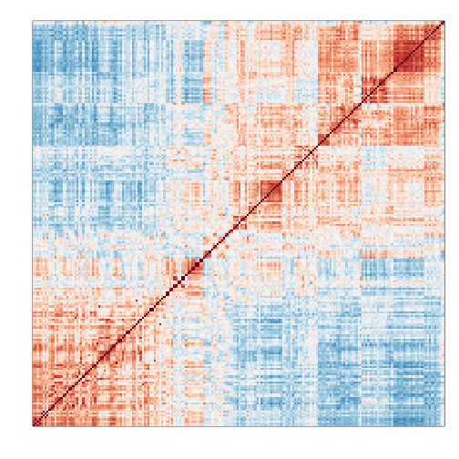

## Factor Analysis

Before we introduce the next type of statistical method for batch effect correction, we introduce the statistical idea that motivates the main idea: Factor Analysis. Factor Analysis was first developed over a century ago. Karl Pearson noted that correlation between different subjects when the correlation was computed across students. To explain this, he posed a model having one factor that was common across subjects for each student that explained this correlation:

$$
Y_ij = \alpha_i W_1 + \varepsilon_{ij}
$$

with $$Y_{ij}$$ the grade for individual $$i$$ on subject $$j$$ and $$\alpha_i$$ representing the ability of student $$i$$ to obtain good grades. 

In this example, $$W_1$$ is a constant. Here we will motivate factor analysis with a slightly more complicated situation that resembles the presence of batch effects. We generate a random $$N \times 6$$ matrix $$\mathbf{Y}$$ with representing grades in six different subjects for N different children. We generate the data in a way that subjects are correlated with some more than others:


#### Sample correlations

Note that we observe high correlation across the six subjects:

```r
round(cor(Y),2)
```

```
##          Math Science   CS  Eng Hist Classics
## Math     1.00    0.67 0.64 0.34 0.29     0.28
## Science  0.67    1.00 0.65 0.29 0.29     0.26
## CS       0.64    0.65 1.00 0.35 0.30     0.29
## Eng      0.34    0.29 0.35 1.00 0.71     0.72
## Hist     0.29    0.29 0.30 0.71 1.00     0.68
## Classics 0.28    0.26 0.29 0.72 0.68     1.00
```

A graphical look shows that the correlation suggests a grouping of the subjects into STEM and the humanities.

In the figure below, high correlations are red, no correlation is white and negative correlations are blue (code not shown).

 

The figure shows the following: there is correlation across all subjects, indicating that students have an underlying hidden factor (academic ability for example) that results in subjects begin correlated since students that test high in one subject tend to test high in the others. We also see that this correlation is higher with the STEM subjects and within the humanities subjects. This implies that there is probably another hidden factor that determines if students are better in STEM or humanities. We now show how these concepts can be explained with a statistical model.

#### Factor model

Based on the plot above, we hypothesize that there are two hidden factors $$\mathbf{W}_1$$ and $$\mathbf{W}_2$$ and, to account for the observed correlation structure, we model the data in the following way:

$$
Y_{ij} = \alpha_{i,1} W_{1,j} + \alpha_{i,2} W_{2,j} + \varepsilon_{ij}
$$

The interpretation of these parameters are as follows: $$\alpha_{i,1}$$ is the overall academic ability for student $$i$$ and $$\alpha_{i,2}$$ is the difference in ability between the STEM and humanities for student $$i$$. Now, can we estimate the $$W$$ and $$\alpha$$ ? 

#### Factor analysis and PCA

It turns out that under certain assumptions, the first two principal components are optimal estimates for $$W_1$$ and $$W_2$$. So we can estimate them like this:


```r
s <- svd(Y)
What <- t(s$v[,1:2])
colnames(What)<-colnames(Y)
round(What,2)
```

```
##       Math Science    CS  Eng Hist Classics
## [1,]  0.36    0.36  0.36 0.47 0.43     0.45
## [2,] -0.44   -0.49 -0.42 0.34 0.34     0.39
```

As expected, the first factor is close to a constant and will help explain the observed correlation across all subjects, while the second is a factor differs between STEM and humanities. We can now use these estimates in the model:

$$
Y_{ij} = \alpha_{i,1} \hat{W}_{1,j} + \alpha_{i,2} \hat{W}_{2,j} + \varepsilon_{ij}
$$
 
and we can now fit the model and note that it explains a large percent of the variability.


```r
fit = s$u[,1:2]%*% (s$d[1:2]*What)
var(as.vector(fit))/var(as.vector(Y))
```

```
## [1] 0.7880933
```

The important lesson here is that when we have correlated units, the standard linear models are not appropriate. We need to account for the observed structure somehow. Factor analysis is a powerful way of achieving this. 

#### Factor analysis in general

In high-throughput data, it is quite common to see correlation structure. For example, notice the complex correlations we see across samples in the plot below. These are the correlations for a gene expression experiment with columns ordered by date:


```r
library(Biobase)
library(GSE5859)
data(GSE5859)
n <- nrow(pData(e))
o <- order(pData(e)$date)
Y=exprs(e)[,o]
cors=cor(Y-rowMeans(Y))
cols=colorRampPalette(rev(brewer.pal(11,"RdBu")))(100)

mypar()
image(1:n,1:n,cors,xaxt="n",yaxt="n",col=cols,xlab="",ylab="",zlim=c(-1,1))
```

 

Two factors will not be enough to model the observed correlation structure. However, a more general factor model can be useful:

$$
Y_{ij} = \sum_{k=1}^K \alpha_{i,k} W_{j,k} + \varepsilon_{ij}
$$

And we can use PCA to estimate $$\mathbf{W}_1,\dots,\mathbf{W}_K$$. However, choosing $$k$$ is a challenge and a topic of current research. In the next section we describe how exploratory data analysis might help.


