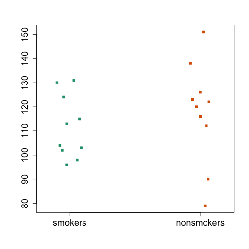
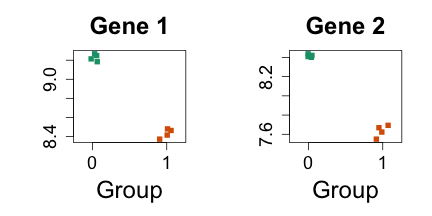
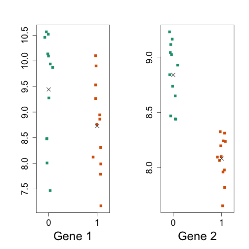

# Statistical Inference

In biology journals we see many figures such as *Figure*-page 3. Today we will learn what the litte star means. In most genome wide association studies we see Manhattan plots (*Figure* page 4). We will leanr what _P_ means. 

In science it is common to ask if two things are different. Is the risk of cancer different in smokers and non-smokers? Is the probability of getting type II different for different genetic backgrounds? Is this gene differentially expressed in cancer? When we make two measurements and compare, we almost always see some difference. But will wee see it again if we measure again? If someone else measures? Statistical inference can help us answer this question.

## Association tests

One of the most famous examples of hypothesis testing was performed by RA Fisher on a lady that claimed could tell if milk was added before or after the tea was poured. Fisher gave the lady four pairs of cups of tea: one with milk poured first, the other after. The order was randomized. Say the lady picked 3 out 4 correctly, do we believe she has a special ability? Hypothesis testing helps answer this question by quantifying what happens by chance.

The basic question we ask is: if the lady is just guessing, what are the chances that she gets 3 or more correct? When we use a statistic and it’s probability distribution to answer this question we call it a _hypothesis test_ or test for short.

If we assume the lady is just guessing randomly, we can think of this particular examples as picking 4 balls out of an urn with 4 green (correct answer) and 4 red (incorrect answer) balls. 

Under the _null hypothesis_ that the lady is just guessing each ball has the same chance of being picked. We can then use combinatorics to figure out the probability. The probability of picking 3 is 
${4 \choose 3} {4 \choose 1} / {8 \choose 4} = 16/70$.  
The probability of picking all correct is
${4 \choose 4} {4 \choose 0}/{8 \choose 4}= 1/70$. Thus the chance of observing a 3 or something more extreme, under the null hypothesis, is 0.24. This is called a p-value. This is called Fisher's exact test and it uses the hyper geometric distribution. It is not appropirate for most the tests applied in genetics but the idea is similar.

The y-axis of a Manhattan plot (*Figure* - page 4) is typically represents the netative of log (base 10) of the p-values obtained for association tests applied at each SNP. 

For example, imagine we have 280 individuals, some of them have a given disease others don’t. We observe that a 20% of the individuals that are homozygous for the minor allele have the disease compared to 10% of the rest. Would we see this again if we picked another 220 individuals?

Here is an example dataset

```r
disease = c(rep(0, 180), rep(1, 20), rep(0, 40), rep(1, 10))
genotype = c(rep("AA", 200), rep("aa", 50))
tab = table(genotype, disease)
tab
```

```
##         disease
## genotype   0   1
##       aa  40  10
##       AA 180  20
```


The null-hypothesis is that the 200 and 50 individuals in each group were assigned disease with the same probability. If this is the case then the probability of disease is

```r
p = mean(disease)
p
```

```
## [1] 0.12
```

The expected table is therefore

```r
rbind(c(1 - p, p) * sum(genotype == "aa"), c(1 - p, p) * sum(genotype == "AA"))
```

```
##      [,1] [,2]
## [1,]   44    6
## [2,]  176   24
```


Using an asymptotic result about the sums of independent binary outcomes, we can compute an approximate probability of seeing a deviation for the expected table as big as this one.
The p-value for this table is 

```r
chisq.test(tab)$p.value
```

```
## [1] 0.08857
```

Note that there is not a one to one relationship between the odds ratio and the p-value. If increase the numbers but keep the difference in proportions the same, the p-value is reduced substantially:

```r
tab = tab * 10
chisq.test(tab)$p.value
```

```
## [1] 1.22e-09
```


## The t-test
Suppose we are asked if new borns from smoking mothers weigh less than those from non-smoker mothers in a population of 1,236 babies. Suppose we are charged \$1000 for each measurement and are given a \$50,000 prize if we answer correclty, how many babies do we weigh? Let's start with 10


```r
dat = read.table("http://www.biostat.jhsph.edu/bstcourse/bio751/data/babies.data", 
    header = TRUE)
set.seed(0)
smokers = sample(dat$bwt[dat$smoke == 1], 10)
nonsmokers = sample(dat$bwt[dat$smoke == 0], 10)
```

Here is a quick plot

```r
library(rafalib)
```

```
## Loading required package: RColorBrewer
```

```r
mypar()
stripchart(list(smokers, nonsmokers), vertical = TRUE, method = "jitter", col = c(1, 
    2), pch = 15, group.names = c("smokers", "nonsmokers"))
```

 

```r
cat("observed difference = ", mean(smokers) - mean(nonsmokers), " ounces")
```

```
## observed difference =  -6.1  ounces
```

We want to know if the difference between the average weight are positive, negative, or practically 0.  The observed difference is a mere 12.2 ounces. Will this difference hold up if we take another sample? Remeber we have to pay for each measurement. 

### Central limit theorem

The Central Limit Theorem (or CLT) is one of the most used mathematical results in science. It tells us that when the sample size is large the average $\bar{X}$ of a random sample follows a normal distribution centered at the population average (what we want to know), call it $\mu$, and with standard deviation equal to the population standard deviation, call it $\sigma$, divided by the square root of the sample size $N$. This implies that if we take many samples of size $N$ then the quantity 
$$
\frac{\hat{X} - \mu}{\sigma/\sqrt{N}}
$$
is approximated with a nomral distribution centered at 0 and with standard deviation 1.

This is very useful for the purposes of our study becase we have two sample averages and are interested in the difference. Becasue both are normal the difference is normal as well, and the variance (the standard deviation squared) is the sum of the two variance.
Under the null hypothese that there is no difference between the population averages, the difference between the sample averages $\hat{Y}-\hat{X}$, with $\hat{X}$ and $\hat{Y}$ the sample average for smokers and non-smokers respectiveley, is approximated by a normal distribution centered at 0 (there is no difference) and with standard deviation $\sqrt{\sigma_X^2 +\sigma_Y^2}/\sqrt{N}$. 

This is imply that this ratio, 
$$
\frac{\bar{Y}-\bar{X}}{\sqrt{\frac{\sigma_X^2}{M} + \frac{\sigma_Y^2}{N}}}
$$
is approximated by a normal distribution centered at 0 and standard deviation 1.  Using this approximation make computing p-values simple because we know the proportion of the distribtuion under any value. For example, only 5% values of larger than 2 (in absolute value):

```r
1 - pnorm(2) + pnorm(-2)
```

```
## [1] 0.0455
```

So what is the p-value of our observed differences? Note that we can't compute the ratio above because we don't know the population standard deviations: $\sigma_X$ and $\sigma_Y$. If we use the sample standard deviations, call then $s_X$ and $s_Y$ we form what is refered to the t-test, a quantity we can actually compute:
$$
\sqrt{N} \frac{\bar{Y}-\bar{X}}{\sqrt{s_X^2 +s_Y^2}}
$$

It turns out that for large enough N, the t-statistic is approximated by a normal distribution centered at 0 and with standard deviation 1. Our t-test is certainly unlikely to occur:


```r
ttest <- sqrt(length(smokers)) * (mean(smokers) - mean(nonsmokers))/sqrt((var(smokers) + 
    var(nonsmokers)))
ttest
```

```
## [1] -0.782
```

```r
2 * pnorm(ttest)
```

```
## [1] 0.4342
```

Giving us a p-valu eof 0.02. But for this p-value to be accurate we need the CLT approximation to hold. So is a sample size of 10 large enough? 30 is a rule a thumb and it implies our 10 is not enough. 

### The t-distribution
For cases were the population values are normally distributed (like weights) the exact distribution can be derived and it is the t-distribution (where the t-statistic gets it's name). Not surprisingly the t-distribution has fatter tails (a bigged proportion of larger values) than the normal distribution since the standard deviation estimates add variability (the numerator is normal in this case). We can now obtain a p-value (we need to specify the _degrees of freedom_, which in the case of the sample ttest is the sum of the sample sizes minus 2.

```r
1 - pt(ttest, 20 - 2) + pt(-ttest, 20 - 2)  ##or
```

```
## [1] 1.556
```

```r
2 * pt(ttest, 20 - 2)
```

```
## [1] 0.4444
```


As expected the p-value using the t-distribution is larger than the one obtained with the normal approximation which gives underestimates when N is small. Regardless, it seems the chance of observing a difference as large as what we saw under the null is pretty small. We should correctly predict that the average height of men is larger than the average height of women and also confirm that the distributions are approximately normal 


```r
mean(dat$bwt[dat$smoke == 1]) - mean(dat$bwt[dat$smoke == 0])
```

```
## [1] -8.938
```


Homework: is the distribution of dat$bwt approximated by normal, t or neither?

### Confidence interevals

Note that we obtained an estimate but never really reported it. We simply reported the p-value. Although common practice, we do not recommend it. Note that we can obtain statistically significant results that are not scientifically significant. The prefered way to report the estimate is the present both the estimate and its standard deviation: 

```r
cat(mean(smokers) - mean(nonsmokers), "+/-", sqrt(var(smokers) + var(nonsmokers))/sqrt(length(smokers)), 
    "\n")
```

```
## -6.1 +/- 7.801
```

We can also _confidence intervals_ which should fall on the true difference for 95% of the random samples one could take.

```r
cat(mean(smokers) - mean(nonsmokers) + c(-2, 2) * sqrt(var(smokers) + var(nonsmokers))/sqrt(length(smokers)), 
    sep = ",")
```

```
## -21.7,9.501
```

Note that the true difference is in fact included in the sample above

## Gene expression
We have data for two strains of mice which we will refer to as strain 0 and 1. We want to know which genes are differentially expressed.  RNA was extracted from 12 randomly selected mice from each strain [(Kendziorski 2005)](#foot). In one experiment we pooled the RNA from all individuals from each strain and then created 4 replicate samples from this pool. 


```r
library(Biobase, quietly = TRUE, verbose = FALSE)
```

```
## Loading required package: methods
## Loading required package: parallel
## 
## Attaching package: 'BiocGenerics'
## 
## The following objects are masked from 'package:parallel':
## 
##     clusterApply, clusterApplyLB, clusterCall, clusterEvalQ,
##     clusterExport, clusterMap, parApply, parCapply, parLapply,
##     parLapplyLB, parRapply, parSapply, parSapplyLB
## 
## The following object is masked from 'package:stats':
## 
##     xtabs
## 
## The following objects are masked from 'package:base':
## 
##     anyDuplicated, append, as.data.frame, as.vector, cbind,
##     colnames, do.call, duplicated, eval, evalq, Filter, Find, get,
##     intersect, is.unsorted, lapply, Map, mapply, match, mget,
##     order, paste, pmax, pmax.int, pmin, pmin.int, Position, rank,
##     rbind, Reduce, rep.int, rownames, sapply, setdiff, sort,
##     table, tapply, union, unique, unlist
## 
## Welcome to Bioconductor
## 
##     Vignettes contain introductory material; view with
##     'browseVignettes()'. To cite Bioconductor, see
##     'citation("Biobase")', and for packages 'citation("pkgname")'.
```

```r
library(genefilter)
```

```
## 
## Attaching package: 'genefilter'
## 
## The following object is masked from 'package:base':
## 
##     anyNA
```

```r
library(dagdata)
data(maPooling)
pd = pData(maPooling)
pooled = which(rowSums(pd) == 12)
y2 = exprs(maPooling[, pooled])
group2 = factor(as.numeric(grepl("b", names(pooled))))
```

If we compare the mean expression between groups for each gene we find several showing consistent differences.


```r
### look at 2 pre-selected samples for illustration
i = 11425
j = 11878
library(rafalib)
mypar(1, 2)
stripchart(split(y2[i, ], group2), vertical = TRUE, method = "jitter", col = c(1, 
    2), main = "Gene 1", xlab = "Group", pch = 15)
stripchart(split(y2[j, ], group2), vertical = TRUE, method = "jitter", col = c(1, 
    2), main = "Gene 2", xlab = "Group", pch = 15)
```

 

Note that if we compute a t-test from these values we obtain highly significant results

```r
library(genefilter)
tt2 = rowttests(y2, group2)
tt2$p.value[i]
```

```
## [1] 2.076e-07
```

```r
tt2$p.value[j]
```

```
## [1] 3.4e-07
```

But would these results hold up if we selected another 24 mice? Note that the equation for the t-test we presented in the previous section include the population standard deviations. Are these quantities measured here? Note that it is being replicated here is the experimental protocol. We have created four _technical replicates_ for each pooled sample. Gene 1 may be a highly variable gene within straing of mice while  Gene 2 a stable one, but we have no way of seeing this. 

It turns we also have microarray data for each individual mice. For each strain we have 12 _biological replicates_. 


```r
individuals = which(rowSums(pd) == 1)
## remove replicates
individuals = individuals[-grep("tr", names(individuals))]
y = exprs(maPooling)[, individuals]
group = factor(as.numeric(grepl("b", names(individuals))))
```


We can compute the sample variance for each gene and compare to the standard deviation obtained with the technical replicates.

```r
technicalsd <- rowSds(y2[, group2 == 0])
biologicalsd <- rowSds(y[, group == 0])
LIM = range(c(technicalsd, biologicalsd))
mypar(1, 1)
boxplot(technicalsd, biologicalsd, names = c("technical", "biological"), ylab = "standard deviation")
```

 


Note the biological variance is much larger than the technical one. And also that the variability of variances is also for biological variance. Here are the two genes we showed above but now for each individual mouse 


```r
mypar(1, 2)
stripchart(split(y[i, ], group), vertical = TRUE, method = "jitter", col = c(1, 
    2), xlab = "Gene 1", pch = 15)
points(c(1, 2), tapply(y[i, ], group, mean), pch = 4, cex = 1.5)
stripchart(split(y[j, ], group), vertical = TRUE, method = "jitter", col = c(1, 
    2), xlab = "Gene 2", pch = 15)
points(c(1, 2), tapply(y[j, ], group, mean), pch = 4, cex = 1.5)
```

 


Note the p-value tell a different story

```r
library(genefilter)
tt = rowttests(y, group)
tt$p.value[i]
```

```
## [1] 0.08987
```

```r
tt$p.value[j]
```

```
## [1] 1.979e-07
```


Which of these two genes do we feel more confident reporting as being differentially expressed? If another investigator takes another random sample of mice and tries the same experiment, which one do you think will replicate? Measuring biological vairability is essential if we want our conclusions to be about the strain of mice in general as opposed to the specific mice we have. 

Now which genes do we report as stastitically significant? For somewhat arbitrary reasons, in science p-values of 0.01 and 0.05 are used as cutoff. In this particular example we get 


```r
sum(tt$p.value < 0.01)
```

```
## [1] 1578
```

```r
sum(tt$p.value < 0.05)
```

```
## [1] 2908
```


## Multiple testing
But do we report all these genes? Let's explore what happens if we split the first group into two, forcing the null hypothesis to be true


```r
set.seed(0)
shuffledIndex <- factor(sample(c(0, 1), sum(group == 0), replace = TRUE))
nullt <- rowttests(y[, group == 0], shuffledIndex)
sum(nullt$p.value < 0.01)
```

```
## [1] 79
```

```r
sum(nullt$p.value < 0.05)
```

```
## [1] 840
```

If we use the 0.05 cutoff we will be reporting 840 false postives. That's a lot! In a later module we will learn about _multiple testing_ corrections. In the meantime now that p-values lose their meaning when we are combing through a long list of tests for the largest ones. An important statistical fact to know is that when the null hypothesis is true for independent tests and we compute the p-value for each, then the distribution of these p-values is uniform: any interval between 0 and 1 has the same proportion. 


```r
mypar(1, 2)
hist(tt$p.value, xlab = "p-values", main = "p-values from experiment", freq = FALSE, 
    ylim = c(0, 4), col = 3)
hist(nullt$p.value, xlab = "p-values", main = "p-values from shuffled data", 
    freq = FALSE, ylim = c(0, 4), col = 3)
```

 


## Power
In practice it is quite common to have only three samples. When this is the case. the estimates of the standard deviation is quite variable. Note that we can get very small standard deviation estimates by chance, which turns the t-test large for cases with a very small difference. When performing many tests, as we do in genomcis, these are quite common. So if we focus on the p-value to prioritize genes we may end up cases with very small differences:

```r
smallset <- c(1:3, 13:15)
smallsett <- rowttests(y[, smallset], group[smallset])
mypar(1, 1)
plot(smallsett$dm, -log10(smallsett$p.value), xlab = "Effect size", ylab = "log -10 (p-value)")
abline(h = -log10(0.01), lty = 2)
abline(v = c(-1, 1) * log2(1.5), lty = 2)
```

 


In a later module we will leanr statistical techniques from improving the standard deviation estimates.

## Footnotes
<a name="foot"></a>

C. Kendziorski, R. A. Irizarry, K.-S. Chen, J. D. Haag, and M. N. Gould, "On the utility of pooling biological samples in microarray experiments", PNAS, 2005. <http://www.pnas.org/content/102/12/4252.long>

