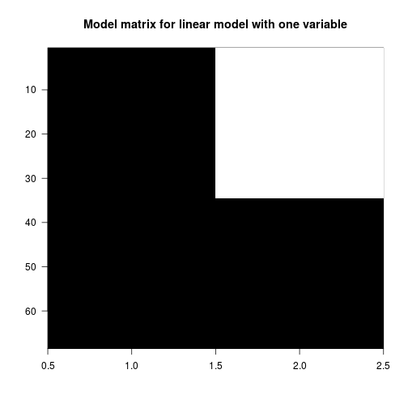
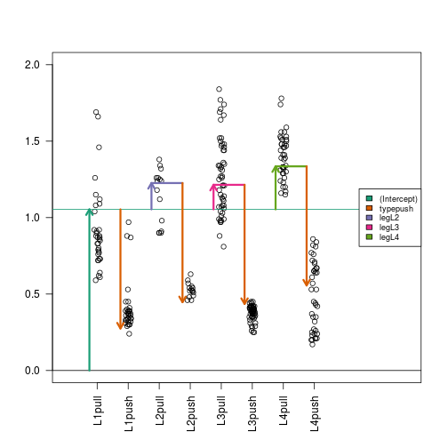
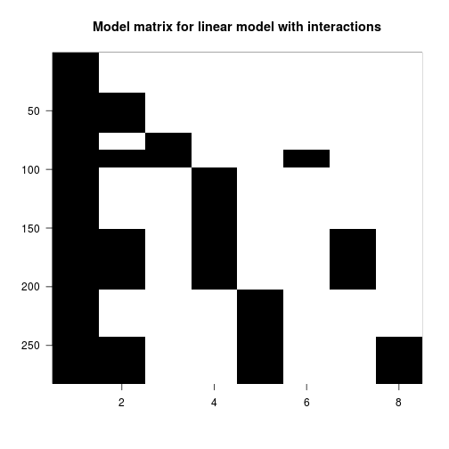
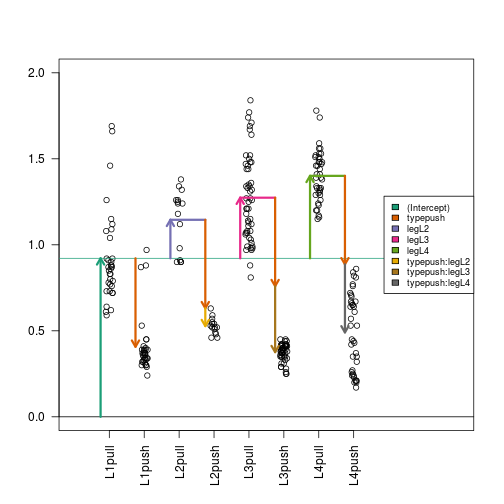
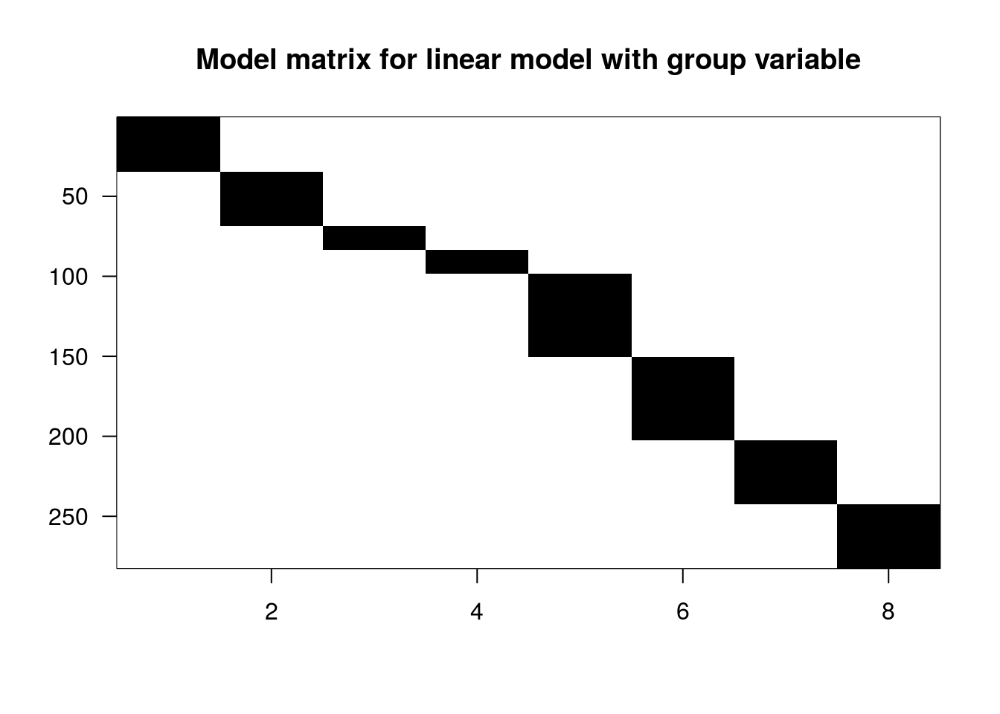
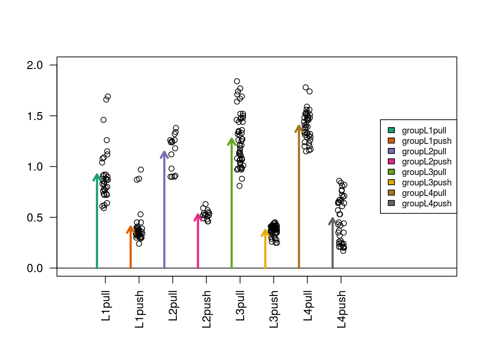

For learning about linear models, we will be using a datasest which compares the different frictional coefficients on the different legs on a spider, and whether more friction comes from a pushing or pulling motion of the leg. The original paper from which the data was provided is:

Jonas O. Wolff  & Stanislav N. Gorb, [Radial arrangement of Janus-like setae permits friction control in spiders](http://dx.doi.org/10.1038/srep01101), Scientific Reports, 22 January 2013.

The abstract of the paper says, 

> The hunting spider Cupiennius salei (Arachnida, Ctenidae) possesses hairy attachment pads (claw tufts) at its distal legs, consisting of directional branched setae... Friction of claw tufts on smooth glass was measured to reveal the functional effect of seta arrangement within the pad.

Figure 1 includes some pretty cool electron microscope images of the tufts. We are intereseted in the comparisons in Figure 4, where the pulling and pushing motions are compared for different leg pairs (for an example of pushing and pulling see the top of Figure 3). We can recreate Figure 4 of the paper, by loading the data and calling boxplot():


```r
url <- "https://raw.githubusercontent.com/genomicsclass/dagdata/master/inst/extdata/spider_wolff_gorb_2013.csv"
filename <- "spider_wolff_gorb_2013.csv"
library(downloader)
if (!file.exists(filename)) download(url, filename)
spider <- read.csv(filename, skip=1)
boxplot(spider$friction ~ spider$type * spider$leg, 
        col=c("grey90","grey40"), las=2, 
        main="Comparison of friction coefficients of different leg pairs ")
```

 

## Initial visual inspection of the data

What we can see immediately, are two trends: 

* pulling motion has a higher frictional coefficient than pushing motion
* the leg pairs to the back of the spider (L4 being the last) generally have higher pulling frictional coefficients.

Another thing to notice is that the groups have different spread, what we call *within-group variance*. This is somewhat of a problem for the kinds of linear models we will explore below, because we will assume that around the fitted values $\hat{Y}_i$, the errors $\varepsilon_i$ are distributed identically, meaning the same variance within each group. The consequence of ignoring the different variance is that comparisons between the groups with small variances will be overly "conservative" (because the overall estimate of variance is larger than these groups), and comparisons between the groups with large variances will be overly confident.

If the spread is related to the location, such that groups with large values also have larger spread, a possibility is to transform the data with a function such as the `log` or `sqrt`. This looks like it could be useful here, as three of the four push groups (L1, L2, L3) have the smallest values and also the smallest spread.

Alternative tests for comparing groups without transforming the values first are: t-tests without the equal variance assumption, using a "Welch" or "Satterthwaite approximation", or a test of a shift in distribution, such as the Mann-Whitney-Wilcoxon test.

However, we will continue, and show the different kinds of linear models using this dataset, setting aside the issue of different within-group variances.

## A linear model with one variable

Just to remind ourselves about the simple two-group linear model, let's subset to the L1 leg pair, and run `lm`:


```r
spider.sub <- spider[spider$leg == "L1",]
fit <- lm(friction ~ type, data=spider.sub)
summary(fit)
```

```
## 
## Call:
## lm(formula = friction ~ type, data = spider.sub)
## 
## Residuals:
##      Min       1Q   Median       3Q      Max 
## -0.33147 -0.10735 -0.04941 -0.00147  0.76853 
## 
## Coefficients:
##             Estimate Std. Error t value Pr(>|t|)    
## (Intercept)  0.92147    0.03827  24.078  < 2e-16 ***
## typepush    -0.51412    0.05412  -9.499  5.7e-14 ***
## ---
## Signif. codes:  0 '***' 0.001 '**' 0.01 '*' 0.05 '.' 0.1 ' ' 1
## 
## Residual standard error: 0.2232 on 66 degrees of freedom
## Multiple R-squared:  0.5776,	Adjusted R-squared:  0.5711 
## F-statistic: 90.23 on 1 and 66 DF,  p-value: 5.698e-14
```

```r
(coefs <- coef(fit))
```

```
## (Intercept)    typepush 
##   0.9214706  -0.5141176
```

We remember that the coefficients are just the mean of the pull observations, and the difference between the means of the two groups:


```r
s <- split(spider.sub$friction, spider.sub$type)
mean(s[["pull"]])
```

```
## [1] 0.9214706
```

```r
mean(s[["push"]]) - mean(s[["pull"]])
```

```
## [1] -0.5141176
```

We can form the design matrix which was used internally to `lm`:


```r
X <- model.matrix(~ type, data=spider.sub)
colnames(X)
```

```
## [1] "(Intercept)" "typepush"
```

```r
head(X)
```

```
##   (Intercept) typepush
## 1           1        0
## 2           1        0
## 3           1        0
## 4           1        0
## 5           1        0
## 6           1        0
```

```r
tail(X)
```

```
##    (Intercept) typepush
## 63           1        1
## 64           1        1
## 65           1        1
## 66           1        1
## 67           1        1
## 68           1        1
```

Now we'll make a plot of the `X` matrix, by putting a black block for the 1's in the design matrix and a white block for the 0's. This plot will be more interesting for the linear models later on in this script. Along the y-axis is the sample number (the row number of the `data`), and along the x-axis is the column of the design matrix $\mathbf{X}$. If you have installed the *rafalib* library, you can make this plot with the `imagemat` function:


```r
# library(devtools); install_github("ririzarr/rafalib")
library(rafalib)
```

```
## Loading required package: RColorBrewer
```

```r
imagemat(X, main="Model matrix for linear model with one variable")
```

 

### Examining the coefficients

Now we will use a big chunk of code just to show how the coefficients from the linear model can be drawn as arrows. You wouldn't necessarily use this code in your daily practice, but it's helpful for visualizing what's going on in the linear model in your head.


```r
stripchart(split(spider.sub$friction, spider.sub$type), 
           vertical=TRUE, pch=1, method="jitter", las=2, xlim=c(0,3), ylim=c(0,2))
a <- -0.25
lgth <- .1
library(RColorBrewer)
cols <- brewer.pal(3,"Dark2")
abline(h=0)
arrows(1+a,0,1+a,coefs[1],lwd=3,col=cols[1],length=lgth)
abline(h=coefs[1],col=cols[1])
arrows(2+a,coefs[1],2+a,coefs[1]+coefs[2],lwd=3,col=cols[2],length=lgth)
abline(h=coefs[1]+coefs[2],col=cols[2])
legend("right",names(coefs),fill=cols,cex=.75,bg="white")
```

 

## A linear model with two variables

Now, we'll continue and examine the full dataset, including the observations from all leg pairs. In order to model both the leg pair differences and the push vs pull difference, we need to include both terms in the formula. Let's see what kind of design matrix will be formed with two variables in the formula:


```r
X <- model.matrix(~ type + leg, data=spider)
colnames(X)
```

```
## [1] "(Intercept)" "typepush"    "legL2"       "legL3"       "legL4"
```

```r
head(X)
```

```
##   (Intercept) typepush legL2 legL3 legL4
## 1           1        0     0     0     0
## 2           1        0     0     0     0
## 3           1        0     0     0     0
## 4           1        0     0     0     0
## 5           1        0     0     0     0
## 6           1        0     0     0     0
```

```r
imagemat(X, main="Model matrix for linear model with two factors")
```

 

The first column is the intercept, and so has 1's for all samples. The second column has 1's for the push samples, and we can see that there are four groups of them. Finally, the third, fourth and fifth columns have 1's for the L2, L3 and L4 samples. The L1 samples do not have a column, because *L1* is the reference level for `leg`, as is *pull* for the `type` variable.

To run this model, we use `lm` with the formula `~ type + leg`. We'll save the linear model to `fitTL` standing for a fit with Type and Leg.


```r
fitTL <- lm(friction ~ type + leg, data=spider)
summary(fitTL)
```

```
## 
## Call:
## lm(formula = friction ~ type + leg, data = spider)
## 
## Residuals:
##      Min       1Q   Median       3Q      Max 
## -0.46392 -0.13441 -0.00525  0.10547  0.69509 
## 
## Coefficients:
##             Estimate Std. Error t value Pr(>|t|)    
## (Intercept)  1.05392    0.02816  37.426  < 2e-16 ***
## typepush    -0.77901    0.02482 -31.380  < 2e-16 ***
## legL2        0.17192    0.04569   3.763 0.000205 ***
## legL3        0.16049    0.03251   4.937 1.37e-06 ***
## legL4        0.28134    0.03438   8.183 1.01e-14 ***
## ---
## Signif. codes:  0 '***' 0.001 '**' 0.01 '*' 0.05 '.' 0.1 ' ' 1
## 
## Residual standard error: 0.2084 on 277 degrees of freedom
## Multiple R-squared:  0.7916,	Adjusted R-squared:  0.7886 
## F-statistic:   263 on 4 and 277 DF,  p-value: < 2.2e-16
```

```r
(coefs <- coef(fitTL))
```

```
## (Intercept)    typepush       legL2       legL3       legL4 
##   1.0539153  -0.7790071   0.1719216   0.1604921   0.2813382
```

### Reminder: the matrix algebra

We can do some quick matrix algebra to remind ourselves that the coefficients returned by `lm` are obtained with the following formula:

$$ \hat{\boldsymbol{\beta}} = (\mathbf{X}^t \mathbf{X})^{-1} \mathbf{X}^t \mathbf{Y} $$


```r
Y <- spider$friction
X <- model.matrix(~ type + leg, data=spider)
beta <- solve(t(X) %*% X) %*% t(X) %*% Y
t(beta)
```

```
##      (Intercept)   typepush     legL2     legL3     legL4
## [1,]    1.053915 -0.7790071 0.1719216 0.1604921 0.2813382
```

```r
coefs
```

```
## (Intercept)    typepush       legL2       legL3       legL4 
##   1.0539153  -0.7790071   0.1719216   0.1604921   0.2813382
```

### Examining the coefficients

We can make the same plot as before, with arrows for each of the coefficients in the model. Note that the orange arrow represents the difference between the push and pull samples for all groups.


```r
spider$group <- factor(paste0(spider$leg, spider$type))
stripchart(split(spider$friction, spider$group), 
           vertical=TRUE, pch=1, method="jitter", las=2, xlim=c(0,11), ylim=c(0,2))
cols <- brewer.pal(5,"Dark2")
abline(h=0)
arrows(1+a,0,1+a,coefs[1],lwd=3,col=cols[1],length=lgth)
abline(h=coefs[1],col=cols[1])
arrows(3+a,coefs[1],3+a,coefs[1]+coefs[3],lwd=3,col=cols[3],length=lgth)
arrows(5+a,coefs[1],5+a,coefs[1]+coefs[4],lwd=3,col=cols[4],length=lgth)
arrows(7+a,coefs[1],7+a,coefs[1]+coefs[5],lwd=3,col=cols[5],length=lgth)
arrows(2+a,coefs[1],2+a,coefs[1]+coefs[2],lwd=3,col=cols[2],length=lgth)
segments(3+a,coefs[1]+coefs[3],4+a,coefs[1]+coefs[3],lwd=3,col=cols[3])
arrows(4+a,coefs[1]+coefs[3],4+a,coefs[1]+coefs[3]+coefs[2],lwd=3,col=cols[2],length=lgth)
segments(5+a,coefs[1]+coefs[4],6+a,coefs[1]+coefs[4],lwd=3,col=cols[4])
arrows(6+a,coefs[1]+coefs[4],6+a,coefs[1]+coefs[4]+coefs[2],lwd=3,col=cols[2],length=lgth)
segments(7+a,coefs[1]+coefs[5],8+a,coefs[1]+coefs[5],lwd=3,col=cols[5])
arrows(8+a,coefs[1]+coefs[5],8+a,coefs[1]+coefs[5]+coefs[2],lwd=3,col=cols[2],length=lgth)
legend("right",names(coefs),fill=cols,cex=.75,bg="white")
```

 

Because we have 8 groups, and only 5 coefficients, the fitted means (the tips of the arrows) do not line up exactly with the mean of each group, like they did for the previous example of a two group linear model.


```r
s <- split(spider$friction, spider$group)
mean(s[["L1pull"]])
```

```
## [1] 0.9214706
```

```r
coefs[1]
```

```
## (Intercept) 
##    1.053915
```

```r
mean(s[["L1push"]])
```

```
## [1] 0.4073529
```

```r
coefs[1] + coefs[2]
```

```
## (Intercept) 
##   0.2749082
```

We can demonstrate, though, that the push vs pull coefficient, `coefs[2]`, is now a weighted mean of the difference of means for each group. And the weighting is determined by the sample size of each group.


```r
means <- sapply(s, mean)
ns <- sapply(s, length)[c(1,3,5,7)]
(w <- ns/sum(ns))
```

```
##    L1pull    L2pull    L3pull    L4pull 
## 0.2411348 0.1063830 0.3687943 0.2836879
```

```r
sum(w * (means[c(2,4,6,8)] - means[c(1,3,5,7)]))
```

```
## [1] -0.7790071
```

```r
coefs[2]
```

```
##   typepush 
## -0.7790071
```

### Contrasting the coefficients

To introduce the concept of *contrasts*, first consider the comparisons which we can read off from the linear model summary:


```r
coefs
```

```
## (Intercept)    typepush       legL2       legL3       legL4 
##   1.0539153  -0.7790071   0.1719216   0.1604921   0.2813382
```

We have the push vs pull effect across all leg pairs, and and the L2 vs L1 effect, the L3 vs L1 effect, and the L4 vs L1 effect. What if we want to compare two groups, and one of the groups is not L1? The solution to this question is to use *contrasts*. 

A *contrast* is a combination of coefficients: $\mathbf{C} \hat{\boldsymbol{\beta}}$, where $\mathbf{C}$ is a row vector with as many columns as the number of coefficients in the linear model. If $\mathbf{C}$ has a 0 then the coefficients are not involved in the contrast.

If we want to compare L3 and L2, this is equivalent to contrasting two coefficents from the linear model, because in this contrast, the comparison to the reference level *L1* cancels out:

$$ (L3 - L1) - (L2 - L1) = L3 - L2 $$

An easy way to make these contrasts of two groups is to use the `contrast` function from the *contrast* package. We just need to specify which groups we want to compare. We have to pick one of *pull* or *push* types, although the answer will not differ, which will we see below.


```r
# install.packages("contrast")
library(contrast)
```

```
## Loading required package: rms
## Loading required package: Hmisc
## Loading required package: grid
## Loading required package: lattice
## Loading required package: survival
## Loading required package: splines
## Loading required package: Formula
## 
## Attaching package: 'Hmisc'
## 
## The following objects are masked from 'package:base':
## 
##     format.pval, round.POSIXt, trunc.POSIXt, units
## 
## Loading required package: SparseM
## 
## Attaching package: 'SparseM'
## 
## The following object is masked from 'package:base':
## 
##     backsolve
```

```r
L3vsL2 <- contrast(fitTL,list(leg="L3",type="pull"),list(leg="L2",type="pull"))
L3vsL2
```

```
## lm model parameter contrast
## 
##     Contrast       S.E.      Lower      Upper     t  df Pr(>|t|)
##  -0.01142949 0.04319685 -0.0964653 0.07360632 -0.26 277   0.7915
```

We can show that the effect size estimate is just the difference between two coefficients. The contrast vector used by `contrast` is stored as `X` within the resulting object:


```r
coefs[4] - coefs[3]
```

```
##       legL3 
## -0.01142949
```

```r
(C <- L3vsL2$X)
```

```
##   (Intercept) typepush legL2 legL3 legL4
## 1           0        0    -1     1     0
## attr(,"assign")
## [1] 0 1 2 2 2
## attr(,"contrasts")
## attr(,"contrasts")$type
## [1] "contr.treatment"
## 
## attr(,"contrasts")$leg
## [1] "contr.treatment"
```

```r
C %*% beta
```

```
##          [,1]
## 1 -0.01142949
```

What about the standard error, and t-statistic? As before, the t-statistic is the estimate (`Contrast`) divided by the standard error (`S.E.`). The standard error of the contrast estimate is formed by multiplying the contrast vector $\mathbf{C}$ on either side of the estimated covariance matrix, $\Sigma \equiv \mathrm{Var}(\hat{\boldsymbol{\beta}})$:

$$ \sqrt{\mathbf{C} \mathbf{\Sigma} \mathbf{C}^T} $$

where we saw the covariance of the coefficients earlier:

$$ \mathbf{\Sigma} = \hat{\sigma}^2 (\mathbf{X}^T \mathbf{X})^{-1}$$


```r
(Sigma <- sum(fitTL$residuals^2)/(nrow(X) - 5) * solve(t(X) %*% X))
```

```
##               (Intercept)      typepush         legL2         legL3
## (Intercept)  0.0007929832 -3.081306e-04 -0.0006389179 -0.0006389179
## typepush    -0.0003081306  6.162612e-04  0.0000000000  0.0000000000
## legL2       -0.0006389179 -6.439411e-20  0.0020871318  0.0006389179
## legL3       -0.0006389179 -6.439411e-20  0.0006389179  0.0010566719
## legL4       -0.0006389179 -1.191291e-19  0.0006389179  0.0006389179
##                     legL4
## (Intercept) -0.0006389179
## typepush     0.0000000000
## legL2        0.0006389179
## legL3        0.0006389179
## legL4        0.0011819981
```

```r
sqrt(C %*% Sigma %*% t(C))
```

```
##            1
## 1 0.04319685
```

```r
L3vsL2$SE
```

```
## [1] 0.04319685
```

Again, to show it doesn't matter if we had picked `type="push"`. The reason it does not change the contrast is because it leads to addition of the `typepush` effect on both sides of the difference, which cancels out.


```r
L3vsL2.equiv <- contrast(fitTL,list(leg="L3",type="push"),list(leg="L2",type="push"))
L3vsL2.equiv$X
```

```
##   (Intercept) typepush legL2 legL3 legL4
## 1           0        0    -1     1     0
## attr(,"assign")
## [1] 0 1 2 2 2
## attr(,"contrasts")
## attr(,"contrasts")$type
## [1] "contr.treatment"
## 
## attr(,"contrasts")$leg
## [1] "contr.treatment"
```

## A linear model with interactions


```r
X <- model.matrix(~ type + leg + type:leg, data=spider)
colnames(X)
```

```
## [1] "(Intercept)"    "typepush"       "legL2"          "legL3"         
## [5] "legL4"          "typepush:legL2" "typepush:legL3" "typepush:legL4"
```

```r
head(X)
```

```
##   (Intercept) typepush legL2 legL3 legL4 typepush:legL2 typepush:legL3
## 1           1        0     0     0     0              0              0
## 2           1        0     0     0     0              0              0
## 3           1        0     0     0     0              0              0
## 4           1        0     0     0     0              0              0
## 5           1        0     0     0     0              0              0
## 6           1        0     0     0     0              0              0
##   typepush:legL4
## 1              0
## 2              0
## 3              0
## 4              0
## 5              0
## 6              0
```

```r
imagemat(X, main="Model matrix for linear model with interactions")
```

 


```r
fitX <- lm(friction ~ type + leg + type:leg, data=spider)
summary(fitX)
```

```
## 
## Call:
## lm(formula = friction ~ type + leg + type:leg, data = spider)
## 
## Residuals:
##      Min       1Q   Median       3Q      Max 
## -0.46385 -0.10735 -0.01111  0.07848  0.76853 
## 
## Coefficients:
##                Estimate Std. Error t value Pr(>|t|)    
## (Intercept)     0.92147    0.03266  28.215  < 2e-16 ***
## typepush       -0.51412    0.04619 -11.131  < 2e-16 ***
## legL2           0.22386    0.05903   3.792 0.000184 ***
## legL3           0.35238    0.04200   8.390 2.62e-15 ***
## legL4           0.47928    0.04442  10.789  < 2e-16 ***
## typepush:legL2 -0.10388    0.08348  -1.244 0.214409    
## typepush:legL3 -0.38377    0.05940  -6.461 4.73e-10 ***
## typepush:legL4 -0.39588    0.06282  -6.302 1.17e-09 ***
## ---
## Signif. codes:  0 '***' 0.001 '**' 0.01 '*' 0.05 '.' 0.1 ' ' 1
## 
## Residual standard error: 0.1904 on 274 degrees of freedom
## Multiple R-squared:  0.8279,	Adjusted R-squared:  0.8235 
## F-statistic: 188.3 on 7 and 274 DF,  p-value: < 2.2e-16
```

```r
coefs <- coef(fitX)
```


### Examining the coefficients


```r
stripchart(split(spider$friction, spider$group), 
           vertical=TRUE, pch=1, method="jitter", las=2, xlim=c(0,11), ylim=c(0,2))
cols <- brewer.pal(8,"Dark2")
abline(h=0)
arrows(1+a,0,1+a,coefs[1],lwd=3,col=cols[1],length=lgth)
abline(h=coefs[1],col=cols[1])
arrows(2+a,coefs[1],2+a,coefs[1]+coefs[2],lwd=3,col=cols[2],length=lgth)
arrows(3+a,coefs[1],3+a,coefs[1]+coefs[3],lwd=3,col=cols[3],length=lgth)
arrows(5+a,coefs[1],5+a,coefs[1]+coefs[4],lwd=3,col=cols[4],length=lgth)
arrows(7+a,coefs[1],7+a,coefs[1]+coefs[5],lwd=3,col=cols[5],length=lgth)
# now the interactions:
segments(3+a,coefs[1]+coefs[3],4+a,coefs[1]+coefs[3],lwd=3,col=cols[3])
arrows(4+a,coefs[1]+coefs[3],4+a,coefs[1]+coefs[3]+coefs[2],lwd=3,col=cols[2],length=lgth)
arrows(4+a,coefs[1]+coefs[2]+coefs[3],4+a,coefs[1]+coefs[2]+coefs[3]+coefs[6],lwd=3,col=cols[6],length=lgth)
#
segments(5+a,coefs[1]+coefs[4],6+a,coefs[1]+coefs[4],lwd=3,col=cols[4])
arrows(6+a,coefs[1]+coefs[4],6+a,coefs[1]+coefs[4]+coefs[2],lwd=3,col=cols[2],length=lgth)
arrows(6+a,coefs[1]+coefs[4]+coefs[2],6+a,coefs[1]+coefs[4]+coefs[2]+coefs[7],lwd=3,col=cols[7],length=lgth)
#
segments(7+a,coefs[1]+coefs[5],8+a,coefs[1]+coefs[5],lwd=3,col=cols[5])
arrows(8+a,coefs[1]+coefs[5],8+a,coefs[1]+coefs[5]+coefs[2],lwd=3,col=cols[2],length=lgth)
arrows(8+a,coefs[1]+coefs[5]+coefs[2],8+a,coefs[1]+coefs[5]+coefs[2]+coefs[8],lwd=3,col=cols[8],length=lgth)
legend("right",names(coefs),fill=cols,cex=.75,bg="white")
```

 

### Contrasts

For some simple cases, we can use the contrast package:


```r
library(contrast)
L2push.vs.pull <- contrast(fitX,
                   list(leg="L2", type = "push"), 
                   list(leg="L2", type = "pull"))
L2push.vs.pull
```

```
## lm model parameter contrast
## 
##  Contrast      S.E.      Lower      Upper     t  df Pr(>|t|)
##    -0.618 0.0695372 -0.7548951 -0.4811049 -8.89 274        0
```

```r
coefs[2] + coefs[6]
```

```
## typepush 
##   -0.618
```

### Differences of differences

The question if the push vs pull difference is different for different legs can be asked in general by the anova() function:


```r
anova(fitX)
```

```
## Analysis of Variance Table
## 
## Response: friction
##            Df Sum Sq Mean Sq  F value    Pr(>F)    
## type        1 42.783  42.783 1179.713 < 2.2e-16 ***
## leg         3  2.921   0.974   26.847 2.972e-15 ***
## type:leg    3  2.098   0.699   19.282 2.256e-11 ***
## Residuals 274  9.937   0.036                       
## ---
## Signif. codes:  0 '***' 0.001 '**' 0.01 '*' 0.05 '.' 0.1 ' ' 1
```

If we want to compare two specific groups, and one of the groups is the L1 group, then we can simply read off the interaction effects in summary(fit).

### Difference of differences not involving the reference level


```r
library(multcomp)
```

```
## Loading required package: mvtnorm
## Loading required package: TH.data
```

```r
C <- matrix(c(0,0,0,0,0,-1,1,0), 1)
L3vsL2interaction <- glht(fitX, linfct=C)
summary(L3vsL2interaction)
```

```
## 
## 	 Simultaneous Tests for General Linear Hypotheses
## 
## Fit: lm(formula = friction ~ type + leg + type:leg, data = spider)
## 
## Linear Hypotheses:
##        Estimate Std. Error t value Pr(>|t|)    
## 1 == 0 -0.27988    0.07893  -3.546  0.00046 ***
## ---
## Signif. codes:  0 '***' 0.001 '**' 0.01 '*' 0.05 '.' 0.1 ' ' 1
## (Adjusted p values reported -- single-step method)
```

```r
coefs[7] - coefs[6]
```

```
## typepush:legL3 
##     -0.2798846
```

## A different specification of the same model


```r
# earlier, we defined the 'group' column:
spider$group <- factor(paste0(spider$leg, spider$type))
X <- model.matrix(~ 0 + group, data=spider)
colnames(X)
```

```
## [1] "groupL1pull" "groupL1push" "groupL2pull" "groupL2push" "groupL3pull"
## [6] "groupL3push" "groupL4pull" "groupL4push"
```

```r
head(X)
```

```
##   groupL1pull groupL1push groupL2pull groupL2push groupL3pull groupL3push
## 1           1           0           0           0           0           0
## 2           1           0           0           0           0           0
## 3           1           0           0           0           0           0
## 4           1           0           0           0           0           0
## 5           1           0           0           0           0           0
## 6           1           0           0           0           0           0
##   groupL4pull groupL4push
## 1           0           0
## 2           0           0
## 3           0           0
## 4           0           0
## 5           0           0
## 6           0           0
```

```r
imagemat(X, main="Model matrix for linear model with group variable")
```

 


```r
fitG <- lm(friction ~ 0 + group, data=spider)
summary(fitG)
```

```
## 
## Call:
## lm(formula = friction ~ 0 + group, data = spider)
## 
## Residuals:
##      Min       1Q   Median       3Q      Max 
## -0.46385 -0.10735 -0.01111  0.07848  0.76853 
## 
## Coefficients:
##             Estimate Std. Error t value Pr(>|t|)    
## groupL1pull  0.92147    0.03266   28.21   <2e-16 ***
## groupL1push  0.40735    0.03266   12.47   <2e-16 ***
## groupL2pull  1.14533    0.04917   23.29   <2e-16 ***
## groupL2push  0.52733    0.04917   10.72   <2e-16 ***
## groupL3pull  1.27385    0.02641   48.24   <2e-16 ***
## groupL3push  0.37596    0.02641   14.24   <2e-16 ***
## groupL4pull  1.40075    0.03011   46.52   <2e-16 ***
## groupL4push  0.49075    0.03011   16.30   <2e-16 ***
## ---
## Signif. codes:  0 '***' 0.001 '**' 0.01 '*' 0.05 '.' 0.1 ' ' 1
## 
## Residual standard error: 0.1904 on 274 degrees of freedom
## Multiple R-squared:   0.96,	Adjusted R-squared:  0.9588 
## F-statistic:   821 on 8 and 274 DF,  p-value: < 2.2e-16
```

```r
coefs <- coef(fitG)
```

### Examining the coefficients


```r
stripchart(split(spider$friction, spider$group), 
           vertical=TRUE, pch=1, method="jitter", las=2, xlim=c(0,11), ylim=c(0,2))
cols <- brewer.pal(8,"Dark2")
abline(h=0)
for (i in 1:8) {
  arrows(i+a,0,i+a,coefs[i],lwd=3,col=cols[i],length=lgth)
}
legend("right",names(coefs),fill=cols,cex=.75,bg="white")
```

 

### Simple contrasts using the contrast package


```r
groupL2push.vs.pull <- contrast(fitG,
                                list(group = "L2push"), 
                                list(group = "L2pull"))
groupL2push.vs.pull
```

```
## lm model parameter contrast
## 
##   Contrast      S.E.      Lower      Upper     t  df Pr(>|t|)
## 1   -0.618 0.0695372 -0.7548951 -0.4811049 -8.89 274        0
```

```r
coefs[4] - coefs[3]
```

```
## groupL2push 
##      -0.618
```

### Differences of differences when there is not an intercept


```r
C <- matrix(c(0,0,1,-1,-1,1,0,0), 1)
groupL3vsL2interaction <- glht(fitG, linfct=C)
summary(groupL3vsL2interaction)
```

```
## 
## 	 Simultaneous Tests for General Linear Hypotheses
## 
## Fit: lm(formula = friction ~ 0 + group, data = spider)
## 
## Linear Hypotheses:
##        Estimate Std. Error t value Pr(>|t|)    
## 1 == 0 -0.27988    0.07893  -3.546  0.00046 ***
## ---
## Signif. codes:  0 '***' 0.001 '**' 0.01 '*' 0.05 '.' 0.1 ' ' 1
## (Adjusted p values reported -- single-step method)
```

```r
(coefs[6] - coefs[5]) - (coefs[4] - coefs[3])
```

```
## groupL3push 
##  -0.2798846
```

