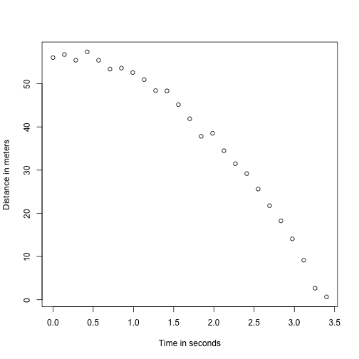
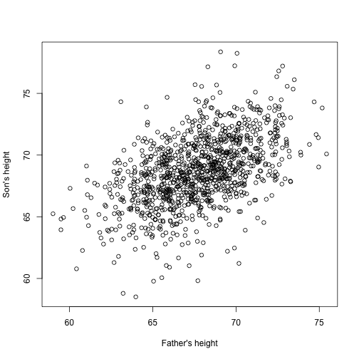
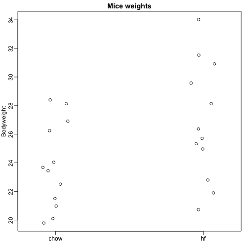

# Introduciton


```r
library(rafalib)
```

```
## Loading required package: RColorBrewer
```

```r
mypar2()
```

We are going to describe three examples from the life sciences. One from physics, one related to genetics, and one from an mouse experiment. They are very different yet we end up using the same statistical technique: fitting linear models. Linear models typically taught and described in the language of matrix algebra. We will teach you both. 

# Objects falling

Imagine you are Galileo back in the 16th century trying to describe the velocity of an objects falling. An assistant climbs the Tower of Pizza and drops a ball while several another record the position at different times. Let's simulate some data the equations we know today and adding some measurement error:

```r
set.seed(1)
g <- 9.8 ## meters per second
n <- 25
tt <- seq(0,3.4,len=n) ##time in secs, t is a base function
d <- 56.67  - 0.5*g*tt^2 + rnorm(n,sd=1)
```

The assistants hand the data to Galileo and this is what he sees:


```r
plot(tt,d,ylab="Distance in meters",xlab="Time in seconds")
```

 

He does not know the exact equation but looking at the plot above, he form a theory that the position should follow a parabola. So he models the data with:

$$ Y_i = \beta_0 + \beta_1 x_i + \beta_2 x_i^2 + \varepsilon, i=1,\dots,n $$

With $Y_i$ representing location, $t_i$ representing the time, and $\varepsilon$ accounts for measurement error. 

But what are the $\beta$s? A standard approach in science is to find the values that minimize the distance of the fitted curve to the data. The following is called the least squares equation and we will see it often in this chapter:

$$ \sum_{i=1}^n \\{  Y_i - (\beta_0 + \beta_1 t_i + \beta_2 t_i^2)\\}^2 $$

Note, here we can use calculus and find the values: take the partial derivatives and set them to 0 and solve. Linear algebra provides another way of solving this problem. We will see that soon. Once we find the minimu, wel call the values the least squares estimates (LSE) and denote them with $\hat{\beta}$. The quantity retured by the least square equation above for these estimates is called the residual sum of squares (RSS). Note that because all these quantities depend on $y$ *they are random variables*.


# Father son's heights
Now imagine you are Francis Galton in the 19th century and you collect paired height data from father and sons. You suspect that height is inherited. Your data 


```r
#install.packages("UsingR")
library(UsingR)
x=father.son$fheight
y=father.son$sheight
```

looks like this:


```r
plot(x,y,xlab="Father's height",ylab="Son's height")
```

 

The son's height does seem to increase linearly with father's height. In this case a model that describes the data is as follows:

$$ Y_i = \beta_0 + \beta_1 x_i + \varepsilon, i=1,\dots,N $$

With $x_i$ and $Y_i$ the father and son heights respectively, for the $i$-th pair and $\varepsilon$ a term to account for the extra variability. Here we think of the father's height as the predictor and being fixed (not random) so we use lower case. Note that measurement error can't explain all the variability seen in $\varepsilon$. Note that this makes sense as there are other variables not in the model, for example, mother's height and environmentalism factors.

Now, how do pick $\beta_0$ and $\beta_1$ ? As before a widely used approach is to minimize the least squares:

$$ \sum_{i=1}^N \\{  Y_i - (\beta_0 + \beta_1 x_i) \\}^2 $$

Note that this equation is similar to the one used with a dropped object data. Next we will described how linear algebra gives us a way to find the least squares estimates generally. 

## More on Galton (advanced)
When studying this data, Galton made a fascinating discovery using exploratory analysis.

<center>

</center>

He noted that if he tabulated the number of father/son height pairs and followed all the x,y values having the same totals in the table
they formed an ellipses. Below you see the ellipsis formed by the pairs having 3 cases. This then led to modeling this data as correlated bivariate normal. 

$$ Pr(X<a,Y<b) = \int_{-\infty}^{a} \int_{-\infty}^{b} \frac{1}{2\pi\sigma_x\sigma_y\sqrt{1-\rho^2}}
\exp{ \left\\{
\frac{1}{2(1-\rho^2)}
\left[\left(\frac{x-\mu_x}{\sigma_x}\right)^2 -  
2\rho\left(\frac{x-\mu_x}{\sigma_x}\right)\left(\frac{y-\mu_y}{\sigma_y}\right)+
\left(\frac{y-\mu_y}{\sigma_y}\right)^2
\right]
\right\\}
}
$$

From here we can show, with some math, that if you keep $X$ fixed (condition to be $x$) the the distribution of $Y$ is normally distributed with mean:
$\mu_x +\sigma_y \rho \left(\frac{x-\mu_x}{\sigma_x}\right)$ and standard deviation $\sigma_y \sqrt{1-\rho^2}$. Note that $\rho$ is the correlation between $Y$ and $X$ and this implies that if we fix $X=x$, $Y$ does in fact follow a linear model. Homework what are $\beta_0$ and $\beta_1$ in terms of $\mu_x,\mu_y,\sigma_x,\sigma_y$, and $\rho$. It turns out that the least squares estimate of $\beta_1$ can be written in terms of the sample correlation and standard deviations.

# Random samples from multiple populations

Here we read-in mouse body weight data from mice that were fed two different diets, high fat and control (chow). We have a random sample of 12 mice for each. We are interested in determining if the diet has an effect on weight. Here is the data


```r
dir <- system.file(package="dagdata")
filename <- file.path(dir,"extdata/femaleMiceWeights.csv")
dat <- read.csv(filename)
mypar2(1,1)
stripchart(Bodyweight~Diet,data=dat,vertical=TRUE,method="jitter",pch=1,main="Mice weights")
```

 

We want to estimate the difference in average weight between populations. We showed how we can use t-tests and condifence intervals based on the difference in sample averages to do this. Although linear algebrea does not actually simplify the calculations here, it is worth noting that we can in fact also accomdate this data with a linear model:

$$ Y_i = \beta_0 + \beta_1 x_{i} + \varepsilon_i$$

with $\beta_0$ the chow diet average weight,
$\beta_1$ the difference between averages,
$x_i = 1$ when mouse $i$ gets the high fat (hf) diet, $x_i = 0$ when it gets the chow diet, and 
 $\varepsilon_i$ explains the differences between mice of same population. 
 
 We will see many models like this one later.

# General linear model

A general model that encompases all of the above examples is the following:

$$ Y_i = \beta_0 + \beta_1 x_{i,1} + \beta_2 x_{i,2} + \dots +  \beta_2 x_{i,p} \varepsilon_i, i=1,\dots,n $$

 
$$ Y_i = \beta_0 + \sum_{j=1}^p \beta_j x_{i,j} + \varepsilon_i, i=1,\dots,n $$

Note that we have a general number of predictors $p$. Matrix algebra provides a compact language and mathematical framework to compute and make derivations with any linear models that first into the above framework,
