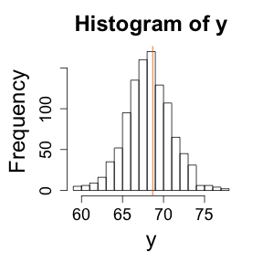
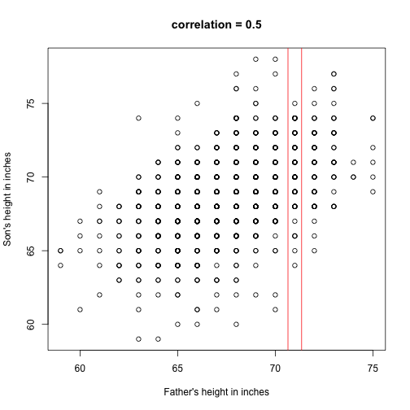
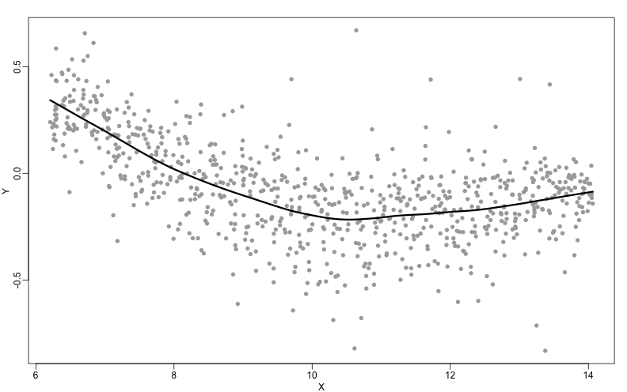
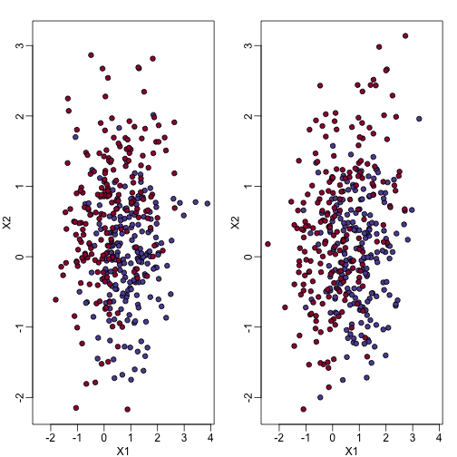
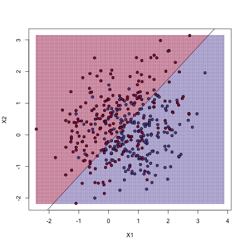

# Introduction
Here we give brief introduction to machine learning. Some of the examples we give follows examples from the book The Elements of Statistical Learning: Data Mining, Inference, and Prediction, by Trevor Hastie, Robert Tibshirani and Jerome Friedman. A free PDF of this book can be found at the following URL:

<http://statweb.stanford.edu/~tibs/ElemStatLearn/>

Similar to inference in the context of regression, Machine Learning (ML) studies the relationships between outcomes $$Y$$ and covariates $$X$$. In ML we call $$X$$ the predictors. The main difference between ML and inference is that in ML we are interested in predicting $$Y$$ using $$X$$. Statistical models are used, but while in inference we estimate and interpret model parameters, in ML they are mainly a means to an end: predicting $$Y$$. 

Here we introduce the main concepts needed to understand ML along with two specific algorithms: regression and k nearest neighbors (knn). Note there are dozens of popular algorithms that we do not cover here are some 


# Conditional probabilities and expectations

Prediction problems can be divided into categorical and continuous outcomes. However, many of the algorithms can be applied to both due to the connection between conditional probabilities and conditional expectations. 

In categorical problems, for example binary outcome, if we know the probability of $$Y$$ being a 1 given that we know the value of the predictors $$X=(X_1,\dots,X_p)^\top$$ then we can optimize our predictions. We write this probability like this $$f(x)=\mbox{Pr}(Y=1|X=x)$$. Note that $$Y$$ is a random variable which implies we are not guaranteed perfect prediction (unless these probabilities are 1 or 0). You can think of this probability as the proportion of the population with covariates $$X=x$$ that is a 1.

Now, given that the expectation is the average of all the values of $$Y$$, in this is equivalent to the proportion of 1s which in this case is the probability. So for this case $$f(x) \equiv \mbox{E}(Y|X=x)=\mbox{Pr}(Y=1|X=x)$$. The expected value has another attractive mathematical property and it is that it minimized the expected distance between the predictor $$\hat{Y}$$ and $$Y$$: $$\mbox{E}\{ (\hat{Y} - Y)^2 | X=x \}$$. 

Here, we start by describing linear regression in the context of prediction. We use the son and father height example to illustrate. In our example we are trying to predict the son's height $$Y$$ based on the father's $$X$$. Note that here we have only on predictor. Note that if we are asked to predict the height of a randomly selected son we would go with the mean:


```r
library(rafalib)
mypar(1,1)
library(UsingR)
data("father.son")
x=round(father.son$fheight) ##round to nearest inch
y=round(father.son$sheight)
hist(y,breaks=seq(min(y),max(y)))
abline(v=mean(y),col=2)
```

 

In this case we can also approximate the distribution of $$Y$$ as normal which implies the mean maximizes the probability density. 

Now imagine we are given more information. We are told the the father of this randomly selected son has height 71 inches (1.2 SDs taller than the average) What is our prediction now? 


```r
plot(x,y,xlab="Father's height in inches",ylab="Son's height in inches",main=paste("correlation =",signif(cor(x,y),2)))
abline(v=c(-0.35,0.35)+71,col="red")
```

 

```r
hist(y[x==71],xlab="Heights",nc=8,main="",xlim=range(y))
```

 

<a name="regression"></a>

## Stratification
The best guess is still the expectation, but our strata has changed from all the data to only the $$Y$$ with $$X=71$$. So we can stratify and take the average which is the conditional expectations. Out prediction for any $$x$$ is therefore:
$$
f(x) = E(Y|X=x)
$$

It turns that because this data is approximated by a bivariate normal distribution we can, using calculus, show that 
$$
f(x) = \mu_Y + \rho \frac{\sigma_Y}{\sigma_X} (X-\mu_X)
$$
and if we estimate these five parameters from the sample we get the regression line:


```r
plot(x,y,xlab="Father's height in inches",ylab="Son's height in inches",main=paste("correlation =",signif(cor(x,y),2)))
abline(v=c(-0.35,0.35)+71,col="red")
abline(lm(y~x),col=1)
```

 

```r
hist(y[x==71],xlab="Heights",nc=8,main="",xlim=range(y))
```

 

In this particular case the regression line provides an optimal prediction function for $$Y$$. But this is not generally true

<a name="smoothing"></a>

# Smoothing 

The following data are from measurements from replicated RNA. We consider that data used in an the MA-plot ($$Y$=log ratios and $$A$=averages) and take down-sample in a way that balances the number of points for different strata of $$A$$:


```r
library(SpikeIn)
data(SpikeIn95)

##Example with two columns
i=10;j=9
##remove the spiked in genes and take random sample
siNames<-colnames(pData(SpikeIn95))
ind <- which(!probeNames(SpikeIn95)%in%siNames)
pms <- pm(SpikeIn95)[ ind ,c(i,j)]
##pick a representative sample for A and order A
Y=log2(pms[,1])-log2(pms[,2])
X=(log2(pms[,1])+log2(pms[,2]))/2
set.seed(4)
ind <- tapply(seq(along=X),round(X*5),function(i)
  if(length(i)>20) return(sample(i,20)) else return(NULL))
ind <- unlist(ind)
X <- X[ind]
Y <- Y[ind]
o <-order(X)
X <- X[o]
Y <- Y[o]
```

In the MA plot we see that there $$Y$$ depends on $$X$$. Note that this this dependence must be a bias because these are based on replicates which means $$Y$$ should be 0 on average regardless of $$X$$. We want to predict $$f(x)=E(Y|X=x)$$ so that we can remove this bias.


```r
library(rafalib)
mypar2(1,1)
plot(X,Y)
```


Note that linear regression is biased does not capture the apparent curvature in $$f(x)$$:


Note for example that points above the fitted line (green) and those below (purple) are not evenly distributed.

## Bin Smoothing

Instead of fitting a line, let's go back to the idea of stratifying and computing the mean. This is referred to as _bin smoothing_. Now, if we stratify by $$x$$ The general idea is that the underlying curve is "smooth" enough that in small bins it is approximately constant which implies all the $$Y$$ in that bin have the same expected value. For example, in the plot below we highlight points in a bin centered at 8.6 as well as the points of a bin centered at 12.1 if we us bins of size 1. We also show  and the fitted mean values for the $$Y$$ in those bin (dashed lines):


```r
mypar2(1,1)
centers <- seq(min(X),max(X),0.1)
plot(X,Y,col="grey",pch=16)
windowSize <- .5
i <- 25
center<-centers[i]
ind=which(X>center-windowSize & X<center+windowSize)
fit<-mean(Y)
points(X[ind],Y[ind],bg=3,pch=21)
lines(c(min(X[ind]),max(X[ind])),c(fit,fit),col=2,lty=2,lwd=4)
i <- 60
center<-centers[i]
ind=which(X>center-windowSize & X<center+windowSize)
fit<-mean(Y[ind])
points(X[ind],Y[ind],bg=3,pch=21)
lines(c(min(X[ind]),max(X[ind])),c(fit,fit),col=2,lty=2,lwd=4)
```


By computing this mean for bins around every point we form an estimate of the underlying curve $$f(x)$$:

```r
windowSize<-0.5
smooth<-rep(NA,length(centers))
mypar2(4,3)
for(i in seq(along=centers)){
  center<-centers[i]
  ind=which(X>center-windowSize & X<center+windowSize)
  smooth[i]<-mean(Y[ind])
  if(i%%round(length(centers)/12)==1){ ##we show 12
    plot(X,Y,col="grey",pch=16)
    points(X[ind],Y[ind],bg=3,pch=21)
    lines(c(min(X[ind]),max(X[ind])),c(smooth[i],smooth[i]),col=2,lty=2)
    lines(centers[1:i],smooth[1:i],col="black")
    points(centers[i],smooth[i],col="black",pch=16,cex=1.5)
  }
}
```


The final result looks like this:


##Loess
 
Local weighted regression (loess) is similar to bin smoothing. The difference is that we approximate the local behavior with a line or a parabola. This permits us to expand the bin sizes as seen below:


```r
centers <- seq(min(X),max(X),0.1)
mypar2(1,1)
plot(X,Y,col="darkgrey",pch=16)
windowSize <- 1
i <- 25
center<-centers[i]
ind=which(X>center-windowSize & X<center+windowSize)
fit<-lm(Y~X,subset=ind)
points(X[ind],Y[ind],bg=3,pch=21)
a <- min(X[ind]);b <- max(X[ind])
lines(c(a,b),fit$coef[1]+fit$coef[2]*c(a,b),col=2,lty=2,lwd=3)
i <- 60
center<-centers[i]
ind=which(X>center-windowSize & X<center+windowSize)
fit<-lm(Y~X,subset=ind)
points(X[ind],Y[ind],bg=3,pch=21)
a <- min(X[ind]);b <- max(X[ind])
lines(c(a,b),fit$coef[1]+fit$coef[2]*c(a,b),col=2,lty=2,lwd=3)
```


Here are 12 steps of the process:

```r
mypar2(4,3)
windowSize<-1
smooth<-rep(NA,length(centers))
for(i in seq(along=centers)){
  center<-centers[i]
  ind=which(X>center-windowSize & X<center+windowSize)
  fit<-lm(Y~X,subset=ind)
  smooth[i]<-fit$coef[1]+fit$coef[2]*center

  if(i%%round(length(centers)/12)==1){ ##we show 12
    plot(X,Y,col="grey",pch=16)
    points(X[ind],Y[ind],bg=3,pch=21)
    a <- min(X[ind]);b <- max(X[ind])
    lines(c(a,b),fit$coef[1]+fit$coef[2]*c(a,b),col=2,lty=2)
  
    lines(centers[1:i],smooth[1:i],col="black")
    points(centers[i],smooth[i],col="black",pch=16,cex=1.5)
  }
}
```


This results is a smoother fit since we use larger sample sizes to estimate our local parameters:


# Multivariate predictors

Most of ML is concerned with cases with more than one predictor. For illustration purposes we move to a case in which $$X$$ is two dimensional and $$Y$$ is binary. We simulate a situation with a non-linear relationship using an example from Hastie, Tibshirani and Friedman's book. In the plot below we show the actual values of $$f(x_1,x_2)=E(Y|X_1=x_1,X_2=x_2)$$ using colors


```r
library(rafalib)
hmcol <- colorRampPalette(rev(brewer.pal(11, "Spectral")))(100)
mycols=c(hmcol[1],hmcol[100])

set.seed(1)
##create covariates and outcomes
##outcomes are alwasy 50 0s and 50 1s
s2=0.15
##pick means to create a non linear conditional expectation
M0 <- mvrnorm(10,c(1,0),s2*diag(2)) ##generate 10 means
M1 <- rbind(mvrnorm(3,c(1,1),s2*diag(2)),
            mvrnorm(3,c(0,1),s2*diag(2)),
            mvrnorm(4,c(0,0),s2*diag(2)))

###funciton to generate random pairs
s<- sqrt(1/5)
N=200
makeX <- function(M,n=N,sigma=s*diag(2)){
  z <- sample(1:10,n,replace=TRUE) ##pick n at random from above 10
  m <- M[z,] ##these are the n vectors (2 components)
  return(t(apply(m,1,function(mu) mvrnorm(1,mu,sigma)))) ##the final values
}


###create the training set and the test set
x0 <- makeX(M0)##the final values for y=0 (green)
testx0 <- makeX(M0)
x1 <- makeX(M1)
testx1 <-makeX(M1)
x <- rbind(x0,x1) ## one matrix with everything
test <- rbind(testx0,testx1)
y <- c(rep(0,N),rep(1,N)) #the outcomes
ytest <- c(rep(0,N),rep(1,N))
cols <- mycols[c(rep(1,N),rep(2,N))]
colstest <- cols

##Create a grid so we can predict all of X,Y
GS <- 150 ##grid size is GS x GS
XLIM <- c(min(c(x[,1],test[,1])),max(c(x[,1],test[,1])))
tmpx <- seq(XLIM[1],XLIM[2],len=GS)
YLIM <- c(min(c(x[,2],test[,2])),max(c(x[,2],test[,2])))
tmpy <- seq(YLIM[1],YLIM[2],len=GS)
newx <- expand.grid(tmpx,tmpy) #grid used to show color contour of predictions

###Bayes rule: best possible answer
p <- function(x){ ##probability of Y given X
  p0 <- mean(dnorm(x[1],M0[,1],s)*dnorm(x[2],M0[,2],s))
  p1 <- mean(dnorm(x[1],M1[,1],s)*dnorm(x[2],M1[,2],s))
  p1/(p0+p1)
}

###Create the bayesrule prediction
bayesrule <- apply(newx,1,p)
colshat <- bayesrule

colshat <- hmcol[floor(bayesrule*100)+1]

mypar2(1,1)
plot(x,type="n",xlab="X1",ylab="X2",xlim=XLIM,ylim=YLIM)
points(newx,col=colshat,pch=16,cex=0.35)
```

 

If we should $$E(Y|X=x)>0.5$$ in red and the rest in blue we see the boundary region in which we switch from predicting from 0 to 1.


```r
##Draw contours of E(Y|X) < 0.5
mypar2(1,1)
colshat[bayesrule>=0.5] <- mycols[2]
colshat[bayesrule<0.5] <- mycols[1]
plot(x,type="n",xlab="X1",ylab="X2",xlim=XLIM,ylim=YLIM)
points(newx,col=colshat,pch=16,cex=0.35)
contour(tmpx,tmpy,matrix(round(bayesrule),GS,GS),levels=c(1,2),add=TRUE,drawlabels=FALSE)
```

 

The above plots relate to the "truth" that we do not get to see. A typical first step in an ML is to use a sample to estimate $$f(x)$$ 
Now make a plot of training data and test data

```r
plot(x,pch=21,bg=cols,xlab="X1",ylab="X2",xlim=XLIM,ylim=YLIM)
```

 

We will review two specif ML techniques. First, we need to review the main concept we use to evaluate the performance of these methods. 

# Training and Test sets

In the code above you will notice that we created two sets data""


```r
x0 <- makeX(M0)##the final values for y=0 (green)
testx0 <- makeX(M0)
x1 <- makeX(M1)
testx1 <-makeX(M1)
x <- rbind(x0,x1) ## one matrix with everything
test <- rbind(testx0,testx1)
```

You will notice that the test and train set have similar global properties as they were generated by the same random variables (more blue towards the bottom right) but are, by construction, different. 

```r
mypar2(1,2)
plot(x,pch=21,bg=cols,xlab="X1",ylab="X2",xlim=XLIM,ylim=YLIM)
plot(test,pch=21,bg=colstest,xlab="X1",ylab="X2",xlim=XLIM,ylim=YLIM)
```

 

The reason for this is to detect over-training  by testing on a different data than the one used to fit  model. We will see how important this is.


## Predicting with regression


A first naive approach to this ML problem is to fit a two variable linear regression model:


```r
X1 <- x[,1] ##these are the covariates
X2 <- x[,2] 
fit1 <- lm(y~X1+X2)
```

Once we the fitted values we can estimate $$f(x_1,x_2)$$ with $$\hat{f}(x_1,x_2)=\hat{\beta}_0 + \hat{\beta}_1x_1 +\hat{\beta}_2$$. When predicting 1s and 0s we simply predict 1 when $$\hat{f}(x_1,x_2)>0.5$$. We now examine the error rates in the test and training sets and also plot the boundary region:


```r
##prediction on train
yhat <- predict(fit1)
yhat <- as.numeric(yhat>0.5)
cat("Linear regression prediction error in train:",1-mean(yhat==y),"\n")
```

```
## Linear regression prediction error in train: 0.295
```

We can quickly obtain predicted values for any set of values using the `predict` function:


```r
yhat <- predict(fit1,newdata=data.frame(X1=newx[,1],X2=newx[,2]))
```

Now we can obtain a plot showing where we predict 1s and where we predict 0 as well as the boundary. We can also use the `predict` function to obtain predicted values for our test set. Note that nowhere do we fit the model on the test set: 


```r
colshat <- yhat
colshat[yhat>=0.5] <- mycols[2]
colshat[yhat<0.5] <- mycols[1]
m <- -fit1$coef[2]/fit1$coef[3] #boundary slope
b <- (0.5 - fit1$coef[1])/fit1$coef[3] #boundary intercept

##prediction on test
yhat <- predict(fit1,newdata=data.frame(X1=test[,1],X2=test[,2]))
yhat <- as.numeric(yhat>0.5)
cat("Linear regression prediction error in test:",1-mean(yhat==ytest),"\n")
```

```
## Linear regression prediction error in test: 0.3075
```

```r
plot(test,type="n",xlab="X1",ylab="X2",xlim=XLIM,ylim=YLIM)
abline(b,m)
points(newx,col=colshat,pch=16,cex=0.35)

points(test,bg=cols,pch=21)
```

 

Note that the error rates in the test and train sets are quite similar. Thus do not seem to be over-training. This is not surprising as we are fitting a 2 parameter model to 400 data points. However note that the boundary is a line. Because we are fitting plane to the data, there is no other option here. The linear regression method is too rigid. The rigid makes it stable and avoids over training but it also keeps the model from adapting to the non-linear relationship between $$Y$$ and $$X$$. We saw this before in the smoothing section. The next ML technique we consider is similar to the smoothing techniques described before.

<a name="knn"></a>

# K-nearest neighbor

K-nearest neighbors (kNN) is similar to bin smoothing but it is easier to adapt to multiple dimensions. Basically for any point $$x$$ for which we want an estimate we look for the k nearest points and then take an average. We can now control flexibility through  $$k$$. Here we compare $$k=1$$ and $$k=100$$.


```r
library(class)
mypar2(2,2)
for(k in c(1,200)){
  cat(k,"nearest neighbors\n")
  
  ##predict on train
  yhat <- knn(x,x,y,k=k)
  cat("KNN prediction error in train:",1-mean((as.numeric(yhat)-1)==y),"\n")
  
##make plot
  yhat <- knn(x,newx,y,k=k)
  colshat <- mycols[as.numeric(yhat)]
  
  plot(x,type="n",xlab="X1",ylab="X2",xlim=XLIM,ylim=YLIM)
  points(newx,col=colshat,cex=0.35,pch=16)
  contour(tmpx,tmpy,matrix(as.numeric(yhat),GS,GS),levels=c(1,2),add=TRUE,drawlabels=FALSE)
  points(x,bg=cols,pch=21)
  title(paste("Train: KNN (",k,")",sep=""))
  
  plot(test,type="n",xlab="X1",ylab="X2",xlim=XLIM,ylim=YLIM)
  points(newx,col=colshat,cex=0.35,pch=16)
  contour(tmpx,tmpy,matrix(as.numeric(yhat),GS,GS),levels=c(1,2),add=TRUE,drawlabels=FALSE)
  points(test,bg=cols,pch=21)
  title(paste("Test: KNN (",k,")",sep=""))
  
  yhat <- knn(x,test,y,k=k)
  cat("KNN prediction error in test:",1-mean((as.numeric(yhat)-1)==y),"\n")
}
```

```
## 1 nearest neighbors
## KNN prediction error in train: 0
```

```
## KNN prediction error in test: 0.375 
## 200 nearest neighbors
## KNN prediction error in train: 0.2825
```


```
## KNN prediction error in test: 0.295
```

Note that when $$k=1$$ we make no mistakes in the training test since every point is it's closes neighbor and it is equal to itself. Note that the we some islands of blue in the red area that once we move to the test set are more error prone. In the case $$k=100$$ we do not have this problem and we also see that we improve over linear regression

Here is a comparison of the test and train set errors for various values of $$k$$. We also include the error rate that we would make if we actually knew $$\mobx{E}(Y|X_1=x1,X_2=x_2)$$ referred to as _Bayes Rule_

```r
###Bayes Rule
yhat <- apply(test,1,p)
cat("Bayes rule prediction error in train",1-mean(round(yhat)==y),"\n")
```

```
## Bayes rule prediction error in train 0.2775
```

```r
bayes.error=1-mean(round(yhat)==y)
train.error <- rep(0,16)
test.error <- rep(0,16)
for(k in seq(along=train.error)){
  cat(k,"nearest neighbors\n")
  
  ##predict on train
  yhat <- knn(x,x,y,k=2^(k/2))
  train.error[k] <- 1-mean((as.numeric(yhat)-1)==y)
  
  yhat <- knn(x,test,y,k=2^(k/2))
  test.error[k] <- 1-mean((as.numeric(yhat)-1)==y)
}
```

```
## 1 nearest neighbors
## 2 nearest neighbors
## 3 nearest neighbors
## 4 nearest neighbors
## 5 nearest neighbors
## 6 nearest neighbors
## 7 nearest neighbors
## 8 nearest neighbors
## 9 nearest neighbors
## 10 nearest neighbors
## 11 nearest neighbors
## 12 nearest neighbors
## 13 nearest neighbors
## 14 nearest neighbors
## 15 nearest neighbors
## 16 nearest neighbors
```

```r
ks <- 2^(seq(along=train.error)/2)
mypar()
plot(ks,train.error,type="n",xlab="K",ylab="Prediction Error",log="x",ylim=range(c(test.error,train.error)))
lines(ks,train.error,type="b",col=4,lty=2,lwd=2)
lines(ks,test.error,type="b",col=5,lty=3,lwd=2)
abline(h=bayes.error,col=6)
legend("bottomright",c("Train","Test","Bayes"),col=c(4,5,6),lty=c(2,3,1),box.lwd=0)
```

 


