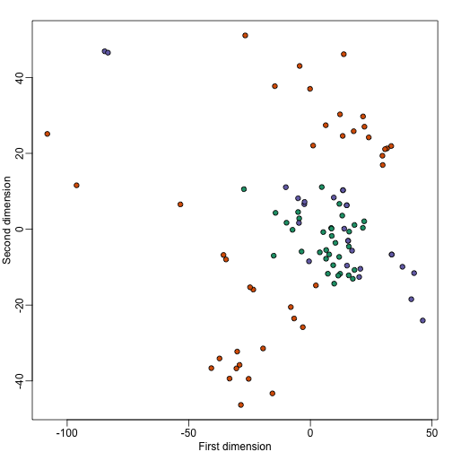
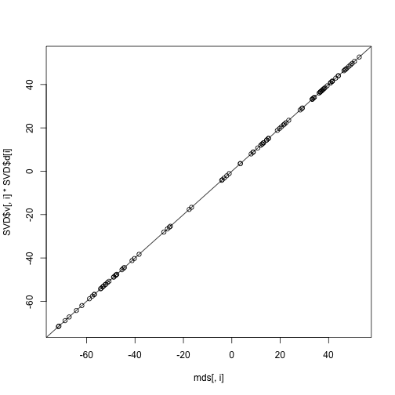

# Introduction

Visualizing data is one of the most, if not the most, important step in the analysis of high throughput data. The right visualization method may reveal problems with the experimental data that can render the results from a standard analysis, that is typically appropriate, completely useless. 

We have shown methods for visualizing global properties of the columns of rows but plots that reveal relationships between columns or between rows is more complicated due to the high dimensionality of data. To compare each of the 189 samples to each other we would have to create, for example, 17,766 MA plots. Creating a scatter plot of the data is impossible since points are very high dimensional. 

Here we describe a powerful technique for exploratory data analysis based on dimension reduction. The general idea is relatively simple, we reduce the dataset to have a few dimensions yet approximately preserve certain properties such as distance between samples. Once we reduce it to, say, two dimensions, we can easily make plots. The technique behind it all, the singular value decomposition, is also useful in other context.  


# Math for Multidimensional Scaling Plot

If the sum of squares of the first two columns of $$\mathbf{U^\top Y=DV}$$ is much larger than the rest then:

$$\mathbf{Y}\approx [\mathbf{U}_1 \mathbf{U}_2] 
  \begin{pmatrix}
    d_{1}&0\\
    0&d_{2}\\
  \end{pmatrix}
  [\mathbf{V}_1 \mathbf{V}_2]^\top  
$$

This implies that column $$i$$ is approximately

$$
\mathbf{Y}_i \approx
[\mathbf{U}_1 \mathbf{U}_2] 
  \begin{pmatrix}
    d_{1}&0\\
    0&d_{2}\\
  \end{pmatrix}
  \begin{pmatrix}
    v_{i,1}\\
    v_{i,2}\\
     \end{pmatrix}
    =
    [\mathbf{U}_1 \mathbf{U}_2] 
  \begin{pmatrix}
    d_{1} v_{i,1}\\
    d_{2} v_{i,2}
 \end{pmatrix}
$$


Define the following two dimensional vector:

 $$\mathbf{Z}_i=\begin{pmatrix}
    d_{1} v_{i,1}\\
    d_{2} v_{i,2}
 \end{pmatrix}$$

Then

$$ (\mathbf{Y}_i - \mathbf{Y}_j)^\top(\mathbf{Y}_i - \mathbf{Y}_j) \approx$$

$$\left\{ [\mathbf{U}_1 \mathbf{U}_2] (\mathbf{Z}_i-\mathbf{Z}_j) \right\}^\top \left\{[\mathbf{U}_1 \mathbf{U}_2]  (\mathbf{Z}_i-\mathbf{Z}_j)\right\} =
$$

$$ (\mathbf{Z}_i-\mathbf{Z}_j)^\top [\mathbf{U}_1 \mathbf{U}_2]^\top [\mathbf{U}_1 \mathbf{U}_2] (\mathbf{Z}_i-\mathbf{Z}_j) =$$

$$(\mathbf{Z}_i-\mathbf{Z}_j)^\top(\mathbf{Z}_i-\mathbf{Z}_j)=
$$

$$(Z_{i,1}-Z_{j,1})^2 + (Z_{i,2}-Z_{j,2})^2
$$

This derivation tells us that the distance between samples $$i$$ and $$j$$ is approximated by the distance between two two dimensional points.


$$ (\mathbf{Y}_i - \mathbf{Y}_j)^\top(\mathbf{Y}_i - \mathbf{Y}_j) \approx
 (Z_{i,1}-Z_{j,1})^2 + (Z_{i,2}-Z_{j,2})^2
$$


So the distance between $$\mathbf{Y}_i$$ and $$\mathbf{Y}_j$$ is approximated by the distance between two dimensional points. Note because this is a two dimensional vector and we can visualize the distances by plotting $$\mathbf{Z}_1$$ versus $$\mathbf{Z}_2$$. Note also that we may need more than two dimensions to obtain a decent approximation. Here we use only two to be able to make a scatter-plot. However, the same arguments can be made for more dimensions, let $$\mathbf{Z}$$ have more dimensions and then summarize the data with a series of scatterplots.


# Example 

Here is an MDS plot for kidney, liver and  colon samples


```
## [1] 22215    99
```

Suppose we want to explore just two dimensions. Then the calculations above tell us we should look at `z` as defined here:


```r
s <- svd(mat-rowMeans(mat))
z <- sweep(s$v[,1:2],2,s$d[1:2],"*")
```

As we noted these are 99 two dimensional points:


```r
dim(z)
```

```
## [1] 99  2
```

And we are approximating the distance between our 99 22215 dimensional points with these 99 two-dimensional points. 
But now we can plot them:


```
## Loading required package: RColorBrewer
```


We can easily look at other dimensions


```r
z <- sweep(s$v[,3:4],2,s$d[3:4],"*")
mypar2(1,1)
plot(z[,1],z[,2],bg=as.numeric(ftissue),pch=21,xlab="First dimension",ylab="Second dimension")
```

 

Here we note there is separation between the kidneys. 

# `cmdscale`

The `cmdscale` makes this computation for us. It is also useful because it only computes the number of dimensions we ask for. One does not have to perform the full SVD which can be time consuming. By default it returns a two dimensions but we can change that through the parameter `k`


# Variance Explained

Because the columns of $$\mathbf{U}$$ and $$\mathbf{V}$$ are 
orthogonal we know their sum of squares is 1. So the sum of squares of the columns of $$\mathbf{DU}$$ and $$\mathbf{VD}$$ are determined by $$\mathbf{D}$$. This is a diagonal matrix so all the information is stored in just one vector. 


```r
SVD <- svd(mat-rowMeans(mat))
length(SVD$d)
```

```
## [1] 99
```

The sum of squares of the, say, 11th column of $$\mathbf{DU}$$ is therefore 


```r
i <- 11
SVD$d[i]^2
```

```
## [1] 8149.242
```

We can see how much "variability" is added to the approximation of $$\mathbf{Y}$$ by looking at the percent of variability for each column:


Here we can see that we can get a very good approximation with just the first 20 so, since after that practically nothing is added. We can confirm:


```r
k <- 20
mathat <- SVD$u[,1:k] %*% diag(SVD$d[1:k]) %*% t(SVD$v[,1:k])
mean((mat - rowMeans(mat) - mathat)^2)
```

```
## [1] 0.05196795
```


# Multidimensional scaling with SVD

Note that these two are equivalent


```r
i=2
plot(mds[,i],SVD$v[,i]*SVD$d[i])
abline(0,1)
```

 

```r
#abline(0,-1)
```

Also note that the columns of $$\mathbf{Z}$$ are multiplied by scalars $$d_{11}$$ and $$d_{22}$$. Thus the only difference between plotting with MDS and plotting $$\mathbf{V}$$ are these scalars. We can add them back by multiplying by $$\mathbf{D}$$ but we can make quick plots like this


Here are columns 3 and 4


