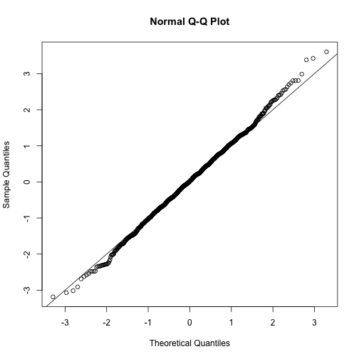
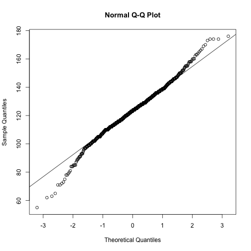
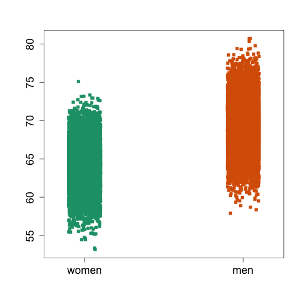
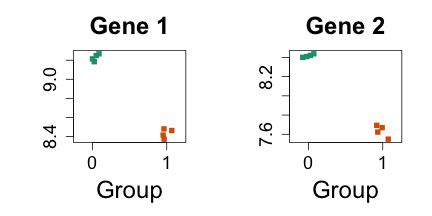
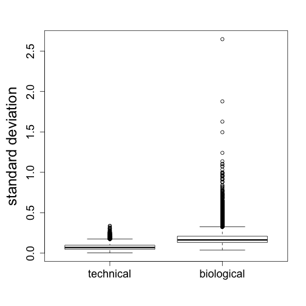
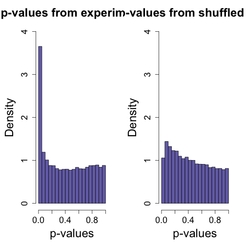

# Monte Carlo Simulations

Computers can be used to generate pseudo-random numbers. For most practicaly purposes these pseudo-random numbers can be used to immitate real random variables. This permits us to examine properties of random variables using a computer instead of theoretical or analytical derivations. One very useful aspect of this concept is that we can create _simulated_ data to test out ideas or competing methods without actually having to perform laboratory experiments.

Simulations can also be used to check theoretical or analytical results. Also, many of the theoretical results we use in statistics are based on asymptotics: they hold when the number of samples as, for example, the sample size goes to infinity. In practice we never have an infinite number of samples so we may want to know how well the theory works with our actual sample size. Sometimes we can answer this question analytically, but not always. Simulations are extremely useful in these cases.

We illustrate this with a simple example related to the central limit theorem. In the inference module we used a sample size of 10 to predict the, on average and in the population in question, men are taller than women. We used the central limit theorem to approximate the distribution of the t-statistic as normal with mean 0 and standard deviation 1. But is 10 large enough to use this approximantion? Let's use a monte carlo simulation to corroborate. Below is the code we used to obtain random sample and then the difference of 3.30


```r
dat = read.table("http://www.biostat.jhsph.edu/bstcourse/bio751/data/babies.data", 
    header = TRUE)
set.seed(1)
smokers = sample(dat$bwt[dat$smoke == 1], 10)
nonsmokers = sample(dat$bwt[dat$smoke == 0], 10)
cat("observed difference = ", mean(smokers) - mean(nonsmokers), " ounces")
```

```
## observed difference =  -2.3  ounces
```

But different random samplea give us a different answer

```r
for (i in 1:10) {
    smokers = sample(dat$bwt[dat$smoke == 1], 10)
    nonsmokers = sample(dat$bwt[dat$smoke == 0], 10)
    cat("observed difference = ", mean(smokers) - mean(nonsmokers), "ounces\n")
}
```

```
## observed difference =  -9.3 ounces
## observed difference =  -13.1 ounces
## observed difference =  -20.1 ounces
## observed difference =  -11 ounces
## observed difference =  -12.3 ounces
## observed difference =  -11.3 ounces
## observed difference =  -4.1 ounces
## observed difference =  -0.4 ounces
## observed difference =  -15.2 ounces
## observed difference =  -3.7 ounces
```

The sample means are _random variables_: they are different everytime we take a new random sample. We want to know the statistical properties of these random variables.
Note that in practice we can afford to measure so many samples, but on a computer it is as easy as writing a loop. Let's take 1,000 random samples and re-computing the t-statistic:

```r
ttestgenerator <- function(b = 1000, n = 10) {
    sapply(1:b, function(i) {
        smokers = sample(dat$bwt[dat$smoke == 0], n)
        nonsmokers = sample(dat$bwt[dat$smoke == 0], n)
        return((mean(smokers) - mean(nonsmokers))/sqrt((var(smokers))/n + var(nonsmokers)/n))
    })
}
ttests <- ttestgenerator(1000, 10)
```

With 1,000 simulated ocurrences of this random variable we can now get a gimplse of it's distribution

```r
hist(ttests)
```

 

Now let's check on the theory used on the previous module. Under the null hypothesis the difference in means is 0. To recreate this with our simulation we will sample men twice: there can't be a difference in population average if we sample from the same population.
So is the distribution of this t-statistic well approximated by the normal distribution?

```r
qqnorm(ttests)
abline(0, 1)
```

 

This looks like a very good approximation. So for this particular population a sample size of 10 was large enough to use the CLT approximation. How about 3 ? 


```r
ttests <- ttestgenerator(1000, 3)

qqnorm(ttests)
abline(0, 1)
```

 

Now we see that the large quantiles (refered to by statisticians as the _tails_) are large than expected. In the previous module we explained that when the sample size is not large enough and the *population values* follow a normal distribution then the t-distribution is a better approximation. Our simulation results seem to confirm this:

```r
qs <- (seq(0, 999) + 0.5)/1000
qqplot(qt(qs, df = 2 * 3 - 2), ttests, xlim = c(-6, 6), ylim = c(-6, 6))
abline(0, 1)
```

 

The t-distribution is a much better approximation in this case but it is still not perfect. This is due to the fact that the original data is not that well approximated by the normal distribution.


```r
qqnorm(dat$bwt[dat$smoke == 0])
qqline(dat$bwt[dat$smoke == 0])
```

 


### Simulating the observations

In the previous section we sampled from the entire population. In many cases we don't have access to data from the entire population. In these cases we can simulate that data as well. For the case of wieghts we could use 

```r
nonsmokerweights = rnorm(25000, 123, 17)
```

and repeat the entire excercise.

*Homework*:
1) How different are the normal(0,1) and t-distribution when degrees of freedom are 18? How about 4?
2) For the case with 10 samples, what is the distribution of the sample median weight for smokers? How does the mean, median of the distribution compare to the population median? 
3) Repeat the code above but simulated income for american and canadians. Is the median income the same? is the mean income the same?

## Permutations
Suppose we have a situation in which none of the standard statistical tools apply. We have computed a summary statisitic, such as the difference in mean, but do not have a useful approximation such as that provided by the CLT. In practice, we do not have access to all values in the population so we can't perform a simulation as done above. Permutation can be useful in these scenarios. 

We are back to the scenario were we only have 10 measurements for each group.


```r
set.seed(0)
N = 50
smokers = sample(dat$bwt[dat$smoke == 1], N)
nonsmokers = sample(dat$bwt[dat$smoke == 0], N)
obs = mean(smokers) - mean(nonsmokers)
```

Is the observed difference significant? Remember we are pretending that we can't use the CLT or the t-distribution approximations. How can we determine the distribution of this difference under the null that there is no difference? Permutations tests take advantege of the fact that if there is no difference the shuffling the data should not matter. So we shuffle the men and women labels, say, 1,000 and see how much the results matter.

```r
avgdiff <- sapply(1:1000, function(i) {
    all = sample(c(smokers, nonsmokers))
    smokersstar = all[1:N]
    nonsmokersstar = all[(N + 1):(2 * N)]
    return(mean(smokersstar) - mean(nonsmokersstar))
})
hist(avgdiff)
abline(v = obs)
```

 

```r
print(mean(abs(avgdiff) > abs(obs)))
```

```
## [1] 0.002
```

Note that the observed difference is not significant using this approach. Permuations sill have assumptions: samples are assumed to independent. If we have few samples we can't do permutations. Permutations result in conservative p-values since, if there is s a real differences, some of the permutations will be unblanced and will contain signal.


```r
dat = read.csv("http://www.biostat.jhsph.edu/bstcourse/bio751/data/USheights_subsample.csv")
men = dat$Height[dat$Gender == 1]
women = dat$Height[dat$Gender == 0]
library(rafalib)
```

```
## Loading required package: RColorBrewer
```

```r
mypar()
stripchart(list(women, men), vertical = TRUE, method = "jitter", col = c(1, 
    2), pch = 15, group.names = c("women", "men"))
```

 

We want to know if the difference between the average heights are positive, negative, or practically 0.  The observed difference is a mere 3.3 inches. 

```r
mean(men) - mean(women)
```

```
## [1] 5.186
```

Will this difference hold up if we take another sample? Remeber we have to pay for each measurement. 

### Central limit theorem

The Central Limit Theorem (or CLT) is one of the most used mathematical results in science. It tells us that when the sample size is large the average of random a sample follows a normal distribution centered at the population average (what we want to know), call it $\mu$, and with standard deviation equal to the population standard deviation, call it $\sigma$, divded by the square root of the sample size. This implies that under the null hypothese that there is no difference between the population averages, the difference between the sample averages $\hat{Y}-\hat{X}$ with $\hat{X}$ and $\hat{Y}$ the sample average for women and men respectiveley, is approximated by a normal distribution centered at 0 (there is no difference) and with standard deviation $\sqrt{\sigma_X^2 +\sigma_Y^2}/\sqrt{N}$. To see that this is the standard devition you need to know that the varaince of the sum of two independent random varialbes is the sum of their variances and the standard deviation is the square root of the variance. 

This is imply that this ratio:
$$
\frac{\bar{Y}-\bar{X}}{\sqrt{\frac{\sigma_X^2}{M}+\frac{\sigma_Y^2}{N}}}
$$
is approximated by a normal distribution centered at 0 and standard deviation 1.  Using this approximation make computing p-values simple because we know the proportion of the distribtuion under value. For example, only 5% values of larger than 2 (in absolute value):

```r
1 - pnorm(2) + pnorm(-2)
```

```
## [1] 0.0455
```

So what is the p-value of our observed differences? Note that we can't compute the ratio above because we don't know the population standard deviations: $\sigma_X$ and $\sigma_Y$. If we use the sample standard deviations, call then $\hat{\sigma}_X$ and $\hat{\sigma}_Y$ we form what is refered to the t-test, a quantity we can actually compute:
$$
\sqrt{N} \frac{\bar{Y}-\bar{X}}{\sqrt{\hat{\sigma}_X^2 +\hat{\sigma}_Y^2}}
$$
It turns out that for large enough N, the t-statistic is approximated by a normal distribution centered at 0 and with standard deviation 1. Our t-test is certainly unlikely to occur:


```r
ttest <- sqrt(length(men) * (mean(men) - mean(women))/sqrt((var(men) + var(women))))
ttest
```

```
## [1] 127.3
```

```r
2 * pnorm(-ttest)
```

```
## [1] 0
```

But what is large enough? 30 is a rule a thumb and it implies our 10 is not enough. But for cases were the population values are normally distributed (like heights) the exact distribution can be derived and it is the t-distribution (where the t-statistic gets it's name). Not surprisingly the t-distribution has fatter tails (a bigged proportion of larger values) than the normal distribution since the standard deviation estimates add variability (the numerator is normal in this case). We can now obtain a p-value (we need to specify the _degrees of freedom_, which in the case of the sample ttest is the sum of the sample sizes minus 2.

```r
1 - pt(ttest, 20 - 2) + pt(-ttest, 20 - 2)  ##or
```

```
## [1] 2.363e-28
```

```r
2 * pt(-ttest, 20 - 2)
```

```
## [1] 4.727e-28
```


As expected the p-value using the t-distribution is larger than the one obtained with the normal approximation which gives underestimates when N is small. Regardless, it seems the chance of observing a difference as large as what we saw under the null is pretty small. We should correctly predict that the average height of men is larger than the average height of women and also confirm that the distributions are approximately normal 


```r
mean(dat$Height[dat$Gender == 1]) - mean(dat$Height[dat$Gender == 0])
```

```
## [1] 5.186
```

```r
library(rafalib)
plot(0, 0, type = "n", xlim = range(dat$Height), ylim = c(0, 1750), xlab = "Heights", 
    ylab = "Frequency")
shist(dat$Height[dat$Gender == 1], plotHist = FALSE, col = 1, unit = 1, add = TRUE)
shist(dat$Height[dat$Gender == 0], plotHist = FALSE, col = 2, unit = 1, add = TRUE)
```

 


Homework: is the distribution of dat$Gender approximated by normal, t or neither?

Note that we obtained an estimate but never really reported it. We simply reported the p-value. Although common practice, we do not recommend it. Note that we can obtain statistically significant results that are not scientifically significant. The prefered way to report the estimate is the present both the estimate and its standard deviation: 

```r
cat(mean(men) - mean(women), "+/-", sqrt(var(men) + var(women))/sqrt(length(men)), 
    "\n")
```

```
## 5.186 +/- 0.03595
```

We can also _confidence intervals_ which should fall on the true difference for 95% of the random samples one could take.

```r
cat(mean(men) - mean(women) + c(-2, 2) * sqrt(var(men) + var(women))/sqrt(length(men)), 
    sep = ",")
```

```
## 5.114,5.258
```

Note that the true difference is in fact included in the sample above

## Monte Carlo simulation

## Gene expression
We have data for two strains of mice which we will refer to as strain 0 and 1. We want to know which genes are differentially expressed.  We extracted RNA from 12 randomely selected mice from each strain [CITE POOLING PAPER]. In one experiment we pooled the RNA from all individuals from each strain and then created 4 replicate samples from this pool. 


```r
library(Biobase, quietly = TRUE, verbose = FALSE)
```

```
## Loading required package: methods
## Loading required package: parallel
## 
## Attaching package: 'BiocGenerics'
## 
## The following objects are masked from 'package:parallel':
## 
##     clusterApply, clusterApplyLB, clusterCall, clusterEvalQ,
##     clusterExport, clusterMap, parApply, parCapply, parLapply,
##     parLapplyLB, parRapply, parSapply, parSapplyLB
## 
## The following object is masked from 'package:stats':
## 
##     xtabs
## 
## The following objects are masked from 'package:base':
## 
##     anyDuplicated, append, as.data.frame, as.vector, cbind,
##     colnames, do.call, duplicated, eval, evalq, Filter, Find, get,
##     intersect, is.unsorted, lapply, Map, mapply, match, mget,
##     order, paste, pmax, pmax.int, pmin, pmin.int, Position, rank,
##     rbind, Reduce, rep.int, rownames, sapply, setdiff, sort,
##     table, tapply, union, unique, unlist
## 
## Welcome to Bioconductor
## 
##     Vignettes contain introductory material; view with
##     'browseVignettes()'. To cite Bioconductor, see
##     'citation("Biobase")', and for packages 'citation("pkgname")'.
```

```r
library(genefilter)
```

```
## 
## Attaching package: 'genefilter'
## 
## The following object is masked from 'package:base':
## 
##     anyNA
```

```r
library(dagdata)
data(maPooling)
pd = pData(maPooling)
pooled = which(rowSums(pd) == 12)
y2 = exprs(maPooling[, pooled])
group2 = factor(as.numeric(grepl("b", names(pooled))))
```

If we compare the mean expression between groups for each gene we find several showing consistent differences.


```r
### look at 2 pre-selected samples for illustration
i = 11425
j = 11878
library(rafalib)
mypar(1, 2)
stripchart(split(y2[i, ], group2), vertical = TRUE, method = "jitter", col = c(1, 
    2), main = "Gene 1", xlab = "Group", pch = 15)
stripchart(split(y2[j, ], group2), vertical = TRUE, method = "jitter", col = c(1, 
    2), main = "Gene 2", xlab = "Group", pch = 15)
```

 

Note that if we compute a t-test from these values we obtain highly significant results

```r
library(genefilter)
tt2 = rowttests(y2, group2)
tt2$p.value[i]
```

```
## [1] 2.076e-07
```

```r
tt2$p.value[j]
```

```
## [1] 3.4e-07
```

But would these results hold up if we selected another 24 mice? Note that the equation for the t-test we presented in the previous section include the population standard deviations. Are these quantities measured here? Note that it is being replicated here is the experimental protocol. We have created four _technical replicates_ for each pooled sample. Gene 1 may be a highly variable gene within straing of mice while  Gene 2 a stable one, but we have no way of seeing this. 

It turns we also have microarray data for each individual mice. For each strain we have 12 _biological replicates_. 


```r
individuals = which(rowSums(pd) == 1)
## remove replicates
individuals = individuals[-grep("tr", names(individuals))]
y = exprs(maPooling)[, individuals]
group = factor(as.numeric(grepl("b", names(individuals))))
```


We can compute the sample variance for each gene and compare to the standard deviation obtained with the technical replicates.

```r
technicalsd <- rowSds(y2[, group2 == 0])
biologicalsd <- rowSds(y[, group == 0])
LIM = range(c(technicalsd, biologicalsd))
mypar(1, 1)
boxplot(technicalsd, biologicalsd, names = c("technical", "biological"), ylab = "standard deviation")
```

 


Note the biological variance is much larger than the technical one. And also that the variability of variances is also for biological variance. Here are the two genes we showed above but now for each individual mouse 


```r
mypar(1, 2)
stripchart(split(y[i, ], group), vertical = TRUE, method = "jitter", col = c(1, 
    2), xlab = "Gene 1", pch = 15)
points(c(1, 2), tapply(y[i, ], group, mean), pch = 4, cex = 1.5)
stripchart(split(y[j, ], group), vertical = TRUE, method = "jitter", col = c(1, 
    2), xlab = "Gene 2", pch = 15)
points(c(1, 2), tapply(y[j, ], group, mean), pch = 4, cex = 1.5)
```

 


Note the p-value tell a different story

```r
library(genefilter)
tt = rowttests(y, group)
tt$p.value[i]
```

```
## [1] 0.08987
```

```r
tt$p.value[j]
```

```
## [1] 1.979e-07
```


Which of these two genes do we feel more confident reporting as being differentially expressed? If another investigator takes another random sample of mice and tries the same experiment, which one do you think will replicate? Measuring biological vairability is essential if we want our conclusions to be about the strain of mice in general as opposed to the specific mice we have. 

Now which genes do we report as stastitically significant? For somewhat arbitrary reasons, in science p-values of 0.01 and 0.05 are used as cutoff. In this particular example we get 


```r
sum(tt$p.value < 0.01)
```

```
## [1] 1578
```

```r
sum(tt$p.value < 0.05)
```

```
## [1] 2908
```


## Multiple testing
But do we report all these genes? Let's explore what happens if we split the first group into two, forcing the null hypothesis to be true


```r
set.seed(0)
shuffledIndex <- factor(sample(c(0, 1), sum(group == 0), replace = TRUE))
nullt <- rowttests(y[, group == 0], shuffledIndex)
sum(nullt$p.value < 0.01)
```

```
## [1] 79
```

```r
sum(nullt$p.value < 0.05)
```

```
## [1] 840
```

If we use the 0.05 cutoff we will be reporting 840 false postives. That's a lot! In a later module we will learn about _multiple testing_ corrections. In the meantime now that p-values lose their meaning when we are combing through a long list of tests for the largest ones. An important statistical fact to know is that when the null hypothesis is true for independent tests and we compute the p-value for each, then the distribution of these p-values is uniform: any interval between 0 and 1 has the same proportion. 


```r
mypar(1, 2)
hist(tt$p.value, xlab = "p-values", main = "p-values from experiment", freq = FALSE, 
    ylim = c(0, 4), col = 3)
hist(nullt$p.value, xlab = "p-values", main = "p-values from shuffled data", 
    freq = FALSE, ylim = c(0, 4), col = 3)
```

 


## Power
In practice it is quite common to have only three samples. When this is the case. the estimates of the standard deviation is quite variable. Note that we can get very small standard deviation estimates by chance, which turns the t-test large for cases with a very small difference. When performing many tests, as we do in genomcis, these are quite common. So if we focus on the p-value to prioritize genes we may end up cases with very small differences:

```r
smallset <- c(1:3, 13:15)
smallsett <- rowttests(y[, smallset], group[smallset])
mypar(1, 1)
plot(smallsett$dm, -log10(smallsett$p.value), xlab = "Effect size", ylab = "log -10 (p-value)")
abline(h = -log10(0.01), lty = 2)
abline(v = c(-1, 1) * log2(1.5), lty = 2)
```

 


In a later module we will leanr statistical techniques from improving the standard deviation estimates.


 
 
 
 


