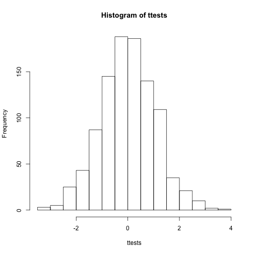
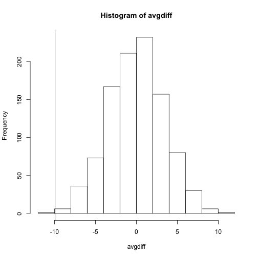

# Monte Carlo Simulations

Computers can be used to generate pseudo-random numbers. For most practicaly purposes these pseudo-random numbers can be used to immitate real random variables. This permits us to examine properties of random variables using a computer instead of theoretical or analytical derivations. One very useful aspect of this concept is that we can create _simulated_ data to test out ideas or competing methods without actually having to perform laboratory experiments.

Simulations can also be used to check theoretical or analytical results. Also, many of the theoretical results we use in statistics are based on asymptotics: they hold when the number of samples as, for example, the sample size goes to infinity. In practice we never have an infinite number of samples so we may want to know how well the theory works with our actual sample size. Sometimes we can answer this question analytically, but not always. Simulations are extremely useful in these cases.

We illustrate this with a simple example related to the central limit theorem. In the inference module we used a sample size of 10 to explore a data set containing babie weights and several covariants, one of which is whether the mother smokes. Babies of smoking mothers tend to weigh slightly less. We used the central limit theorem to approximate the distribution of the t-statistic as normal with mean 0 and standard deviation 1. But is 10 large enough to use this approximantion? Let's use a monte carlo simulation to corroborate.

Below is the code we used to obtain random sample and then the difference of -2.3.

```r
dat=read.table("http://www.biostat.jhsph.edu/bstcourse/bio751/data/babies.data",header=TRUE)
set.seed(1)
smokers=sample(dat$bwt[dat$smoke==1],10)
nonsmokers=sample(dat$bwt[dat$smoke==0],10)
cat("observed difference = ",mean(smokers)-mean(nonsmokers)," ounces")
```

```
## observed difference =  -2.3  ounces
```
But different random samplea give us a different answer

```r
for(i in 1:10){
  smokers=sample(dat$bwt[dat$smoke==1],10)
  nonsmokers=sample(dat$bwt[dat$smoke==0],10)
  cat("observed difference = ",mean(smokers)-mean(nonsmokers),"ounces\n")
}
```

```
## observed difference =  -9.3 ounces
## observed difference =  -13.1 ounces
## observed difference =  -20.1 ounces
## observed difference =  -11 ounces
## observed difference =  -12.3 ounces
## observed difference =  -11.3 ounces
## observed difference =  -4.1 ounces
## observed difference =  -0.4 ounces
## observed difference =  -15.2 ounces
## observed difference =  -3.7 ounces
```
The sample means are _random variables_: they are different everytime we take a new random sample. We want to know the statistical properties of these random variables.
Note that in practice we can afford to measure so many samples, but on a computer it is as easy as writing a loop. Let's take 1,000 random samples under the null and re-computing the t-statistic:

```r
ttestgenerator <- function(b=1000,n=10){
  sapply(1:b,function(i){
    smokers=sample(dat$bwt[dat$smoke==0],n)
    nonsmokers=sample(dat$bwt[dat$smoke==0],n)
    return((mean(smokers)-mean(nonsmokers))/sqrt((var(smokers))/n+var(nonsmokers)/n))
    })
}
ttests <- ttestgenerator(1000,10)
```
With 1,000 simulated ocurrences of this random variable we can now get a gimplse of it's distribution

```r
hist(ttests)
```

 
Now let's check on the theory used on the previous module. Under the null hypothesis the difference in means is 0. To recreate this with our simulation we will sample men twice: there can't be a difference in population average if we sample from the same population.
So is the distribution of this t-statistic well approximated by the normal distribution?

```r
qqnorm(ttests)
abline(0,1)
```

 
This looks like a very good approximation. So for this particular population a sample size of 10 was large enough to use the CLT approximation. How about 3 ? 


```r
ttests <- ttestgenerator(1000,3)

qqnorm(ttests)
abline(0,1)
```

 
Now we see that the large quantiles (refered to by statisticians as the _tails_) are large than expected. In the previous module we explained that when the sample size is not large enough and the *population values* follow a normal distribution then the t-distribution is a better approximation. Our simulation results seem to confirm this:

```r
qs <- (seq(0,999)+0.5)/1000
qqplot(qt(qs,df=2*3-2),ttests,xlim=c(-6,6),ylim=c(-6,6))
abline(0,1)
```

 
The t-distribution is a much better approximation in this case but it is still not perfect. This is due to the fact that the original data is not that well approximated by the normal distribution.


```r
qqnorm(dat$bwt[dat$smoke==0])
qqline(dat$bwt[dat$smoke==0])
```

 


### Simulating the observations

In the previous section we sampled from the entire population. In many cases we don't have access to data from the entire population. In these cases we can simulate that data as well. For the case of wieghts we could use 

```r
nonsmokerweights=rnorm(25000,123,17)
```
and repeat the entire excercise.

#### *Homework*
1. How different are the $\text{normal}(0,1)$ and t-distribution when degrees of freedom are 18? How about 4?
2. For the case with 10 samples, what is the distribution of the sample median weight for smokers? How does the mean, median of the distribution compare to the population median? 
3. Repeat the code above but simulated income for american and canadians. Is the median income the same? is the mean income the same?

## Permutations
Suppose we have a situation in which none of the standard statistical tools apply. We have computed a summary statisitic, such as the difference in mean, but do not have a useful approximation such as that provided by the CLT. In practice, we do not have access to all values in the population so we can't perform a simulation as done above. Permutation can be useful in these scenarios. 

We are back to the scenario were we only have 10 measurements for each group.


```r
set.seed(0)
N=50
smokers=sample(dat$bwt[dat$smoke==1],N)
nonsmokers=sample(dat$bwt[dat$smoke==0],N)
obs=mean(smokers)-mean(nonsmokers)
```
Is the observed difference significant? Remember we are pretending that we can't use the CLT or the t-distribution approximations. How can we determine the distribution of this difference under the null that there is no difference? Permutations tests take advantege of the fact that if there is no difference the shuffling the data should not matter. So we shuffle the men and women labels, say, 1,000 and see how much the results matter.

Generate a null distribution by shuffling the data

```r
avgdiff <- sapply(1:1000,function(i){
    all=sample(c(smokers,nonsmokers))
    smokersstar=all[1:N]
    nonsmokersstar=all[(N+1):(2*N)]
  return(mean(smokersstar)-mean(nonsmokersstar))
})  
hist(avgdiff)
abline(v=obs)
```

 
How many of the null means are bigger than the observed value?
That proportion would be the p-value for the null.

```r
print(mean(abs(avgdiff)> abs(obs)))
```

```
## [1] 0.002
```
Note that if we repeat for N=10, the observed difference is not significant using this approach. Permutations still have assumptions: samples are assumed to independent. If we have few samples we can't do permutations. Permutations result in conservative p-values since, if there is s a real differences, some of the permutations will be unblanced and will contain signal.


