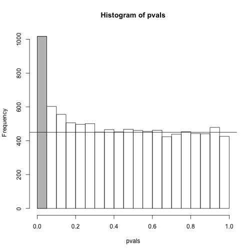
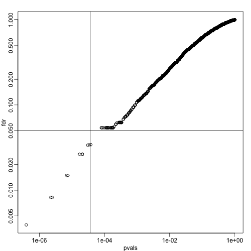
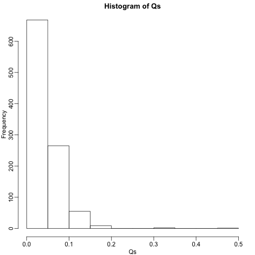
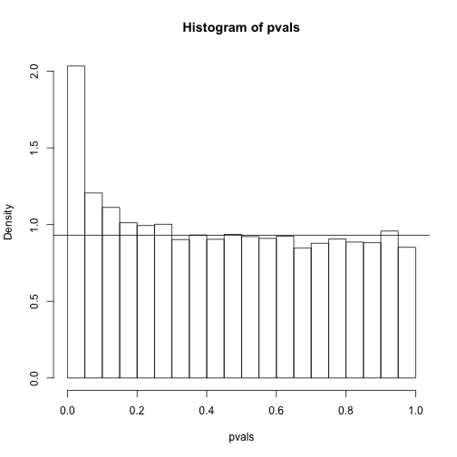

```r
library(rafalib)
```

## Procedures

In the previous section we learned how p-values are no longer a useful quantity to interpret when dealing with high-dimensional data. This is because we are testing many _features_ at the same time. We refer to this as the _multiple comparison_ or _multiple testing_ or _multiplicity_ problem. The definition of a p-value does not provide a useful quantification here. Again, because when we test many hypotheses simultaneously, a list based simply on a small p-values cut-off of, say 0.01, can result in many false positives with high probability. Here we define terms that are more appropriate in the context of high-throughput data.

The most widely used approach to the multiplicity problem is to define a _procedure_ and then estimate an informative _error rate_ for this procedure. The procedures are typically flexible through parameters or cutoffs that let us control specificity and sensitivity. An example of a procedure is: 

* Compute a p-value for each gene.
* Call significant all genes with p-values smaller than $$\alpha$$.

Note that changing the $$\alpha$$ permits us to adjust specificity and sensitivity. 

Next we define the _error rates_  that we will try to estimate and control.

## Error Rates

Throughout this section we will be using the type I error and type II error terminology. We will also refer to them as false positives and false negatives respectively. Keep in mind that specificity relates to type I errors, while sensitivity relates to type II errors.

In the context of high-throughput data we can make several type I errors and several type II errors in one experiment, as opposed to one or the other as seen in Chapter 1. In this table we summarize the possibilities using the notation from the seminal paper by Benjamini-Hochberg:

|   | Called significant   | Not called significant   | Total  |  
|---|---|---|---|
|Null True   | $$V$$   | $$m_0-V$$  | $$m_0$$  |
|Alternative True   | $$S$$  | $$m_1-S$$    | $$m_1$$    |   
|True   | $$R$$  |  $$m-R$$ | $$m$$  |

To describe the entries in the table let's use as an example a dataset representing measurements from 10,000 genes, which means that the total number of tests that we are conducting is: $$m=10,000$$. The number of genes for which the null hypothesis is true, which in most cases represent the "non-interesting" genes, is $$m_0$$, while the number of genes for which the null hypothesis is false is $$m_1$$. In general, we are interested in _detecting_ as many as the cases for which the null hypothesis is false (true positives), without incorrectly detecting cases for which the null hypothesis is true (false positives). For most high-throughput experiments, we assume that $$m_0$$ is much greater than $$m_1$$. For example, we test 10,000 and 100 genes to be _interesting_. This implies $$m_1=100$$ and $$m_0=19,900$$. 

Throughout this chapter we refer to _features_ as the units being tested. In genomics, examples of features are genes, transcripts, binding sites, CpG sites, and SNPs. In the table, $$R$$ represents the total number of features that we call significant after applying our procedure, while $$m-R$$ is the total number of genes we don't call significant. The rest of the table contains important quantities that are unknown in practice.

* $$V$$ represents the number of type I errors or false positives. Specifically, $$V$$ is the number of features for which the null hypothesis is true, that we call significant.
* $$S$$ represents the number of true positives. Specifically, $$S$$ is the number of features for which the null hypothesis is false, that we call significant. 

This implies that there are $$m_1-S$$ type II errors or _false negatives_ and $$m_0-V$$ true negatives. 

Keep in mind that if we only ran one test, a p-value is simply the probability that $$V=1$$ when $$m=m_0=1$$. Power is the probability of $$S=1$$ when $$m=m_1=1$$. In this very simple case, we wouldn't bother making tables. Below we will show how defining the terms in the table helps in practice the high-dimensional context.

  
#### Data example

Let's compute these quantities with a data example. We will use a Monte Carlo simulation using our mice data to imitate a situation in which we perform tests for 10,000 different fad diets, none of them having an effect on weight. This implies that the null hypothesis is true for diets and thus $$m=m_0=10,000$$ and $$m_1=0$$. Let's run the tests with a sample size of $$N=12$$ and compute $$R$$. Our procedure will declare any diet achieving a p-value smaller than $$\alpha=0.05$$ as significant. 


```r
set.seed(1)
population = unlist( read.csv("femaleControlsPopulation.csv") )
alpha <- 0.05
N <- 12
m <- 10000
pvals <- replicate(m,{
  control = sample(population,N)
  treatment = sample(population,N)
  t.test(treatment,control)$p.value
})
```

Although in practice we do not know the fact that no diet works, in this simulation we do, and therefore we can actually compute $$V$$ and $$S$$. Because all null hypotheses are true, we know $$V=R$$. Of course, in practice we can't compute this quantity.


```r
sum(pvals < 0.05) ##This is R
```

```
## [1] 462
```
These many false positives are not acceptable in most contexts.

Here is more complicated code showing results where 10% of the diets are effective with an average effect size of $$\Delta= 3$$ ounces. 
Studying this code carefully will help understand the meaning of the table above.
First let's define _the truth_:

```r
alpha <- 0.05
N <- 12
m <- 10000
p0 <- 0.90 ##10% of diets work, 90% don't
m0 <- m*p0
m1 <- m-m0
nullHypothesis <- c( rep(TRUE,m0), rep(FALSE,m1))
delta <- 3
```

Now we are ready to simulate 10,000 tests, perform a t-test on each, and record if we rejected the null hypothesis or not:

```r
set.seed(1)
calls <- sapply(1:m, function(i){
  control <- sample(population,N)
  treatment <- sample(population,N)
  if(!nullHypothesis[i]) treatment <- treatment + delta
  ifelse( t.test(treatment,control)$p.value < alpha, 
          "Called Significant",
          "Not Called Significant")
})
```
Because in this simulation we know the truth (saved in `nullHypothesis`) we can compute the entries of the table:


```r
null_hypothesis <- factor( nullHypothesis, levels=c("TRUE","FALSE"))
table(null_hypothesis,calls)
```

```
##                calls
## null_hypothesis Called Significant Not Called Significant
##           TRUE                 421                   8579
##           FALSE                520                    480
```

The first column of the table above shows us $$V$$ and $$S$$. Note that $$V$$ and $$S$$ are random variables. If we run the simulation repeatedly, these values change. Here is a quick example:


```r
B <- 10 ##number of simulations
VandS <- replicate(B,{
  calls <- sapply(1:m, function(i){
    control <- sample(population,N)
    treatment <- sample(population,N)
    if(!nullHypothesis[i]) treatment <- treatment + delta
    t.test(treatment,control)$p.val < alpha
  })
  cat("V =",sum(nullHypothesis & calls), "S =",sum(!nullHypothesis & calls),"\n")
  c(sum(nullHypothesis & calls),sum(!nullHypothesis & calls))
  })
```

```
## V = 410 S = 564 
## V = 400 S = 552 
## V = 366 S = 546 
## V = 382 S = 553 
## V = 372 S = 505 
## V = 382 S = 530 
## V = 381 S = 539 
## V = 396 S = 554 
## V = 380 S = 550 
## V = 405 S = 569
```

This motivates the definition of error rates. We can, for example, estimate probability that $$V$$ is larger than 0. This is interpreted as the probability of making at least one type I error among the 10,000 tests. In the example we made many more than 1 in every single simulation, so we suspect this probability is very practically 1. When $$m=1$$, this probability is equivalent to the p-value. When we have a multiple tests situation, we call it the Family Wide Error Rate (FWER) and it relates to a technique that is widely used: The Bonferroni Correction.

## The Bonferroni Correction 

Now that we have learned about the Family Wide Error Rate (FWER), we describe what we can actually do to control it.  In practice we want to choose a _procedure_ that guarantees the FWER is smaller than a predetermined value such as 0.05. We can keep it general and instead of 0.05, use $$\alpha$$ in our derivations.

Since are now describing what we do in practice, we no longer have the advantage of knowing _the truth_. Instead, we pose a procedure and try to estimate the FWER.  Let's consider the naive procedure: "reject all the hypotheses with p-value <0.01". For illustrative purposes we will assume all the tests are independent (in the case of testing diets this is a safe assumption; in the case of genes it is not so safe since genes act together). Let $$p_1,\dots,p_{10000}$$ be the the p-values we get from each test. These are independent random variables so: 

$$
\begin{align*}
\mbox{Pr}(\mbox{at least one rejection}) &= 1 -\mbox{Pr}(\mbox{no rejections}) \\
&= 1 - \prod_{i=1}^{1000} \mbox{Pr}(p_i>0.01) \\
&= 1-0.95^{1000} \approx 1
\end{align*}
$$

Or if you want to use simulations:


```r
B<-10000
minpval <- replicate(B, min(runif(10000,0,1))<0.01)
mean(minpval>=1)
```

```
## [1] 1
```

So our FWER is 1! This is not what we were hoping for. If we wanted it to be lower than $$\alpha=0.05$$, we failed miserably. 

So what do we do to make the probability of a mistake lower than $$\alpha$$ ? Using the derivation above we can change the procedure by selecting a more stringent cutoff, previously 0.01, to lower our probability of at least one mistake to be 5%. Namely, by noting that: 

$$\mbox{Pr}(\mbox{at least one rejection}) =  1-(1-k)^{10000}$$

and solving for $$k$$, we get $$1-(1-k)^{10000}=0.05 \implies k = 1-0.95^{1/10000} \approx 0.000005$$

This now gives a specific example of a _procedure_. This one is actually called Sidak's procedure. Specifically, we define a set of instructions, such as "reject all the null hypothesis for which p-values < 0.000005". Then, knowing the p-values are random variables, we use statistical theory to compute how many mistakes, on average, we are expected to make if we follow this procedure. More precisely, we compute bounds on these rates; that is, we show that they are smaller than some predetermined value. There is a preference in the life sciences to err on the side of being conservative.

A problem with Sidak's procedure is that it assumes the tests are independent. It therefore only controls FWER when this assumption holds. The Bonferroni correction is more general in that it controls FWER even if the tests are not independent. 
As with Sidak's procedure we start by noting that: 

$$FWER = \mbox{Pr}(V>0) \leq \mbox{Pr}(V>0 \mid \mbox{all nulls are true})$$

or using the notation from the table above:

$$\mbox{Pr}(V>0) \leq \mbox{Pr}(V>0 \mid m_1=0)$$

The Bonferroni procedure sets $$k=\alpha/m$$ since we can show that:

$$
\begin{align*}
\mbox{Pr}(V>0 \,\mid \, m_1=0) &= \mbox{Pr}\left( \min_i \{p_i\} \leq \frac{\alpha}{m} \mid m_1=0 \right)\\
 &\leq \sum_{i=1}^m\leq \left(p_i \leq \frac{\alpha}{m} \right)\\
 &= m \frac{\alpha}{m}=\alpha
\end{align*}
$$

Controlling the FWER at 0.05 is a very conservative approach. Using the p-values computed in the previous section:


```r
set.seed(1)
pvals <- sapply(1:m, function(i){
  control <- sample(population,N)
  treatment <- sample(population,N)
  if(!nullHypothesis[i]) treatment <- treatment + delta
  t.test(treatment,control)$p.value
})
```
We note that only:

```r
sum(pvals < 0.05/10000)
```

```
## [1] 2
```
are called significant after applying the Bonferroni procedure, despite having 1000 diets that work. 


```r
set.seed(1)
pvals <- sapply(1:m, function(i){
  control <- sample(population,N)
  treatment <- sample(population,N)
  if(!nullHypothesis[i]) treatment <- treatment + delta
  t.test(treatment,control)$p.value
})
```
We note that only:

```r
sum(pvals < 0.05/10000)
```

```
## [1] 2
```


## False Discovery Rate 

There are many situations for which requiring an FWER of 0.05 does not make sense as it is much too strict. For example, consider the very common exercise of running a preliminary small study to determine a handful of candidate genes. This is referred to as a _discovery_ driven project or experiment. We may be in search of an unknown causative gene and more than willing to perform follow up studies with many more samples on just the candidates. If we develop a procedure that produces, for example, a list of 10 genes of which 1 or 2 pan out as important, the experiment is a resounding success. With a small sample size, the only way to achieve a FWER $$\leq$$ 0.05 is with an empty list of genes. We already saw in the previous section that despite 1,000 diets being effective, we ended up with a list with just 2. Change the sample size to 6 and you very likely get 0:


```r
set.seed(1)
pvals <- sapply(1:m, function(i){
  control <- sample(population,6)
  treatment <- sample(population,6)
  if(!nullHypothesis[i]) treatment <- treatment + delta
  t.test(treatment,control)$p.value
  })
sum(pvals < 0.05/10000)
```

```
## [1] 0
```

By requiring a FWER $$\leq$$ 0.05 we are practically assuring 0 power (sensitivity). In many applications, this specificity requirement is over-kill. A widely used alternative to the FWER is the false discover rate (FDR). The idea behind FDR is to consider the random variable $$Q \equiv V/R$$ with $$Q=0$$ when $$R=0$$ and $$V=0$$. Note that $$R=0$$ (nothing called significant) implies $$V=0$$ (no false positives). So $$Q$$ is a random variable that can take values between 0 and 1 and we can define a rate by considering the average of $$Q$$. To better understand this concept here, we compute $$Q$$ for the procedure: call everything p-value < 0.05 significant.

Before running the simulation we are going to _vectortize_ the code. This means that instead of using `sapply` to run `m` tests, we will create a matrix with all data in one call to sample. This code runs several times faster than the code above which is necessary here due to the fact that we will be generating several simulations. Understanding this chuNk of code and how it is equivalent to the code above using `sapply` will take a you long way in helping you code efficiently in R.


```r
library(genefilter) ##rowttests is here
set.seed(1)
##Define groups to be used with rowttests
g <- factor( c(rep(0,N),rep(1,N)) )
B <- 100 ##number of simulations
Qs <- replicate(B,{
  ##matrix with control data (rows are tests, columns are mice)
  controls <- matrix(sample(population, N*m, replace=TRUE),nrow=m)
  
  ##matrix with control data (rows are tests, columns are mice)
  treatments <-  matrix(sample(population, N*m, replace=TRUE),nrow=m)
  
  ##add effect to 10% of them
  treatments[which(!nullHypothesis),]<-treatments[which(!nullHypothesis),]+delta
  
  ##combine to form one matrix
  dat <- cbind(controls,treatments)
  
 calls <- rowttests(dat,g)$p.value < alpha
 R=sum(calls)
 Q=ifelse(R>0,sum(nullHypothesis & calls)/R,0)
 return(Q)
})
mypar(1,1)
hist(Qs) ##Q is a random variable, this is its distribution
```

 

```r
FDR=mean(Qs)
print(FDR)
```

```
## [1] 0.4443414
```

The FDR is relatively high here. This is because for 90% of the tests, the null hypotheses is true. This implies that with a 0.05 p-value cut-off, out of the 100 tests we incorrectly call between 4 and 5 significant on average. This combined with the fact that we don't "catch" all the cases where the alternative is true, gives us a relatively high FDR. So how can we control this? What if we want lower FDR, say 5%?

To visually see why the FDR is high, we can make a histogram of the p-values. We use a higher value of `m` to have more data from the histogram. We draw a horizontal line representing the uniform distribution one gets for the `m0` cases for which the null is true. 


```r
set.seed(1)
controls <- matrix(sample(population, N*m, replace=TRUE),nrow=m)
treatments <-  matrix(sample(population, N*m, replace=TRUE),nrow=m)
treatments[which(!nullHypothesis),]<-treatments[which(!nullHypothesis),]+delta
dat <- cbind(controls,treatments)
pvals <- rowttests(dat,g)$p.value 

hist(pvals,breaks=seq(0,1,0.05))
abline(h=m0/20)
```

 
The first bar on the left represents cases with p-values smaller than 0.05. From the horizontal line we can infer that about 1/2 are false positives. This is in agreement with an FDR of 0.50.  If we look at the bar for 0.01, we can see a lower FDR, as expected, but would call less features significant.


```r
hist(pvals,breaks=seq(0,1,0.01))
abline(h=m0/100)
```

 

As we consider a lower a lower p-value cut-off, the number of features detected decreases (loss of sensitivity), but our FDR also decreases (gain of specificity). So how do we decide? One approach is to set a desired FDR level $$\alpha$$, and then develop procedures that control the error rate: FDR  $$\leq \alpha$$.

#### Benjamini-Hochberg (Advanced)

We want to construct a procedure that guarantees the FDR to be below a certain level $$\alpha$$. For any given $$\alpha$$, the Benjamini-Hochberg (1995) procedure is very practical because it simply requires that we are able to compute p-values for each of the individual tests and this permits a procedure to be defined.

For the procedure order the p-values in increasing order: $$p_{(1)},\dots,p_{(m)}$$. Then define $$k$$ to be the largest $$i$$ for which

$$p_{(i)} \leq \frac{i}{m}\alpha$$

The procedure is to reject tests with p-values larger than $$p_{(k)}$$. Here is an example of how we would select the $$k$$ with code using the p-values computed above:


```r
alpha <- 0.05
i = seq(along=pvals)

mypar(1,2)
plot(i,sort(pvals))
abline(0,i/m*alpha)
##close-up
plot(i[1:15],sort(pvals)[1:15],main="Close-up")
abline(0,i/m*alpha)
```

 

```r
k <- max( which( sort(pvals) < i/m*alpha) )
cutoff <- sort(pvals)[k]
cat("k =",k,"p-value cutoff=",cutoff)
```

```
## k = 11 p-value cutoff= 3.763357e-05
```

We can show mathematically that this procedure has FDR lower than 5%. Please see Benjamini-Hochberg (1995) for details. An important outcome is that we now have selected 11 tests instead of just 2. If we are willing to set an FDR of 50% (for example, 1/2 our genes are expected to be hits!), then this list grows to 1063! The FWER does not provide this flexibility since any list of substantial size will result in an FWER of 1.

Keep in mind that we don't have to run the complicated code above as we have functions to do this. For example, using the p-values `pvals` computed above,
we simply type the following:

```r
fdr <- p.adjust(pvals, method="fdr")
mypar(1,1)
plot(pvals,fdr,log="xy")
abline(h=alpha,v=cutoff) ##cutoff was computed above
```

 

We can run a Monte-Carlo simulation to confirm that the FDR is in fact lower than .05. We compute all p-values first, and then use these to decide which get called.


```r
alpha <- 0.05
B <- 100 ##number of simulations. We should increase for more precision
Qs <- replicate(B,{
  controls <- matrix(sample(population, N*m, replace=TRUE),nrow=m)
  treatments <-  matrix(sample(population, N*m, replace=TRUE),nrow=m)
  treatments[which(!nullHypothesis),]<-treatments[which(!nullHypothesis),]+delta
  dat <- cbind(controls,treatments)
  pvals <- rowttests(dat,g)$p.value 
  ##then the FDR
  calls <- p.adjust(pvals,method="fdr") < alpha
  R=sum(calls)
  Q=ifelse(R>0,sum(nullHypothesis & calls)/R,0)
  return(Q)
})
mypar(1,1)
hist(Qs) ##Q is a random variable, this is its distribution
```

 

```r
FDR=mean(Qs)
print(FDR)
```

```
## [1] 0.03556253
```

The FDR is lower than 0.05. This is to be expected because we need to be conservative to assure the FDR $$\leq$$ 0.05 for any value of $$m_0$$, such as for the extreme case where every hypothesis tested is null: $$m=m_0$$. If you re-do the simulation above for this case, you will find that the FDR increases. 

Finally, note that the `p.adjust` function has several options for error rate controlling procedures:

```r
p.adjust.methods
```

```
## [1] "holm"       "hochberg"   "hommel"     "bonferroni" "BH"        
## [6] "BY"         "fdr"        "none"
```
It is important to remember that these options offer not just different approaches to estimating error rates, but also that different error rates are estimated: namely FWER and FDR. This is an important distinction. More information is available from:


```r
?p.adjust
```

In summary, requiring that FDR $$leq$$ 0.05 is a much more lenient requirement FWER $$leq$$ 0.05. Although we will end up with more false positives, FDR gives us much more power. This makes it particularly appropriate for discovery phase experiments where we may accept FDR levels much higher than 0.05.

## Direct Approach to FDR and q-values (Advanced)

Here we review the results described by John D. Storey in J. R. Statist. Soc. B (2002). One major distinction between Storey's approach and Benjamini and Hochberg's is that we are no longer going to set a $$\alpha$$ level a priori. Because in many high-throughput experiments we are interested in obtaining some list for validation, we can instead decide beforehand that we will consider all tests with $$p-values$$ smaller than 0.01. We then want to attach an estimate of an error rate. Using this approach, we are guaranteed to have $$R>0$$. Note that in the FDR definition above we assigned $$Q=0$$ in the case that $$R=V=0$$. We are therefore computing: 

$$
\mbox{FDR} = E\left( \frac{V}{R} \mid R>0\right) \mbox{Pr}(R>0)
$$

In the approach proposed by Storey we condition on having a non-empty list, which implies $$R>0$$ , and we instead compute the _positive FDR_ 

$$
\mbox{pFDR} = E\left( \frac{V}{R} \mid R>0\right) 
$$

A second distinction is that while Benjamini and Hochberg's procedure controls under the worse case scenario, in which all null hypotheses are true ( $$m=m_0$$ ), Storey proposes that we actually try to estimate $$m_0$$ from the data. Because in high-throughput experiments we have so much data, this is certainly possible. The general idea is to pick a relatively high value p-value cut-off, call it $$\lambda$$, and assume that tests obtaining p-values > $$\lambda$$ are mostly from cases in which the null hypothesis hold. We can then estimate $$\pi_0 = m_0/m$$ as: 

$$
\hat{\pi}_0 = \frac{\#\left\{p_i > \lambda \right\} }{ (1-\lambda) m }
$$

There are more sophisticated procedures than this, but they follow the same general idea. Here is an example setting $$\lambda=0.1$$. Using the p-values computed above we have:


```r
hist(pvals,breaks=seq(0,1,0.05),freq=FALSE)
lambda = 0.1
pi0=sum(pvals> lambda) /((1-lambda)*m)
abline(h= pi0)
```

 

```r
print(pi0) ##this is close to the trye pi0=0.9
```

```
## [1] 0.9311111
```

With this estimate in place we can, for example, alter the Benjamini and Hochberg procedures to select the $$k$$ to be the largest value so that: 

$$\hat{\pi}_0 p_{(i)} \leq \frac{i}{m}\alpha$$

However, instead of doing this we compute a _q-value_ for each test. If a feature resulted in a p-value of $$p$$, the q-value is the estimated pFDR for a list of all the features with a p-value at least as small as $$p$$.

In R this can be computed with the `qvalue` function in the `qvalue` package:


```r
library(qvalue)
```

```
## Error in library(qvalue): there is no package called 'qvalue'
```

```r
res <- qvalue(pvals)
```

```
## Error in eval(expr, envir, enclos): could not find function "qvalue"
```

```r
qvals <- res$qvalues
```

```
## Error in eval(expr, envir, enclos): object 'res' not found
```

```r
plot(pvals,qvals)
```

```
## Error in plot(pvals, qvals): error in evaluating the argument 'y' in selecting a method for function 'plot': Error: object 'qvals' not found
```
we also obtain the estimate of $$\hat{\pi}_0$$:


```r
res$pi0
```

```
## Error in eval(expr, envir, enclos): object 'res' not found
```
This function uses a more sophisticated approach at estimating $$\pi_0$$ than what is described above.
