# Normalization

Normalization is one of the most important procedures in genomics data analysis. A typical dataset contains more than one sample and we are almost always interested in making comparisons between these. Unfortunately, technical and biological sources of unwanted variation can cloud downstream results. Here we demonstrate with real data, how this can happen and then describe several existing solutions. The examples are based on microarray data but can be applied to other datasets.

<a name="dilution"></a>
Our first example is the Dilution dataset that is not publically available. To obtain the dataset you need to request it here: http://www.genelogic.com/support/scientific-studies

This Dilution dataset has six sets of five technical replicates. The six sets differ in the concentration of RNA. The RNA was diluted 5 times so that 1/2 as much RNA was hybridized in each set. We start by showing  data from five technical replicates. We show boxplots and densities:

```r
library(rafalib)
library(affy)
library(affydata)
setwd("/Users/ririzarr/myDocuments/teaching/HarvardX/labs/week4/Dilution")
pd = read.table("pdata.txt", header = TRUE, check.names = FALSE, as.is = TRUE)
pd <- pd[which(pd[, 3] == 0), ]  ##only liver
dat <- ReadAffy(filenames = paste0(pd[, 1], ".cel"), verbose = FALSE, phenoData = pd)
pms = pm(dat)
mypar(1, 2)
boxplot(log2(pms[, 1:5]), range = 0, names = 1:5, las = 3, main = "Five technical replicates", 
    col = 1:5)
shist(log2(pms[, 2]), unit = 0.1, type = "n", xlab = "log (base 2) intensity", 
    main = "Five techical replicates")
for (i in 1:5) shist(log2(pms[, i]), unit = 0.1, col = i, add = TRUE, lwd = 2, 
    lty = i)
```


Notice that although being technical replicates we see different distributions. The shifts in median are quite dramatic with changes of almost 2 fold. To see that simply changing the location by, for example, subtracting the median is not enough we show an MA plot between two of these samples:


```r
mypar(1, 2)
i = 1
j = 2
x = log2(pms[, i])
y = log2(pms[, j])
maplot(x, y, ylim = c(-1.5, 1.5))
abline(h = 0, col = 1, lty = 2, lwd = 2)
shist(y, unit = 0.1, xlab = "log (base) intenisty", col = 1, main = "smooth histogram")
shist(x, unit = 0.1, xlab = "log (base) intenisty", add = TRUE, col = 2)
```


The MA-plot shows non-linear bias. Median normalization would simply move the plot up so that the median difference is 0. But this will not correct the non-linear bias as demonstrated here.


```r
mypar(1, 2)
i = 1
j = 2
M = median(c(x, y))
x = log2(pms[, i]) - median(x) + M
y = log2(pms[, j]) - median(y) + M
maplot(x, y, ylim = c(-1.5, 1.5))
abline(h = 0, col = 1, lty = 2, lwd = 2)
shist(y, unit = 0.1, xlab = "log (base) intenisty", col = 1, main = "smooth histogram")
shist(x, unit = 0.1, xlab = "log (base) intenisty", add = TRUE, col = 2)
```


To understand the downstream consequences of not normalizing we will use the spike-in experiment used in previous units.

```r
library(SpikeIn)
```

```
## Loading required package: affy
## Loading required package: BiocGenerics
## Loading required package: methods
## Loading required package: parallel
## 
## Attaching package: 'BiocGenerics'
## 
## The following objects are masked from 'package:parallel':
## 
##     clusterApply, clusterApplyLB, clusterCall, clusterEvalQ,
##     clusterExport, clusterMap, parApply, parCapply, parLapply,
##     parLapplyLB, parRapply, parSapply, parSapplyLB
## 
## The following object is masked from 'package:stats':
## 
##     xtabs
## 
## The following objects are masked from 'package:base':
## 
##     anyDuplicated, append, as.data.frame, as.vector, cbind,
##     colnames, do.call, duplicated, eval, evalq, Filter, Find, get,
##     intersect, is.unsorted, lapply, Map, mapply, match, mget,
##     order, paste, pmax, pmax.int, pmin, pmin.int, Position, rank,
##     rbind, Reduce, rep.int, rownames, sapply, setdiff, sort,
##     table, tapply, union, unique, unlist
## 
## Loading required package: Biobase
## Welcome to Bioconductor
## 
##     Vignettes contain introductory material; view with
##     'browseVignettes()'. To cite Bioconductor, see
##     'citation("Biobase")', and for packages 'citation("pkgname")'.
```

```r
data(SpikeIn95)
spms <- pm(SpikeIn95)
```

```
## Warning: replacing previous import by 'utils::head' when loading 'hgu95acdf'
## Warning: replacing previous import by 'utils::tail' when loading 'hgu95acdf'
```

```
## 
```

```r
spd = pData(SpikeIn95)
library(rafalib)
```

```
## Loading required package: RColorBrewer
```

```r
mypar(1, 2)
shist(log2(spms[, 2]), unit = 0.1, type = "n", xlab = "log (base 2) intensity", 
    main = "Five techical replicates")
## show the first 10
for (i in 1:10) shist(log2(spms[, i]), unit = 0.1, col = i, add = TRUE, lwd = 2, 
    lty = i)
## Pick 9 and 10 and make an MA plot
i = 10
j = 9  ##example with two samples
siNames <- colnames(spd)
## show probes with expected FC=2
siNames = siNames[which(spd[i, ]/spd[j, ] == 2)]
M = log2(spms[, i]) - log2(spms[, j])
A = (log2(spms[, i]) + log2(spms[, j]))/2
splot(A, M, ylim = c(-1.5, 1.5))
spikeinIndex = which(probeNames(SpikeIn95) %in% siNames)
points(A[spikeinIndex], M[spikeinIndex], ylim = c(-4, 4), bg = 1, pch = 21)
```

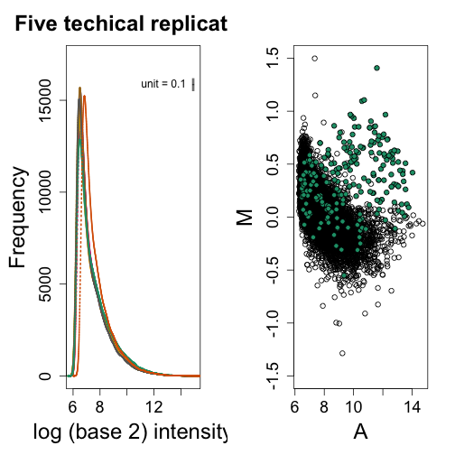 

In this plot the green dots are genes spiked in to be different in the two samples. The rest of the points (black dots) should be at 0 because other than the spiked-in genes these are technical replicates. Notice that without normalization the black dots on the left side of the plot are as high as most of the green dots. If we were to order by fold change, we would obtain many false positives. In the next units we will introduce three normalization procedures that have proven to work well in practice.


## Loess normalization

In the MA-plot above we see a non-linear bias in the M that changes as function of A. The general idea behind loess normalization is to estimate this bias and remove it. Because the bias is a curve of no obvious parametric form (it is not a line or parabola or a sine function, etc.) we want to fit a curve to the data. Local weighted regression ([loess](#foot)) provides one way to do this. Loess is inspired by Taylor's theorem that in practice means that at any given point, if one looks at a small enough region around that point, the curve looks like a parabola. If you look even closer it looks like a straight line (note that gardeners can make a curved edge with a straight shovel). 

Loess takes advantage of this mathematical property of functions. For each point in your data set a region is defined considered to be small enough to assume the curve approximated by a line in that region and a line is fit with weighted least squares. The weights depend on the distance from the point of interest. The robust version of loess also weights points down that are considered outliers. The following code makes an animation that shows loess at work:

```r
o <- order(A)
a <- A[o]
m <- M[o]
ind <- round(seq(1, length(a), len = 5000))
a <- a[ind]
m <- m[ind]
centers <- seq(min(a), max(a), 0.1)
plot(a, m, ylim = c(-1.5, 1.5), col = "grey")
```

 

```r
windowSize <- 1.5
smooth <- rep(NA, length(centers))
# library(animation) saveGIF({ for(i in seq(along=centers)){
# center<-centers[i] ind=which(a>center-windowSize & a<center+windowSize)
# fit<-lm(m~a,subset=ind)
# smooth[i]<-predict(fit,newdata=data.frame(a=center)) if(center<12){
# plot(a,m,ylim=c(-1.5,1.5),col='grey') points(a[ind],m[ind])
# abline(fit,col=3,lty=2,lwd=2) lines(centers[1:i],smooth[1:i],col=2,lwd=2)
# points(centers[i],smooth[i],col=2,pch=16) } } },'loess.gif', interval =
# .15) Final version
plot(a, m, ylim = c(-1.5, 1.5))
lines(centers, smooth, col = 2, lwd = 2)
```

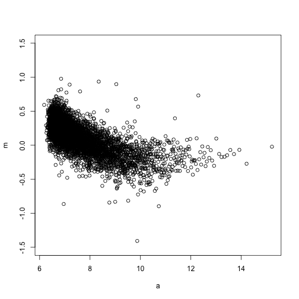 


Now let's use loess to normalize the arrays showing a bias.


```r
o <- order(A)
a <- A[o]
m <- M[o]
ind <- round(seq(1, length(a), len = 5000))
a <- a[ind]
m <- m[ind]
fit <- loess(m ~ a)
bias <- predict(fit, newdata = data.frame(a = A))
nM <- M - bias
mypar(1, 1)
splot(A, M, ylim = c(-1.5, 1.5))
points(A[spikeinIndex], M[spikeinIndex], ylim = c(-4, 4), bg = 1, pch = 21)
lines(a, fit$fitted, col = 2, lwd = 2)
```

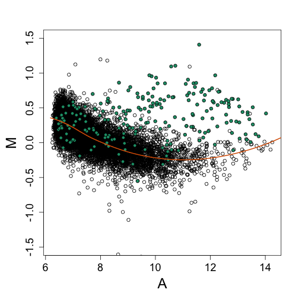 

```r
splot(A, nM, ylim = c(-1.5, 1.5))
points(A[spikeinIndex], nM[spikeinIndex], ylim = c(-4, 4), bg = 1, pch = 21)
abline(h = 0, col = 2, lwd = 2)
```

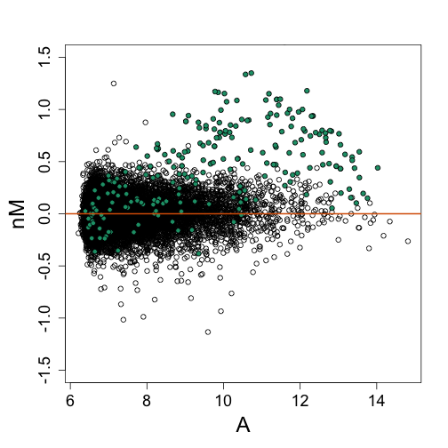 


Note that the bias is removed and now the highest fold changes are almost all spike-ins. Also note that the we can control the size of the intervals in which lines are fit. The smaller we make these intervals the more flexibility we get. This is controlled with the `span` argument of the `loess` function. A span of 0.75 means that the closest points are considered until 3/4 of all points are used. Finally, we are fitting parabolas, but for some datasets these can result in over fitting. For example, a few points can force a parabola to "shoot up" very fast. For this reason using lines (the argument is `degree=1`) is safer.


```r
fit <- loess(m ~ a, degree = 1, span = 1/2)
bias <- predict(fit, newdata = data.frame(a = A))
nM <- M - bias
mypar(1, 1)
splot(A, M, ylim = c(-1.5, 1.5))
points(A[spikeinIndex], M[spikeinIndex], ylim = c(-4, 4), bg = 1, pch = 21)
lines(a, fit$fitted, col = 2, lwd = 2)
```

 

```r
splot(A, nM, ylim = c(-1.5, 1.5))
points(A[spikeinIndex], nM[spikeinIndex], ylim = c(-4, 4), bg = 1, pch = 21)
abline(h = 0, col = 2, lwd = 2)
```

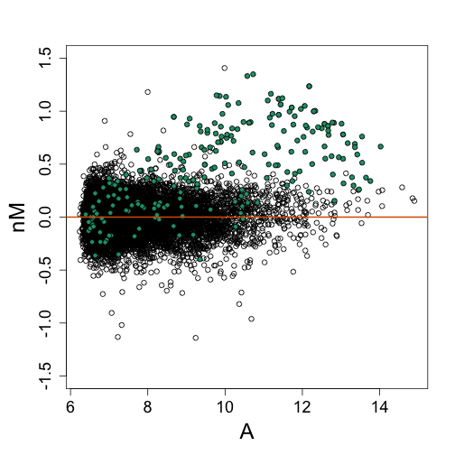 


#### *Homework*
1. Try various values of span different from 0.75 and change the degree. Decide which you believe to be the best and defend the choice.


## Quantile normalization

One limitation of loess normalization is that it depends on pairings of samples. We have this for two color arrays, but for other platforms, such as Affymetrix, we do not have such pairings. [Quantile normalization](#foot) offers a solution that is more generally applicable.

The smooth histogram plots demonstrate that different samples have different distributions, not just median shifts. This happens even when we look at data from replicated RNA. Quantile normalization forces all these distributions to be the same: it makes each quantile (not just the median) the same across samples. The algorithm, as implemeted in Biocondcutor, does the following for a matrix with rows representing genes and columns representing samples:

1. Order the value in each column
2. Replace the values of each row with the average of that row
3. Re-order back to the original order

<!-- Put Figure from POWER point here -->

Here we demonstrate how to use quantile normalization in practice and how it corrects the bias. 

```r
library(preprocessCore)
nspms <- normalize.quantiles(spms)

M = log2(spms[, i]) - log2(spms[, j])
A = (log2(spms[, i]) + log2(spms[, j]))/2
splot(A, M, ylim = c(-1.5, 1.5))
points(A[spikeinIndex], M[spikeinIndex], bg = 1, pch = 21)
```

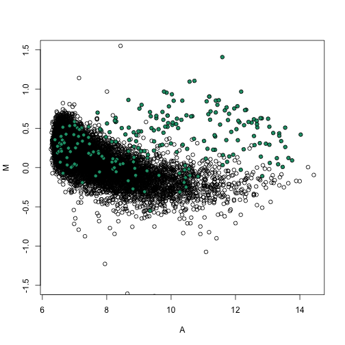 

```r

M = log2(nspms[, i]) - log2(nspms[, j])
A = (log2(nspms[, i]) + log2(nspms[, j]))/2
splot(A, M, ylim = c(-1.5, 1.5))
points(A[spikeinIndex], M[spikeinIndex], bg = 1, pch = 21)
```

 


Note that the densities are now identical as expected since we forced this to be the case.

```r
pms <- spms
mypar(1, 1)
shist(log2(pms[, 2]), unit = 0.1, type = "n", xlab = "log (base 2) intensity", 
    main = "Five techical replicates")
for (i in 1:5) shist(log2(pms[, i]), unit = 0.1, col = i, add = TRUE, lwd = 2, 
    lty = i)
```

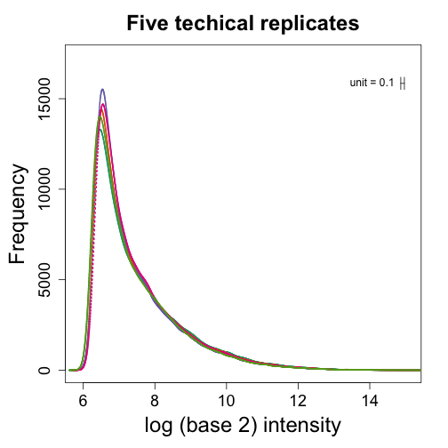 

```r
qpms <- normalize.quantiles(pms[, 1:5])
shist(log2(qpms[, 2]), unit = 0.1, type = "n", xlab = "log (base 2) intensity", 
    main = "Five techical replicates")
for (i in 1:5) shist(log2(qpms[, i]), unit = 0.1, col = i, add = TRUE, lwd = 2, 
    lty = i)
```

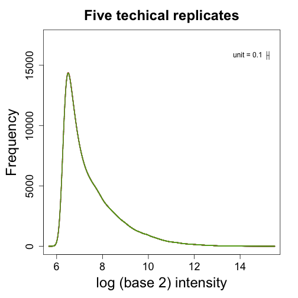 


Note how quantile normalization also fixes the bias but keeps the spiked-in genes different.

## VSN

In the background unit we learned that the background noise appears to be additive. However, shifts we see that explain some of the need for normalization appear to be multiplicative terms. Also we have observed a strong mean and variance relationship that is in agreement with multiplicative error. [Varianze stabilizing normalization](#foot) (vsn) motivates the need for normalization with an additive background multiplicative noise model:

$$
Y_{ij}= \beta_i + \varepsilon_{ij} + A_i \theta_{j} \eta_{ij}
$$
The expression level we are interested in estimating is $\theta_j$ which we assume changes across genes $j$ and is the same across arrays $i$. Here, $\beta_i$ is an array specific background level that changes from probe to probe due to additive noise $\varepsilon_{ij}$. We refer to $A_i$ as the gain and note that it changes from array to array.  Here is a monte carlo simulation demonstrating that by changing $\beta$ and $A$ we can generate non-linear biases as we see in practice.

```r
library(rafalib)
N = 10000
e = rexp(N, 1/1000)
b1 = 24
b2 = 20
A1 = 1
A2 = 1.25
sigma = 1
eta = 0.05
y1 = b1 + rnorm(N, 0, sigma) + A1 * e * 2^rnorm(N, 0, eta)
y2 = b2 + rnorm(N, 0, sigma) + A2 * e * 2^rnorm(N, 0, eta)
mypar(1, 1)
maplot(log2(y1), log2(y2), ylim = c(-1, 1), curve.add = FALSE)
```

 


For this type of data, the variance depends on the mean. We seek a transfromation that stabilizies the variance of the estimates of $\theta$ after we subctract the additive background estimate and divide by the estimate of the gain.


```r
ny1 = (y1 - b1)/A1
ny2 = (y2 - b2)/A2
mypar(1, 2)
maplot(ny1, ny2, curve.add = FALSE, ylim = c(-500, 500))
maplot(log2(ny1), log2(ny2), ylim = c(-2, 2), xlim = c(0, 15))
```

```
## Warning: NaNs produced
## Warning: NaNs produced
```

```
## Error: 'x' and 'y' lengths differ
```

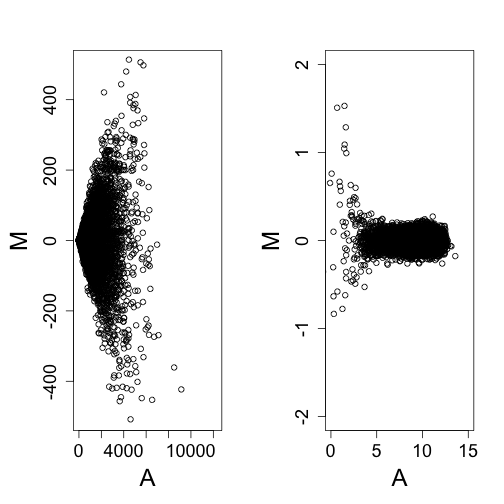 


If we know how the variance depends on the mean, we can compute a variance stabilizing transform:
$$
Y \text{ with } \text{E}(Y)=\mu \text{ and } \text{var}(Y) = v(\mu)\\
\text{var}\{f(Y)\} \text{ does not depend on } \mu
$$
In the case of the model above we can derive the following transformation 

$$
\text{arsinh}(y) = \log\left(y + \sqrt{y^2+1} \right)
$$

The `vsn` library implements this apprach. It estimates $\beta$ and $A$ by assuming that most genes don't change, i.e. $\theta$ does not depend on $i$.

```r

library(vsn)
nspms <- exprs(vsn2(spms))
i = 10
j = 9
M = log2(spms[, i]) - log2(spms[, j])
A = (log2(spms[, i]) + log2(spms[, j]))/2
splot(A, M, ylim = c(-1.5, 1.5))
points(A[spikeinIndex], M[spikeinIndex], bg = 1, pch = 21)
```

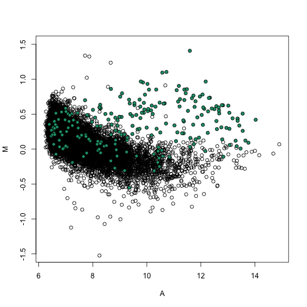 

```r

M = nspms[, i] - nspms[, j]
A = (nspms[, i] + nspms[, j])/2
splot(A, M, ylim = c(-1.5, 1.5))
points(A[spikeinIndex], M[spikeinIndex], bg = 1, pch = 21)
```

 


We notice that it corrects the bias in a similar way to loess and quantile normalization.
## RNA-seq


```r
library(dagdata)
data(bottomly)
library(GenomicRanges)
```

```
## Loading required package: IRanges
## Loading required package: GenomeInfoDb
```

```r
f <- assay(bottomly)
pd <- colData(bottomly)
o <- order(pd$strain == "C57BL/6J")
f <- f[, o]
pd <- pd[o, ]
mypar(1, 1)
boxplot(log2(f + 0.5), col = as.fumeric(pd[, 4]), names = pd[, 5], ylab = "log (base 2) read counts + 0.5")
```

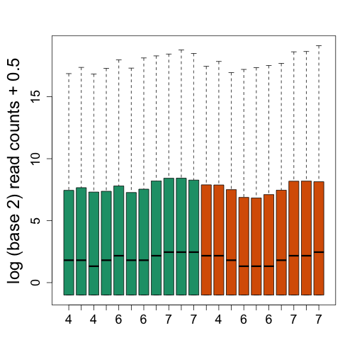 

We see that there is also need for normalization. Fragments per Kilobase per Million (FPKM) normalizes by dividing by the total number of reads. This removes much of the variability seen in the first plot.


```r
# use 'reduce' to merge overlapping exons 'width' gives the length of each
# exon 'sum' operates on each element of the integer list
k <- sum(width(reduce(rowData(bottomly))))/1000
# here we assume no reads mapped outside of genes...
m <- colSums(f)/1e+06


tmp <- sweep(f, 1, k, "/")
fpkm <- sweep(tmp, 2, m, "/")


boxplot(log2(fpkm + 0.001), col = as.fumeric(pd[, 4]), names = pd[, 5], ylab = "log (base 2) RPKM + 0.001")
```

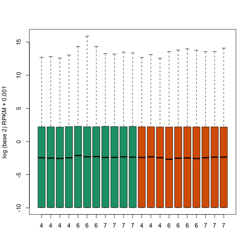 


```r
mypar(2, 2)
for (i in 1:4) hist(log2(fpkm[, i] + 0.001), nc = 100, main = "")
```

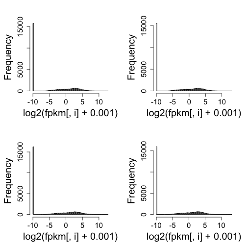 


```r
mypar(1, 1)
keep <- which(rowSums(fpkm == 0) == 0)
plot(0, 0, type = "n", ylim = c(0, 850), xlim = c(-6, 12), ylab = "Frequency", 
    xlab = "log (base 2) FPKM")
for (i in 1:20) shist(log2(fpkm[keep, i]), col = i, add = TRUE, unit = 0.25)
```

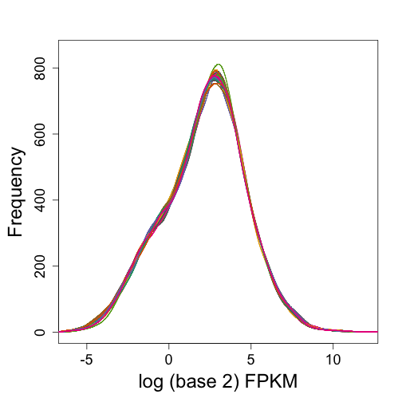 


```r
library(dagdata)
data(pickrell)
library(GenomicRanges)
library(rafalib)
f <- assay(pickrell)
k <- sum(width(reduce(rowData(pickrell))))/1000
m <- colSums(f)/1e+06
tmp <- sweep(f, 1, k, "/")
fpkm <- sweep(tmp, 2, m, "/")
plot(0, 0, type = "n", ylim = c(0, 850), xlim = c(-10, 12), ylab = "Frequency", 
    xlab = "log (base 2) FPKM")
```

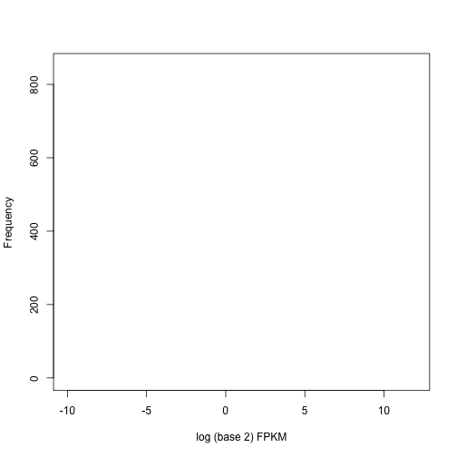 

```r

keep <- which(rowSums(fpkm == 0) == 0)
mypar(1, 2)
i = 2
j = 67  ##picking one of the worse culprits
maplot(log2(fpkm[keep, i]), log2(fpkm[keep, j]))
shist(log2(fpkm[keep, 65]), unit = 0.25, ylab = "Frequency", xlab = "log (base 2) FPKM", 
    col = 1)
for (i in 65:69) shist(log2(fpkm[keep, i]), col = i - 64, add = TRUE, unit = 0.25)
```

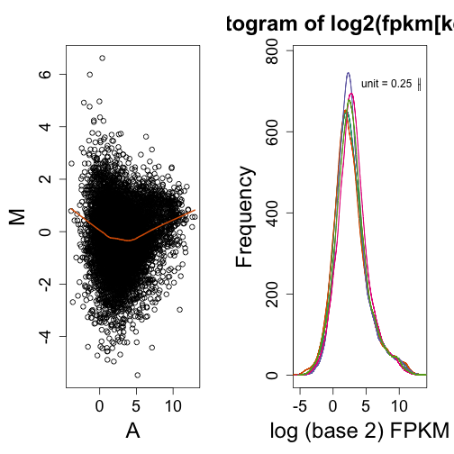 

```r
mypar(1, 1)
plot(colMeans(fpkm == 0), ylab = "proportion of 0s", xlab = "proportion index", 
    pch = 16)
```

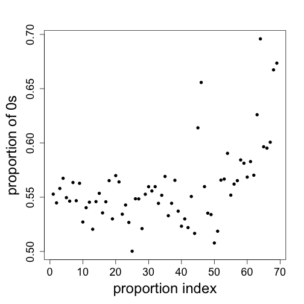 


## When not to use normalization

Boxplots of all Dilution data (see [above](#dilution)). Obviously we don't want to normalize.


```r
library(rafalib)
library(affy)
library(preprocessCore)
setwd("/Users/ririzarr/myDocuments/teaching/HarvardX/genomicsclass/week4/Dilution")
pd = read.table("pdata.txt", header = TRUE, check.names = FALSE, as.is = TRUE)
pd <- pd[which(pd[, 3] == 0), ]  ##only liver
dat <- ReadAffy(filenames = paste0(pd[, 1], ".cel"), verbose = FALSE)
pms = pm(dat)
npms = normalize.quantiles(pms)
mypar()
boxplot(log2(pms), col = as.fumeric(pd[, 2]), range = 0, names = pd[, 2], las = 3, 
    main = "Dilution expreiment")
boxplot(log2(npms), col = as.fumeric(pd[, 2]), range = 0, names = pd[, 2], las = 3, 
    main = "Dilution expreiment")
```


Show the spike-in which are experimentally introduced to be a the same level.

##  spike-ins

```r
siNames <- colnames(pd)[4:11]
spikeIndex <- which(probeNames(dat) %in% siNames)
boxplot(log2(pms)[spikeIndex, ], col = as.fumeric(pd[, 2]), names = pd[, 2], 
    ylim = range(log2(pms)), las = 3)
```


The spike-ins show the problem with normalizing.


```r
i = 1
j = 6
M = log2(pms[, i]) - log2(pms[, j])
A = (log2(pms[, i]) + log2(pms[, j]))/2
splot(A, M, n = 50000, ylim = c(-1, 1))
points(A[spikeIndex], M[spikeIndex], bg = 1, pch = 21)
abline(h = 0)
M = log2(npms[, i]) - log2(npms[, j])
A = (log2(npms[, i]) + log2(npms[, j]))/2
splot(A, M, n = 50000, ylim = c(-1, 1))
points(A[spikeIndex], M[spikeIndex], bg = 1, pch = 21)
abline(h = 0)
```


<!-- mention CHARM approach -->


```r
i = 1
j = 6
M = log2(pms[, i]) - log2(pms[, j])
A = (log2(pms[, i]) + log2(pms[, j]))/2
splot(A, M, n = 50000, ylim = c(-1.5, 1.5))
points(A[spikeIndex], M[spikeIndex], bg = 1, pch = 21)
a <- A[spikeIndex]
m <- M[spikeIndex]
o <- order(a)
a <- a[o]
m <- m[o]
fit <- loess(m ~ a, degree = 1)
bias <- predict(fit, newdata = data.frame(a = A))
lines(a, fit$fitted, col = 2, lwd = 2)
nM <- M - bias
splot(A, nM, n = 50000, ylim = c(-1.5, 1.5))
points(A[spikeIndex], nM[spikeIndex], bg = 1, pch = 21)
abline(h = 0)
```


However, control genes are not always reliable

```r
i = 1
j = 2
M = log2(pms[, i]) - log2(pms[, j])
A = (log2(pms[, i]) + log2(pms[, j]))/2
splot(A, M, n = 50000, ylim = c(-1.5, 1.5))
points(A[spikeIndex], M[spikeIndex], bg = 1, pch = 21)
abline(h = 0)
a <- A[spikeIndex]
m <- M[spikeIndex]
o <- order(a)
a <- a[o]
m <- m[o]
fit <- loess(m ~ a, degree = 1)
bias <- predict(fit, newdata = data.frame(a = A))
lines(a, fit$fitted, col = 2, lwd = 2)
nM <- M - bias
splot(A, nM, n = 50000, ylim = c(-1.5, 1.5))
points(A[spikeIndex], nM[spikeIndex], bg = 1, pch = 21)
abline(h = 0)

```


## Subset Quantile Normalization
<!-- add rick youngs data show it similar to this -->

Here is a dataset were the spike-ins appear to be performing well, at least across biological replicates:

```r
library(rafalib)
library(affy)
library(preprocessCore)
library(mycAffyData)
data(mycData)
erccIndex <- grep("ERCC", probeNames(mycData))
```

```
## Warning: replacing previous import by 'utils::head' when loading 'primeviewcdf'
## Warning: replacing previous import by 'utils::tail' when loading 'primeviewcdf'
```

```
## 
## 
## Attaching package: 'primeviewcdf'
## 
## The following objects are masked from 'package:hgu95acdf':
## 
##     i2xy, xy2i
```

```r
pms <- pm(mycData)
mypar(1, 2)
for (h in 1:2) {
    i = 2 * h
    j = 2 * h - 1
    M = log2(pms[, i]) - log2(pms[, j])
    A = (log2(pms[, i]) + log2(pms[, j]))/2
    splot(A, M, n = 50000, , ylim = c(-4, 4))
    points(A[erccIndex], M[erccIndex], col = 1)
}
```

 


But here are two samples experimentally designed to be different:


```r
library(mycAffyData)
data(mycData)
erccIndex <- grep("ERCC", probeNames(mycData))
pms <- pm(mycData)
mypar(1, 2)
for (h in 1:2) {
    i = h + 2
    j = h
    M = log2(pms[, i]) - log2(pms[, j])
    A = (log2(pms[, i]) + log2(pms[, j]))/2
    splot(A, M, n = 50000, , ylim = c(-4, 4))
    points(A[erccIndex], M[erccIndex], col = 1)
}
```

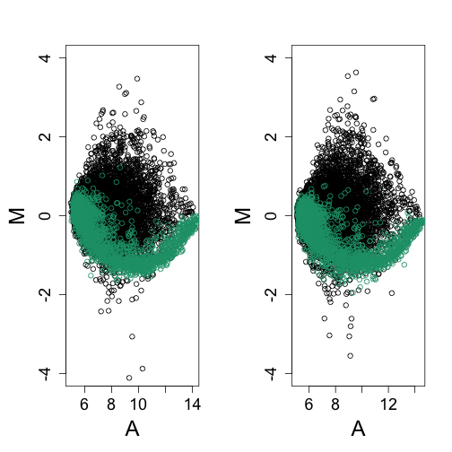 


The Cell paper (Lovén, J. et al. 2012) did not consider SQN but it works very well:

```r
library(SQN)  ##from CRAN
```

```
## Loading required package: mclust
## Package 'mclust' version 4.3
## 
## Attaching package: 'mclust'
## 
## The following object is masked from 'package:GenomicRanges':
## 
##     map
## 
## The following object is masked from 'package:IRanges':
## 
##     map
## 
## Loading required package: nor1mix
```

```r
sqnpms <- SQN(log2(pms), ctrl.id = erccIndex)
pairs <- list(i = c(1, 3, 3, 4), j = c(2, 4, 1, 2))
mypar(2, 2)
for (h in 1:4) {
    i = pairs$i[h]
    j = pairs$j[h]
    M = log2(pms[, i]) - log2(pms[, j])
    A = (log2(pms[, i]) + log2(pms[, j]))/2
    splot(A, M, n = 50000, , ylim = c(-4, 4))
    points(A[erccIndex], M[erccIndex], col = 1)
    abline(h = 0)
}
```

 

```r
mypar(2, 2)
for (h in 1:4) {
    i = pairs$i[h]
    j = pairs$j[h]
    M = sqnpms[, i] - sqnpms[, j]
    A = (sqnpms[, i] + sqnpms[, j])/2
    splot(A, M, n = 50000, , ylim = c(-4, 4))
    points(A[erccIndex], M[erccIndex], col = 1)
    abline(h = 0)
}
```

 


## Footnotes <a name="foot"></a>

### loess

W. S. Cleveland, E. Grosse and W. M. Shyu (1992) Local regression models. Chapter 8 of Statistical Models in S eds J.M. Chambers and T.J. Hastie, Wadsworth & Brooks/Cole.

### Quantile normalization

Bolstad BM, Irizarry RA, Astrand M, Speed TP. "A comparison of normalization methods for high density oligonucleotide array data based on variance and bias." Bioinformatics. 2003. <http://www.ncbi.nlm.nih.gov/pubmed/12538238>

### Variance stabilization

For microarray:

Wolfgang Huber, Anja von Heydebreck, Holger Sültmann, Annemarie Poustka and Martin Vingron, "Variance stabilization applied to microarray data calibration and to the quantification of differential expression" Bioinformatics, 2002. <http://bioinformatics.oxfordjournals.org/content/18/suppl_1/S96.short>

B.P. Durbin, J.S. Hardin, D.M. Hawkins and D.M. Rocke, "A variance-stabilizing transformation for gene-expression microarray data", Bioinformatics. 2002. <http://bioinformatics.oxfordjournals.org/content/18/suppl_1/S105>

Wolfgang Huber, Anja von Heydebreck, Holger Sueltmann, Annemarie Poustka, Martin Vingron, "Parameter estimation for the calibration and variance stabilization of microarray data" Stat Appl Mol Biol Genet, 2003. <http://dx.doi.org/10.2202/1544-6115.1008>

For NGS read counts:

Simon Anders and Wolfgang Huber, "Differential expression analysis for sequence count data", Genome Biology, 2010. <http://genomebiology.com/2010/11/10/r106>

General discussion of variance stabilization:

Robert Tibshirani, "Variance Stabilization and the Bootstrap" Biometrika, 1988. <http://www.jstor.org/discover/10.2307/2336593>
