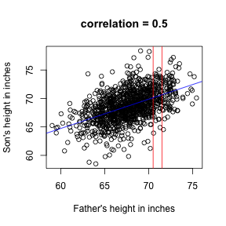
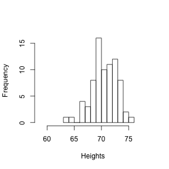
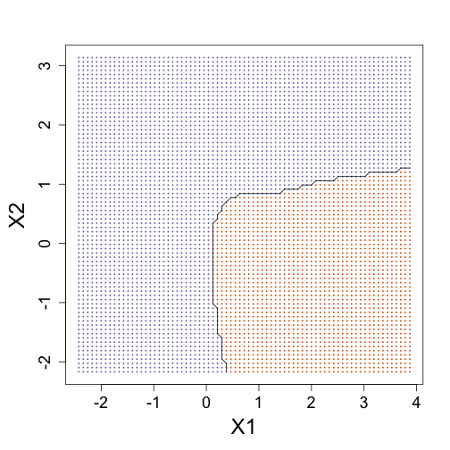
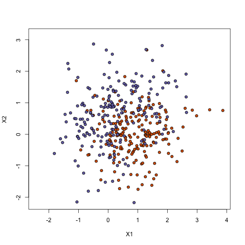
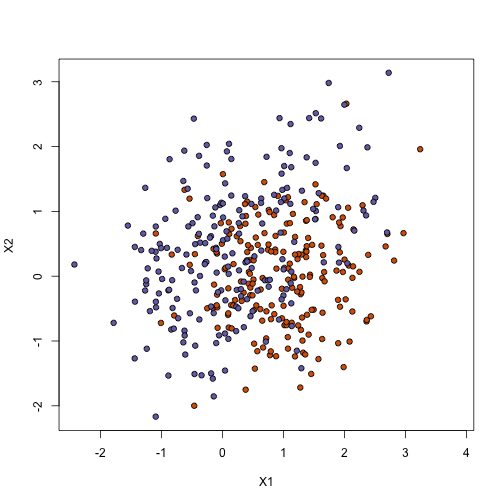
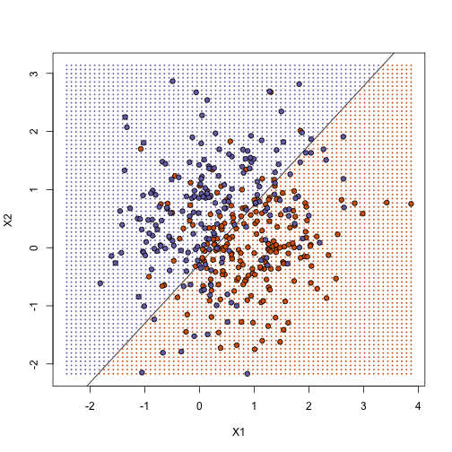
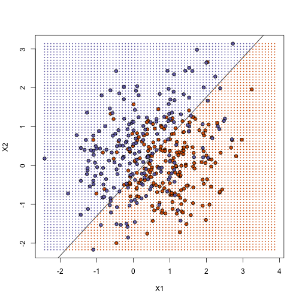
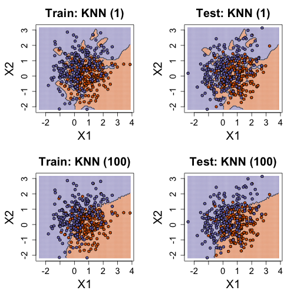

The following lecture closely follows an example from the book, The Elements of Statistical Learning: Data Mining, Inference, and Prediction, by Trevor Hastie, Robert Tibshirani and Jerome Friedman. A free PDF of this book can be found at the following URL:

<http://statweb.stanford.edu/~tibs/ElemStatLearn/>

## Scatter plots and correlation

Predict sons height from fathers:


```r
library(UsingR)
```

```
## Loading required package: MASS
```

```r
data("father.son")
x = father.son$fheight
y = father.son$sheight
plot(x, y, xlab = "Father's height in inches", ylab = "Son's height in inches", 
    main = paste("correlation =", signif(cor(x, y), 2)))
abline(v = c(-0.5, 0.5) + 71, col = "red")
abline(lm(y ~ x), col = "blue")
```

 

```r
hist(y[round(x) == 71], xlab = "Heights", nc = 8, main = "", xlim = range(y))
```

 


## Stratification
Within a population, the best guess (can be showns mathematicallly to best) is the average. So we can stratify and take the average. This is called a conditional expencations. Out prediction for any $x$ is
$$
f(x) = E(Y|X=x)
$$

$$
\frac{Y - \mu_Y}{\sigma_Y} = r \frac{X-\mu_X}{\sigma_X}
$$

What about more general, e.g. several Xs?

Let's create an illustrative dataset with 2 predictors. We will create a non-linear true relationship between $X$ and outcome $Y$


```r
library(rafalib)
```

```
## Loading required package: RColorBrewer
```

```r
mycols = c(2, 3)

set.seed(1)
## create covariates and outcomes outcomes are alwasy 50 0s and 50 1s
s2 = 0.15
## pick means to create a non linear conditional expectation
M0 <- mvrnorm(10, c(1, 0), s2 * diag(2))  ##generate 10 means
M1 <- rbind(mvrnorm(3, c(1, 1), s2 * diag(2)), mvrnorm(3, c(0, 1), s2 * diag(2)), 
    mvrnorm(4, c(0, 0), s2 * diag(2)))

### funciton to generate random pairs
s <- sqrt(1/5)
N = 200
makeX <- function(M, n = N, sigma = s * diag(2)) {
    z <- sample(1:10, n, replace = TRUE)  ##pick n at random from above 10
    m <- M[z, ]  ##these are the n vectors (2 components)
    return(t(apply(m, 1, function(mu) mvrnorm(1, mu, sigma))))  ##the final values
}


### create the training set and the test set
x0 <- makeX(M0)  ##the final values for y=0 (green)
testx0 <- makeX(M0)
x1 <- makeX(M1)
testx1 <- makeX(M1)
x <- rbind(x0, x1)  ## one matrix with everything
test <- rbind(testx0, testx1)
y <- c(rep(0, N), rep(1, N))  #the outcomes
cols <- mycols[c(rep(1, N), rep(2, N))]


## Create a grid so we can predict all of X,Y
GS <- 75  ##grid size is GS x GS
XLIM <- c(min(c(x[, 1], test[, 1])), max(c(x[, 1], test[, 1])))
tmpx <- seq(XLIM[1], XLIM[2], len = GS)
YLIM <- c(min(c(x[, 2], test[, 2])), max(c(x[, 2], test[, 2])))
tmpy <- seq(YLIM[1], YLIM[2], len = GS)
newx <- expand.grid(tmpx, tmpy)  #grid used to show color contour of predictions

### Bayes rule: best possible answer probability of Y given X
p <- function(x) {
    p0 <- mean(dnorm(x[1], M0[, 1], s) * dnorm(x[2], M0[, 2], s))
    p1 <- mean(dnorm(x[1], M1[, 1], s) * dnorm(x[2], M1[, 2], s))
    p1/(p0 + p1)
}

## Draw contours of E(Y|X) < 0.5
mypar(1, 1)
plot(x, type = "n", xlab = "X1", ylab = "X2", xlim = XLIM, ylim = YLIM)
```

 

```r
points(newx, col = colshat, pch = 16, cex = 0.35)
```

```
## Error: object 'colshat' not found
```

```r
contour(tmpx, tmpy, matrix(round(bayesrule), GS, GS), levels = c(1, 2), add = TRUE, 
    drawlabels = FALSE)
```

```
## Error: object 'bayesrule' not found
```


Now make a plot of training data and test data

```r
plot(x, pch = 21, bg = cols, xlab = "X1", ylab = "X2", xlim = XLIM, ylim = YLIM)
```

 

```r
plot(test, pch = 21, bg = cols, xlab = "X1", ylab = "X2", xlim = XLIM, ylim = YLIM)
```

 


Predict with regression

```r
X1 <- x[, 1]  ##these are the covariates
X2 <- x[, 2]
fit1 <- lm(y ~ X1 + X2)

## prediction on train
yhat <- predict(fit1)
yhat <- as.numeric(yhat > 0.5)
cat("Linear regression prediction error in train:", 1 - mean(yhat == y), "\n")
```

```
## Linear regression prediction error in train: 0.295
```

```r

yhat <- predict(fit1, newdata = data.frame(X1 = newx[, 1], X2 = newx[, 2]))
m <- -fit1$coef[2]/fit1$coef[3]
b <- (0.5 - fit1$coef[1])/fit1$coef[3]

## colors for prediction
colshat <- yhat
colshat[yhat >= 0.5] <- mycols[2]
colshat[yhat < 0.5] <- mycols[1]

plot(x, type = "n", xlab = "X1", ylab = "X2", xlim = XLIM, ylim = YLIM)
abline(b, m)
points(newx, col = colshat, cex = 0.35, pch = 16)
points(x, pch = 21, bg = cols, xlab = "X1", ylab = "X2", xlim = XLIM, ylim = YLIM)
```

 


How does it work on test case

```r
## prediction on test
yhat <- predict(fit1, newdata = data.frame(X1 = test[, 1], X2 = test[, 2]))
yhat <- as.numeric(yhat > 0.5)
cat("Linear regression prediction error in test:", 1 - mean(yhat == y), "\n")
```

```
## Linear regression prediction error in test: 0.3075
```

```r

plot(test, type = "n", xlab = "X1", ylab = "X2", xlim = XLIM, ylim = YLIM)
abline(b, m)
points(newx, col = colshat, pch = 16, cex = 0.35)
points(test, bg = cols, pch = 21)
```

 


K-nearest neighbor

```r
library(class)
mypar(2, 2)
for (k in c(1, 100)) {
    cat(k, "nearest neighbors\n")
    
    ## predict on train
    yhat <- knn(x, x, y, k = k)
    cat("KNN prediction error in train:", 1 - mean((as.numeric(yhat) - 1) == 
        y), "\n")
    
    ## make plot
    yhat <- knn(x, newx, y, k = k)
    colshat <- mycols[as.numeric(yhat)]
    
    plot(x, type = "n", xlab = "X1", ylab = "X2", xlim = XLIM, ylim = YLIM)
    points(newx, col = colshat, cex = 0.35, pch = 16)
    contour(tmpx, tmpy, matrix(as.numeric(yhat), GS, GS), levels = c(1, 2), 
        add = TRUE, drawlabels = FALSE)
    points(x, bg = cols, pch = 21)
    title(paste("Train: KNN (", k, ")", sep = ""))
    
    plot(test, type = "n", xlab = "X1", ylab = "X2", xlim = XLIM, ylim = YLIM)
    points(newx, col = colshat, cex = 0.35, pch = 16)
    contour(tmpx, tmpy, matrix(as.numeric(yhat), GS, GS), levels = c(1, 2), 
        add = TRUE, drawlabels = FALSE)
    points(test, bg = cols, pch = 21)
    title(paste("Test: KNN (", k, ")", sep = ""))
    
    yhat <- knn(x, test, y, k = k)
    cat("KNN prediction error in test:", 1 - mean((as.numeric(yhat) - 1) == 
        y), "\n")
}
```

```
## 1 nearest neighbors
## KNN prediction error in train: 0
```

```
## KNN prediction error in test: 0.375 
## 100 nearest neighbors
## KNN prediction error in train: 0.24
```

 

```
## KNN prediction error in test: 0.2825
```


Comparison

```r
### Bayes Rule
yhat <- apply(test, 1, p)
cat("Bayes rule prediction error in train", 1 - mean(round(yhat) == y), "\n")
```

```
## Bayes rule prediction error in train 0.2775
```

```r
bayes.error = 1 - mean(round(yhat) == y)
train.error <- rep(0, 16)
test.error <- rep(0, 16)
for (k in seq(along = train.error)) {
    cat(k, "nearest neighbors\n")
    
    ## predict on train
    yhat <- knn(x, x, y, k = 2^(k/2))
    train.error[k] <- 1 - mean((as.numeric(yhat) - 1) == y)
    
    yhat <- knn(x, test, y, k = 2^(k/2))
    test.error[k] <- 1 - mean((as.numeric(yhat) - 1) == y)
}
```

```
## 1 nearest neighbors
## 2 nearest neighbors
## 3 nearest neighbors
## 4 nearest neighbors
## 5 nearest neighbors
## 6 nearest neighbors
## 7 nearest neighbors
## 8 nearest neighbors
## 9 nearest neighbors
## 10 nearest neighbors
## 11 nearest neighbors
## 12 nearest neighbors
## 13 nearest neighbors
## 14 nearest neighbors
## 15 nearest neighbors
## 16 nearest neighbors
```

```r

ks <- 2^(seq(along = train.error)/2)
mypar()
plot(ks, train.error, type = "n", xlab = "K", ylab = "Prediction Error", log = "x", 
    ylim = range(c(test.error, train.error)))
lines(ks, train.error, type = "b", col = 4, lty = 2, lwd = 2)
lines(ks, test.error, type = "b", col = 5, lty = 3, lwd = 2)
abline(h = bayes.error, col = 6)
legend("bottomright", c("Train", "Test", "Bayes"), col = c(4, 5, 6), lty = c(2, 
    3, 1), box.lwd = 0)
```

 


