## Introduction

RNA-seq is a valuable experiment for quantifying both the types and the amount of RNA molecules in a sample. We've covered the basic idea of the protocol in lectures, but some early references for RNA-seq include [Mortazavi (2008)](#foot) and [Marioni (2008)](#foot).

In this lab, we will focus on comparing the expression levels of genes across different samples, by counting the number of reads which overlap the exons of genes defined by a known annotation. As described in the lecture, this analysis sets aside the task of estimating the different kinds of RNA molecules, and the different isoforms for genes with multiple isoforms. One advantage of looking at these matrices of counts is that we can use statistical distributions to model how the variance of counts will change when the counts are low vs high. We will explore the relationship of the variance of counts to the mean later in this lab.

## Counting reads in genes

In this lab we will examine 8 samples from the airway package, which are from the paper by [Himes et al](http://www.ncbi.nlm.nih.gov/pmc/articles/PMC4057123/): "RNA-seq Transcriptome Profiling Identifies CRISPLD2 as a Glucocorticoid Responsive Gene that Modulates Cytokine Function in Airway Smooth Muscle Cells".

This lab will focus on a summarized version of an RNA-seq experiment: a count matrix, which has genes along the rows and samples along the columns. The values in the matrix are the number of reads which could be uniquely aligned to the exons of a given gene for a given sample. We will demonstrate how to build a count matrix for a subset of reads from an experiment, and then use a pre-made count matrix, to avoid having students download the multi-gigabyte BAM files containing the aligned reads. A new pipeline for building count matrices, which skips the alignment step, is to use fast pseudoaligners such as Sailfish, Salmon and kallisto, followed by the [tximport](http://bioconductor.org/packages/tximport) package. See the package vignette for more details. Here, we will continue with the read counting pipeline.

First, make variables for the different BAM files and GTF file. Use the `sample.table` to contruct the BAM file vector, so that the count matrix will be in the same order as the `sample.table`.


```r
library(airway)
```

```
## Loading required package: SummarizedExperiment
```

```
## Loading required package: methods
```

```
## Loading required package: GenomicRanges
```

```
## Loading required package: BiocGenerics
```

```
## Loading required package: parallel
```

```
## 
## Attaching package: 'BiocGenerics'
```

```
## The following objects are masked from 'package:parallel':
## 
##     clusterApply, clusterApplyLB, clusterCall, clusterEvalQ,
##     clusterExport, clusterMap, parApply, parCapply, parLapply,
##     parLapplyLB, parRapply, parSapply, parSapplyLB
```

```
## The following objects are masked from 'package:stats':
## 
##     IQR, mad, xtabs
```

```
## The following objects are masked from 'package:base':
## 
##     anyDuplicated, append, as.data.frame, as.vector, cbind,
##     colnames, do.call, duplicated, eval, evalq, Filter, Find, get,
##     grep, grepl, intersect, is.unsorted, lapply, lengths, Map,
##     mapply, match, mget, order, paste, pmax, pmax.int, pmin,
##     pmin.int, Position, rank, rbind, Reduce, rownames, sapply,
##     setdiff, sort, table, tapply, union, unique, unlist, unsplit
```

```
## Loading required package: S4Vectors
```

```
## Loading required package: stats4
```

```
## Loading required package: IRanges
```

```
## Loading required package: GenomeInfoDb
```

```
## Loading required package: Biobase
```

```
## Welcome to Bioconductor
## 
##     Vignettes contain introductory material; view with
##     'browseVignettes()'. To cite Bioconductor, see
##     'citation("Biobase")', and for packages 'citation("pkgname")'.
```

```r
dir <- system.file("extdata", package="airway", mustWork=TRUE)
csv.file <- file.path(dir, "sample_table.csv")
sample.table <- read.csv(csv.file, row.names=1)
bam.files <- file.path(dir, paste0(sample.table$Run, "_subset.bam"))
gtf.file <- file.path(dir, "Homo_sapiens.GRCh37.75_subset.gtf")
```

Next we create an *Rsamtools* variable which wraps our BAM files, and create a transcript database from the GTF file. We can ignore the warning about `matchCircularity`. Finally, we make a *GRangesList* which contains the exons for each gene.


```r
library(Rsamtools)
```

```
## Loading required package: XVector
```

```
## Loading required package: Biostrings
```

```r
bam.list <- BamFileList(bam.files)
library(GenomicFeatures)
```

```
## Loading required package: AnnotationDbi
```

```r
# for Bioc 3.0 use the commented out line
# txdb <- makeTranscriptDbFromGFF(gtf.file, format="gtf")
txdb <- makeTxDbFromGFF(gtf.file, format="gtf")
```

```
## Import genomic features from the file as a GRanges object ...
```

```
## OK
```

```
## Prepare the 'metadata' data frame ...
```

```
## OK
```

```
## Make the TxDb object ...
```

```
## OK
```

```r
exons.by.gene <- exonsBy(txdb, by="gene")
```

The following code chunk creates a *SummarizedExperiment* containing the counts for the reads in each BAM file (columns) for each gene in `exons.by.gene` (the rows). We add the `sample.table` as column data. Remember, we know the order is correct, because the `bam.list` was constructed from a column of `sample.table`.


```r
library(GenomicAlignments)
se <- summarizeOverlaps(exons.by.gene, bam.list,
                        mode="Union",
                        singleEnd=FALSE,
                        ignore.strand=TRUE,
                        fragments=TRUE)
colData(se) <- DataFrame(sample.table)
```

A similar function in the *Rsubread* library can be used to construct a count matrix:


```r
library(Rsubread)
fc <- featureCounts(bam.files, annot.ext=gtf.file,
                    isGTFAnnotationFile=TRUE, 
                    isPaired=TRUE)
```

```
## 
##         ==========     _____ _    _ ____  _____  ______          _____  
##         =====         / ____| |  | |  _ \|  __ \|  ____|   /\   |  __ \ 
##           =====      | (___ | |  | | |_) | |__) | |__     /  \  | |  | |
##             ====      \___ \| |  | |  _ <|  _  /|  __|   / /\ \ | |  | |
##               ====    ____) | |__| | |_) | | \ \| |____ / ____ \| |__| |
##         ==========   |_____/ \____/|____/|_|  \_\______/_/    \_\_____/
##        Rsubread 1.18.0
## 
## //========================== featureCounts setting ===========================\\
## ||                                                                            ||
## ||             Input files : 8 BAM files                                      ||
## ||                           P /Users/michael/Library/R/3.2/library/airwa ... ||
## ||                           P /Users/michael/Library/R/3.2/library/airwa ... ||
## ||                           P /Users/michael/Library/R/3.2/library/airwa ... ||
## ||                           P /Users/michael/Library/R/3.2/library/airwa ... ||
## ||                           P /Users/michael/Library/R/3.2/library/airwa ... ||
## ||                           P /Users/michael/Library/R/3.2/library/airwa ... ||
## ||                           P /Users/michael/Library/R/3.2/library/airwa ... ||
## ||                           P /Users/michael/Library/R/3.2/library/airwa ... ||
## ||                                                                            ||
## ||             Output file : ./.Rsubread_featureCounts_pid4785                ||
## ||             Annotations : /Users/michael/Library/R/3.2/library/airway/ ... ||
## ||                                                                            ||
## ||                 Threads : 1                                                ||
## ||                   Level : meta-feature level                               ||
## ||              Paired-end : yes                                              ||
## ||         Strand specific : no                                               ||
## ||      Multimapping reads : not counted                                      ||
## || Multi-overlapping reads : not counted                                      ||
## ||                                                                            ||
## ||          Chimeric reads : counted                                          ||
## ||        Both ends mapped : not required                                     ||
## ||                                                                            ||
## \\===================== http://subread.sourceforge.net/ ======================//
## 
## //================================= Running ==================================\\
## ||                                                                            ||
## || Load annotation file /Users/michael/Library/R/3.2/library/airway/extda ... ||
## ||    Features : 406                                                          ||
## ||    Meta-features : 20                                                      ||
## ||    Chromosomes : 1                                                         ||
## ||                                                                            ||
## || Process BAM file /Users/michael/Library/R/3.2/library/airway/extdata/S ... ||
## ||    Paired-end reads are included.                                          ||
## ||    Assign fragments (read pairs) to features...                            ||
## ||    Found reads that are not properly paired.                               ||
## ||    (missing mate or the mate is not the next read)                         ||
## ||    2 reads have missing mates.                                             ||
## ||    Input was converted to a format accepted by featureCounts.              ||
## ||    Total fragments : 7142                                                  ||
## ||    Successfully assigned fragments : 6649 (93.1%)                          ||
## ||    Running time : 0.13 minutes                                             ||
## ||                                                                            ||
## || Process BAM file /Users/michael/Library/R/3.2/library/airway/extdata/S ... ||
## ||    Paired-end reads are included.                                          ||
## ||    Assign fragments (read pairs) to features...                            ||
## ||    Found reads that are not properly paired.                               ||
## ||    (missing mate or the mate is not the next read)                         ||
## ||    1 read has missing mates.                                               ||
## ||    Input was converted to a format accepted by featureCounts.              ||
## ||    Total fragments : 7200                                                  ||
## ||    Successfully assigned fragments : 6712 (93.2%)                          ||
## ||    Running time : 0.14 minutes                                             ||
## ||                                                                            ||
## || Process BAM file /Users/michael/Library/R/3.2/library/airway/extdata/S ... ||
## ||    Paired-end reads are included.                                          ||
## ||    Assign fragments (read pairs) to features...                            ||
## ||    Found reads that are not properly paired.                               ||
## ||    (missing mate or the mate is not the next read)                         ||
## ||    2 reads have missing mates.                                             ||
## ||    Input was converted to a format accepted by featureCounts.              ||
## ||    Total fragments : 8536                                                  ||
## ||    Successfully assigned fragments : 7910 (92.7%)                          ||
## ||    Running time : 0.13 minutes                                             ||
## ||                                                                            ||
## || Process BAM file /Users/michael/Library/R/3.2/library/airway/extdata/S ... ||
## ||    Paired-end reads are included.                                          ||
## ||    Assign fragments (read pairs) to features...                            ||
## ||    Found reads that are not properly paired.                               ||
## ||    (missing mate or the mate is not the next read)                         ||
## ||    1 read has missing mates.                                               ||
## ||    Input was converted to a format accepted by featureCounts.              ||
## ||    Total fragments : 7544                                                  ||
## ||    Successfully assigned fragments : 7044 (93.4%)                          ||
## ||    Running time : 0.13 minutes                                             ||
## ||                                                                            ||
## || Process BAM file /Users/michael/Library/R/3.2/library/airway/extdata/S ... ||
## ||    Paired-end reads are included.                                          ||
## ||    Assign fragments (read pairs) to features...                            ||
## ||    Found reads that are not properly paired.                               ||
## ||    (missing mate or the mate is not the next read)                         ||
## ||    2 reads have missing mates.                                             ||
## ||    Input was converted to a format accepted by featureCounts.              ||
## ||    Total fragments : 8818                                                  ||
## ||    Successfully assigned fragments : 8261 (93.7%)                          ||
## ||    Running time : 0.13 minutes                                             ||
## ||                                                                            ||
## || Process BAM file /Users/michael/Library/R/3.2/library/airway/extdata/S ... ||
## ||    Paired-end reads are included.                                          ||
## ||    Assign fragments (read pairs) to features...                            ||
## ||    Found reads that are not properly paired.                               ||
## ||    (missing mate or the mate is not the next read)                         ||
## ||    6 reads have missing mates.                                             ||
## ||    Input was converted to a format accepted by featureCounts.              ||
## ||    Total fragments : 11850                                                 ||
## ||    Successfully assigned fragments : 11148 (94.1%)                         ||
## ||    Running time : 0.12 minutes                                             ||
## ||                                                                            ||
## || Process BAM file /Users/michael/Library/R/3.2/library/airway/extdata/S ... ||
## ||    Paired-end reads are included.                                          ||
## ||    Assign fragments (read pairs) to features...                            ||
## ||    Found reads that are not properly paired.                               ||
## ||    (missing mate or the mate is not the next read)                         ||
## ||    6 reads have missing mates.                                             ||
## ||    Input was converted to a format accepted by featureCounts.              ||
## ||    Total fragments : 5877                                                  ||
## ||    Successfully assigned fragments : 5415 (92.1%)                          ||
## ||    Running time : 0.12 minutes                                             ||
## ||                                                                            ||
## || Process BAM file /Users/michael/Library/R/3.2/library/airway/extdata/S ... ||
## ||    Paired-end reads are included.                                          ||
## ||    Assign fragments (read pairs) to features...                            ||
## ||    Found reads that are not properly paired.                               ||
## ||    (missing mate or the mate is not the next read)                         ||
## ||    3 reads have missing mates.                                             ||
## ||    Input was converted to a format accepted by featureCounts.              ||
## ||    Total fragments : 10208                                                 ||
## ||    Successfully assigned fragments : 9538 (93.4%)                          ||
## ||    Running time : 0.13 minutes                                             ||
## ||                                                                            ||
## ||                         Read assignment finished.                          ||
## ||                                                                            ||
## \\===================== http://subread.sourceforge.net/ ======================//
```

```r
names(fc)
```

```
## [1] "counts"     "annotation" "targets"    "stat"
```

```r
unname(fc$counts) # hide the colnames
```

```
##       [,1] [,2] [,3] [,4] [,5] [,6] [,7] [,8]
##  [1,]    0    0    4    1    0    0    1    0
##  [2,]    0    0    1    0    0    0    0    0
##  [3,]    0    0    0    0    0    0    0    0
##  [4,]    0    0    0    0    0    0    0    0
##  [5,] 2673 2031 3263 1570 3446 3615 2171 1949
##  [6,]   38   28   66   24   42   41   47   36
##  [7,]   58   55   55   42   53   54   50   43
##  [8,] 1004 1253 1122 1313 1100 1879  745 1534
##  [9,] 1060 1291 1360 1286 1201 1725  917 1940
## [10,]    2    1    2    1    2    7    1    4
## [11,]    2    0    6    7    1    7    1    6
## [12,] 1588 1745 1778 2007 2146 3349 1262 2561
## [13,]    1    0    0    1    0    0    0    0
## [14,]    1    0    0    0    0    0    0    0
## [15,]    0    0    0    0    0    0    0    0
## [16,]    4   50   19  543    1   10   14 1067
## [17,]    0    0    0    1    0    0    0    0
## [18,]    0    0    0    0    0    0    0    0
## [19,]  218  257  234  248  267  461  206  398
## [20,]    0    1    0    0    2    0    0    0
```

Plot the first column from each function against each other (after matching the rows of the *featureCounts* matrix to the one returned by *summarizeOverlaps*.


```r
plot(assay(se)[,1], 
     fc$counts[match(rownames(se),rownames(fc$counts)),1])
abline(0,1)
```

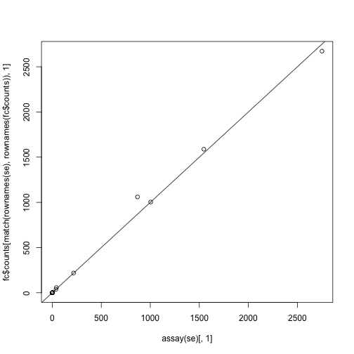

## Visualizing sample-sample distances

We now load the full *SummarizedExperiment* object, counting reads over all the genes.


```r
library(airway)
data(airway)
airway
```

```
## class: RangedSummarizedExperiment 
## dim: 64102 8 
## metadata(1): ''
## assays(1): counts
## rownames(64102): ENSG00000000003 ENSG00000000005 ... LRG_98 LRG_99
## rowRanges metadata column names(0):
## colnames(8): SRR1039508 SRR1039509 ... SRR1039520 SRR1039521
## colData names(9): SampleName cell ... Sample BioSample
```


```r
colData(airway)
```

```
## DataFrame with 8 rows and 9 columns
##            SampleName     cell      dex    albut        Run avgLength
##              <factor> <factor> <factor> <factor>   <factor> <integer>
## SRR1039508 GSM1275862   N61311    untrt    untrt SRR1039508       126
## SRR1039509 GSM1275863   N61311      trt    untrt SRR1039509       126
## SRR1039512 GSM1275866  N052611    untrt    untrt SRR1039512       126
## SRR1039513 GSM1275867  N052611      trt    untrt SRR1039513        87
## SRR1039516 GSM1275870  N080611    untrt    untrt SRR1039516       120
## SRR1039517 GSM1275871  N080611      trt    untrt SRR1039517       126
## SRR1039520 GSM1275874  N061011    untrt    untrt SRR1039520       101
## SRR1039521 GSM1275875  N061011      trt    untrt SRR1039521        98
##            Experiment    Sample    BioSample
##              <factor>  <factor>     <factor>
## SRR1039508  SRX384345 SRS508568 SAMN02422669
## SRR1039509  SRX384346 SRS508567 SAMN02422675
## SRR1039512  SRX384349 SRS508571 SAMN02422678
## SRR1039513  SRX384350 SRS508572 SAMN02422670
## SRR1039516  SRX384353 SRS508575 SAMN02422682
## SRR1039517  SRX384354 SRS508576 SAMN02422673
## SRR1039520  SRX384357 SRS508579 SAMN02422683
## SRR1039521  SRX384358 SRS508580 SAMN02422677
```


```r
rowRanges(airway)
```

```
## GRangesList object of length 64102:
## $$ENSG00000000003 
## GRanges object with 17 ranges and 2 metadata columns:
##        seqnames               ranges strand   |   exon_id       exon_name
##           <Rle>            <IRanges>  <Rle>   | <integer>     <character>
##    [1]        X [99883667, 99884983]      -   |    667145 ENSE00001459322
##    [2]        X [99885756, 99885863]      -   |    667146 ENSE00000868868
##    [3]        X [99887482, 99887565]      -   |    667147 ENSE00000401072
##    [4]        X [99887538, 99887565]      -   |    667148 ENSE00001849132
##    [5]        X [99888402, 99888536]      -   |    667149 ENSE00003554016
##    ...      ...                  ...    ... ...       ...             ...
##   [13]        X [99890555, 99890743]      -   |    667156 ENSE00003512331
##   [14]        X [99891188, 99891686]      -   |    667158 ENSE00001886883
##   [15]        X [99891605, 99891803]      -   |    667159 ENSE00001855382
##   [16]        X [99891790, 99892101]      -   |    667160 ENSE00001863395
##   [17]        X [99894942, 99894988]      -   |    667161 ENSE00001828996
## 
## ...
## <64101 more elements>
## -------
## seqinfo: 722 sequences (1 circular) from an unspecified genome
```

The counts matrix is stored in `assay` of a *SummarizedExperiment*.


```r
head(assay(airway))
```

```
##                 SRR1039508 SRR1039509 SRR1039512 SRR1039513 SRR1039516
## ENSG00000000003        679        448        873        408       1138
## ENSG00000000005          0          0          0          0          0
## ENSG00000000419        467        515        621        365        587
## ENSG00000000457        260        211        263        164        245
## ENSG00000000460         60         55         40         35         78
## ENSG00000000938          0          0          2          0          1
##                 SRR1039517 SRR1039520 SRR1039521
## ENSG00000000003       1047        770        572
## ENSG00000000005          0          0          0
## ENSG00000000419        799        417        508
## ENSG00000000457        331        233        229
## ENSG00000000460         63         76         60
## ENSG00000000938          0          0          0
```

This code chunk is not necessary, but helps to make nicer plots below with large axis labels (`mypar(1,2)` can be substituted with `par(mfrow=c(1,2))` below).


```r
# library(devtools)
# install_github("ririzarr/rafalib")
library(rafalib)
mypar()
```

Note that, on the un-transformed scale, the high count genes have high variance. That is, in the following scatter plot, the points start out in a tight cone and then fan out toward the top right. This is a general property of counts generated from sampling processes, that the variance typically increases with the expected value. We will explore different scaling and transformations options below.


```r
plot(assay(airway)[,1:2], cex=.1)
```


### Creating a DESeqDataSet object

We will use the `DESeq2` package to normalize the sample for sequencing depth. The *DESeqDataSet* object is just an extension of the *SummarizedExperiment* object, with a few changes. The matrix in `assay` is now accessed with `counts` and the elements of this matrix are required to be non-negative integers (0,1,2,...).

We need to specify an experimental *design* here, for later use in differential analysis. The design starts with the tilde symbol `~`, which means, model the counts (log2 scale) using the following formula. Following the tilde, the variables are columns of the `colData`, and the `+` indicates that for differential expression analysis we want to compare levels of `dex` while controlling for the `cell` differences.


```r
library(DESeq2)
```

```
## Loading required package: Rcpp
```

```
## Loading required package: RcppArmadillo
```

```r
dds <- DESeqDataSet(airway, design= ~ cell + dex)
```

We can also make a *DESeqDataSet* from a count matrix and column data.


```r
dds.fc <- DESeqDataSetFromMatrix(fc$counts, 
                                 colData=sample.table, 
                                 design=~ cell + dex)
```

### Normalization for sequencing depth

The following estimates size factors to account for differences in sequencing depth, and is only necessary to make the `log.norm.counts` object below.


```r
dds <- estimateSizeFactors(dds)
sizeFactors(dds)
```

```
## SRR1039508 SRR1039509 SRR1039512 SRR1039513 SRR1039516 SRR1039517 
##  1.0236476  0.8961667  1.1794861  0.6700538  1.1776714  1.3990365 
## SRR1039520 SRR1039521 
##  0.9207787  0.9445141
```

```r
colSums(counts(dds))
```

```
## SRR1039508 SRR1039509 SRR1039512 SRR1039513 SRR1039516 SRR1039517 
##   20637971   18809481   25348649   15163415   24448408   30818215 
## SRR1039520 SRR1039521 
##   19126151   21164133
```

```r
plot(sizeFactors(dds), colSums(counts(dds)))
abline(lm(colSums(counts(dds)) ~ sizeFactors(dds) + 0))
```

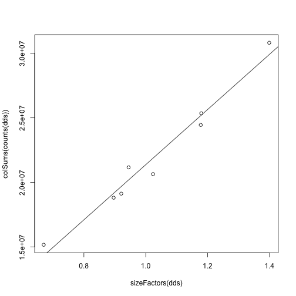

Size factors are calculated by the median ratio of samples to a pseudo-sample (the geometric mean of all samples). In other words, for each sample, we take the exponent of the median of the log ratios in this histogram.


```r
loggeomeans <- rowMeans(log(counts(dds)))
hist(log(counts(dds)[,1]) - loggeomeans, 
     col="grey", main="", xlab="", breaks=40)
```


The size factor for the first sample:


```r
exp(median((log(counts(dds)[,1]) - loggeomeans)[is.finite(loggeomeans)]))
```

```
## [1] 1.023648
```

```r
sizeFactors(dds)[1]
```

```
## SRR1039508 
##   1.023648
```

Make a matrix of log normalized counts (plus a pseudocount):


```r
log.norm.counts <- log2(counts(dds, normalized=TRUE) + 1)
```

Another way to make this matrix, and keep the sample and gene information is to use the function `normTransform`. The same matrix as above is stored in `assay(log.norm)`.


```r
log.norm <- normTransform(dds)
```

Examine the log counts and the log normalized counts (plus a pseudocount).


```r
rs <- rowSums(counts(dds))
mypar(1,2)
boxplot(log2(counts(dds)[rs > 0,] + 1)) # not normalized
boxplot(log.norm.counts[rs > 0,]) # normalized
```

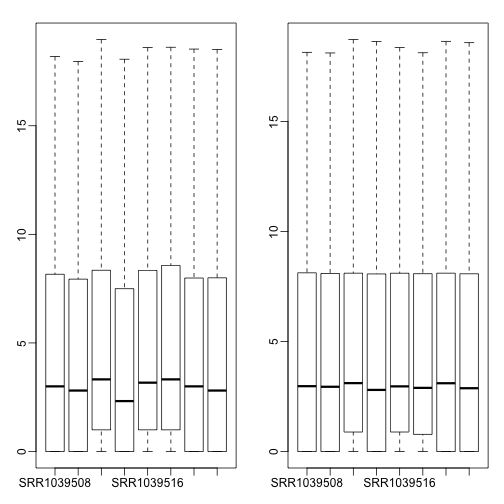

Make a scatterplot of log normalized counts against each other. Note the fanning out of the points in the lower left corner, for points less than $$2^5 = 32$$.


```r
plot(log.norm.counts[,1:2], cex=.1)
```


### Stabilizing count variance

Now we will use a more sophisticated transformation, which is similar to the variance stablizing normalization method taught in Week 3 of Course 4: Introduction to Bioconductor. It uses the variance model for count data to shrink together the log-transformed counts for genes with very low counts. For genes with medium and high counts, the `rlog` is very close to `log2`. For further details, see the section in the DESeq2 [paper](#foot). 


```r
rld <- rlog(dds)
plot(assay(rld)[,1], assay(rld)[,2], cex=.1)
```


Another transformation for stabilizing variance in the *DESeq2* package is `varianceStabilizingTransformation`. These two tranformations are similar, the *rlog* might perform a bit better when the size factors vary widely, and the *varianceStabilizingTransformation* is much faster when there are many samples.


```r
vsd <- varianceStabilizingTransformation(dds)
plot(assay(vsd)[,1], assay(rld)[,2], cex=.1)
```


We can examine the standard deviation of rows over the mean for the *log plus pseudocount* and the *rlog*. Note that the genes with high variance for the *log* come from the genes with lowest mean. If these genes were included in a distance calculation, the high variance at the low count range might overwhelm the signal at the higher count range.


```r
library(vsn)
meanSdPlot(log.norm.counts, ranks=FALSE) 
```

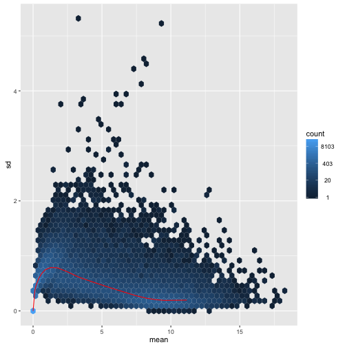

For the rlog:


```r
meanSdPlot(assay(rld), ranks=FALSE)
```

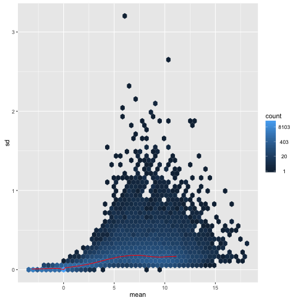

For the VST:


```r
meanSdPlot(assay(vsd), ranks=FALSE)
```

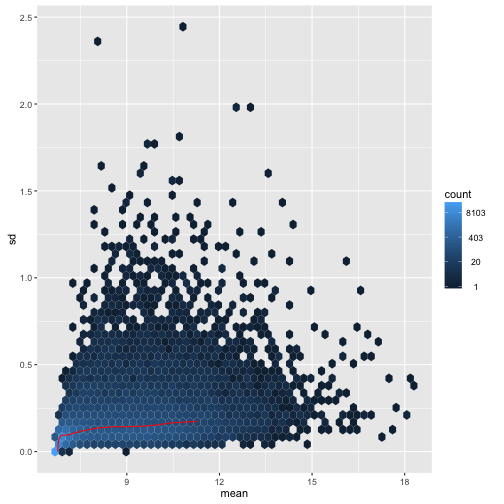

The principal components (PCA) plot is a useful diagnostic for examining relationships between samples:


```r
plotPCA(log.norm, intgroup="dex")
```

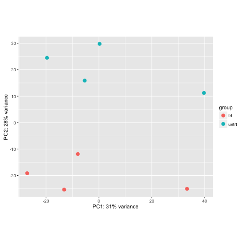

Using the rlog:


```r
plotPCA(rld, intgroup="dex")
```


Using the VST:


```r
plotPCA(vsd, intgroup="dex")
```


We can make this plot even nicer using custom code from the *ggplot2* library:


```r
library(ggplot2)
(data <- plotPCA(rld, intgroup=c("dex","cell"), returnData=TRUE))
```

```
##                   PC1        PC2           group   dex    cell       name
## SRR1039508 -14.331359  -4.208796  untrt : N61311 untrt  N61311 SRR1039508
## SRR1039509   6.754169  -2.245244    trt : N61311   trt  N61311 SRR1039509
## SRR1039512  -8.130393  -3.952904 untrt : N052611 untrt N052611 SRR1039512
## SRR1039513  14.505648  -2.941862   trt : N052611   trt N052611 SRR1039513
## SRR1039516 -11.891410  13.735002 untrt : N080611 untrt N080611 SRR1039516
## SRR1039517   8.373975  17.823844   trt : N080611   trt N080611 SRR1039517
## SRR1039520  -9.965898 -10.014674 untrt : N061011 untrt N061011 SRR1039520
## SRR1039521  14.685269  -8.195366   trt : N061011   trt N061011 SRR1039521
```

```r
(percentVar <- 100*round(attr(data, "percentVar"),2))
```

```
## [1] 39 27
```


```r
makeLab <- function(x,pc) paste0("PC",pc,": ",x,"% variance")
ggplot(data, aes(PC1,PC2,col=dex,shape=cell)) + geom_point() +
  xlab(makeLab(percentVar[1],1)) + ylab(makeLab(percentVar[2],2))
```

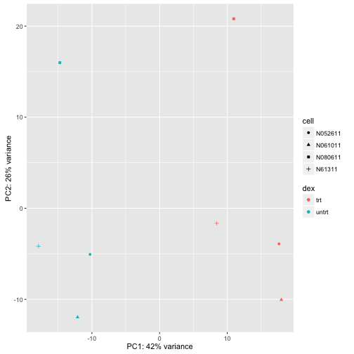

In addition, we can plot a hierarchical clustering based on Euclidean distance matrix:


```r
mypar(1,2)
plot(hclust(dist(t(log.norm.counts))), labels=colData(dds)$dex)
plot(hclust(dist(t(assay(rld)))), labels=colData(rld)$dex)
```

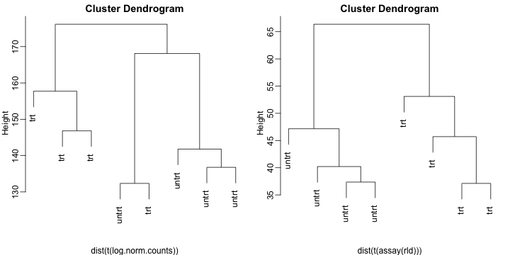

## Differential gene expression

### Modeling raw counts with normalization

We will now perform *differential gene expression* on the counts, to try to find genes in which the differences in expected counts across samples due to the condition of interest rises above the biological and technical variance we observe. 

We will use an overdispersed Poisson distribution -- called the negative binomial -- to model the *raw counts* in the count matrix. The model will include the *size factors* into account to adjust for sequencing depth. The formula will look like:

$$ K_{ij} \sim \text{NB}(s_{ij} q_{ij}, \alpha_i ) $$

where $$K_{ij}$$ is a single raw count in our count table, $$s_{ij}$$ is a size factor or more generally a normalization factor, $$q_{ij}$$ is proportional to gene expression (what we want to model with our design variables), and $$\alpha_i$$ is a *dispersion parameter*.

Why bother modeling *raw counts*, rather than dividing out the sequencing depth and working with the normalized counts? In other words, why put the $$s_{ij}$$ on the right side of the equation above, rather than dividing out on the left side and modeling $$K_{ij} / s_{ij}$$. The reason is that, with the raw count, we have knowledge about the link between the expected value and its variance. So we prefer the first equation below to the second equation, because with the first equation, we have some additional information about the variance of the quantity on the left hand side.

$$ K_{ij} \sim \text{NB}(\mu_{ij} = s_{ij} q_{ij} ) $$

$$ \frac{K_{ij}}{s_{ij}} \sim \mathcal{L}(\mu_{ij} = q_{ij}) $$

When we sample cDNA fragments from a pool in a sequencing library, we can model the count of cDNA fragments which originated from a given gene with a binomial distribution, with a certain probability of picking a fragment for that gene which relates to factors such as the expression of that gene (the abundance of mRNA in the original population of cells), its length and technical factors in the production of the library. When we have many genes, and the rate for each gene is low, while the total number of fragments is high, we know that the Poisson is a good model for the binomial. And for the binomial and the Poisson, there is an explicit link between on observed count and its expected variance.

Below is an example of what happens when we divide or multiply a raw count. Here we show three distributions which all have the expected value of 100, although they have different variances. The first is a raw count with mean 100, the second and third are raw counts with mean 1000 and 10, which were then scaled by 1/10 and 10, respectively. 


```r
mypar(3,1)
n <- 10000
brks <- 0:300
hist(rpois(n,100),main="",xlab="",breaks=brks,col="black")
hist(rpois(n,1000)/10,main="",xlab="",breaks=brks,col="black")
hist(rpois(n,10)*10,main="",xlab="",breaks=brks,col="black")
```

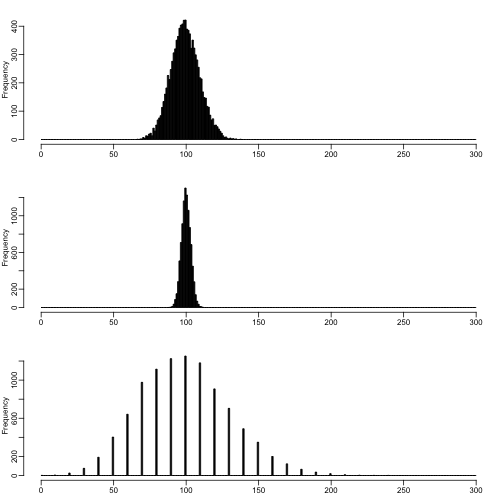

So, when we scale a raw count, we break the implicit link between the mean and the variance. This is not necessarily a problem, if we have 100s of samples over which to observe within-group variance, however RNA-seq samples can often have only 3 samples per group, in which case, we can get a benefit of information from using raw counts, and incorporating normalization factors on the right side of the equation above.

### Counts across biological replicates and over-dispersion

For the negative binomial, the variance parameter is called *disperison*, and it links the mean value with the expected variance. The reason we see more dispersion than in a Poisson is mostly due to changes in the proportions of genes across biological replicates -- which we would expect due to natural differences in gene expression. 


```r
mypar(3,1)
n <- 10000
brks <- 0:400
hist(rpois(n,lambda=100),
     main="Poisson / NB, disp=0",xlab="",breaks=brks,col="black")
hist(rnbinom(n,mu=100,size=1/.01),
     main="NB, disp = 0.01",xlab="",breaks=brks,col="black")
hist(rnbinom(n,mu=100,size=1/.1),
     main="NB, disp = 0.1",xlab="",breaks=brks,col="black")
```


The square root of the dispersion is the coefficient of variation -- SD/mean -- after subtracting the variance we expect due to Poisson sampling.


```r
disp <- 0.5
mu <- 100
v <- mu + disp * mu^2
sqrt(v)/mu
```

```
## [1] 0.7141428
```

```r
sqrt(v - mu)/mu
```

```
## [1] 0.7071068
```

```r
sqrt(disp)
```

```
## [1] 0.7071068
```

A number of methods for assessing differential gene expression from RNA-seq counts use the negative binomial distribution to make probabilistic statements about the differences seen in an experiment. A few such methods are *edgeR*, *DESeq2*, and *DSS*. Other methods, such as *limma+voom* find other ways to explicitly model the mean of log counts and the observed variance of log counts. A very incomplete list of statistical methods for RNA-seq differential expression is provided in the [footnotes](#foot).

*DESeq2* performs a similar step to *limma* as discussed in PH525x Course 3, in using the variance of all the genes to improve the variance estimate for each individual gene. In addition, *DESeq2* shrinks the unreliable fold changes from genes with low counts, which will be seen in the resulting MA-plot.

### Experimental design and running DESeq2

Remember, we had created the *DESeqDataSet* object earlier using the following line of code (or alternatively using *DESeqDataSetFromMatrix*)


```r
dds <- DESeqDataSet(airway, design= ~ cell + dex)
```

First, we setup the `design` of the experiment, so that differences will be considered across time and protocol variables. We can read and if necessary reset the design using the following code.


```r
design(dds)
```

```
## ~cell + dex
```

```r
design(dds) <- ~ cell + dex
```

The last variable in the design is used by default for building results tables (although arguments to `results` can be used to customize the results table), and we make sure the "control" or "untreated" level is the first level, such that log fold changes will be treated over control, and not control over treated.


```r
levels(dds$dex)
```

```
## [1] "trt"   "untrt"
```

```r
dds$dex <- relevel(dds$dex, "untrt")
levels(dds$dex)
```

```
## [1] "untrt" "trt"
```

The following line runs the *DESeq2* model. After this step, we can build a results table, which by default will compare the levels in the last variable in the design, so the *dex* treatment in our case:


```r
dds <- DESeq(dds)
```

```
## estimating size factors
```

```
## estimating dispersions
```

```
## gene-wise dispersion estimates
```

```
## mean-dispersion relationship
```

```
## final dispersion estimates
```

```
## fitting model and testing
```

```r
res <- results(dds)
```

### Examining results tables


```r
head(res)
```

```
## log2 fold change (MAP): dex trt vs untrt 
## Wald test p-value: dex trt vs untrt 
## DataFrame with 6 rows and 6 columns
##                    baseMean log2FoldChange      lfcSE       stat
##                   <numeric>      <numeric>  <numeric>  <numeric>
## ENSG00000000003 708.6021697    -0.37424998 0.09873107 -3.7906000
## ENSG00000000005   0.0000000             NA         NA         NA
## ENSG00000000419 520.2979006     0.20215551 0.10929899  1.8495642
## ENSG00000000457 237.1630368     0.03624826 0.13684258  0.2648902
## ENSG00000000460  57.9326331    -0.08523371 0.24654402 -0.3457140
## ENSG00000000938   0.3180984    -0.11555969 0.14630532 -0.7898530
##                       pvalue        padj
##                    <numeric>   <numeric>
## ENSG00000000003 0.0001502838 0.001251416
## ENSG00000000005           NA          NA
## ENSG00000000419 0.0643763851 0.192284345
## ENSG00000000457 0.7910940556 0.910776144
## ENSG00000000460 0.7295576905 0.878646940
## ENSG00000000938 0.4296136373          NA
```

```r
table(res$padj < 0.1)
```

```
## 
## FALSE  TRUE 
## 13145  4883
```

A summary of the results can be generated:


```r
summary(res)
```

```
## 
## out of 33469 with nonzero total read count
## adjusted p-value < 0.1
## LFC > 0 (up)     : 2641, 7.9% 
## LFC < 0 (down)   : 2242, 6.7% 
## outliers [1]     : 0, 0% 
## low counts [2]   : 15441, 46% 
## (mean count < 5)
## [1] see 'cooksCutoff' argument of ?results
## [2] see 'independentFiltering' argument of ?results
```

For testing at a different threshold, we provide the `alpha` to *results*, so that the mean filtering is optimal for our new FDR threshold.


```r
res2 <- results(dds, alpha=0.05)
table(res2$padj < 0.05)
```

```
## 
## FALSE  TRUE 
## 12736  4057
```

### Visualizing results

The MA-plot provides a global view of the differential genes, with the log2 fold change on the y-axis over the mean of normalized counts:


```r
plotMA(res, ylim=c(-4,4))
```


We can also test against a different null hypothesis. For example, to test for genes which have fold change more than doubling or less than halving:


```r
res.thr <- results(dds, lfcThreshold=1)
plotMA(res.thr, ylim=c(-4,4))
```

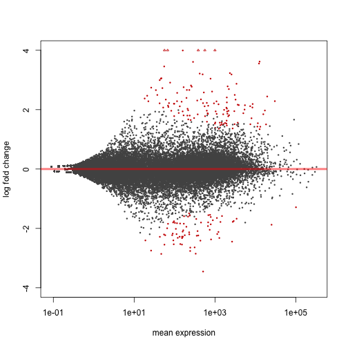

A p-value histogram:


```r
hist(res$pvalue[res$baseMean > 1], 
     col="grey", border="white", xlab="", ylab="", main="")
```

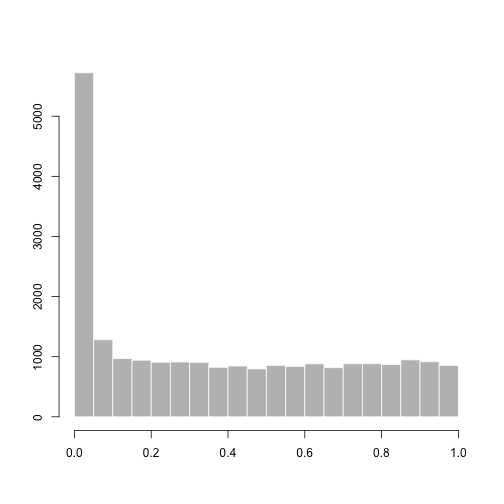

A sorted results table:


```r
resSort <- res[order(res$padj),]
head(resSort)
```

```
## log2 fold change (MAP): dex trt vs untrt 
## Wald test p-value: dex trt vs untrt 
## DataFrame with 6 rows and 6 columns
##                   baseMean log2FoldChange     lfcSE      stat
##                  <numeric>      <numeric> <numeric> <numeric>
## ENSG00000152583   997.4398       4.316100 0.1724127  25.03354
## ENSG00000165995   495.0929       3.188698 0.1277441  24.96160
## ENSG00000101347 12703.3871       3.618232 0.1499441  24.13054
## ENSG00000120129  3409.0294       2.871326 0.1190334  24.12201
## ENSG00000189221  2341.7673       3.230629 0.1373644  23.51868
## ENSG00000211445 12285.6151       3.552999 0.1589971  22.34631
##                        pvalue          padj
##                     <numeric>     <numeric>
## ENSG00000152583 2.637881e-138 4.755573e-134
## ENSG00000165995 1.597973e-137 1.440413e-133
## ENSG00000101347 1.195378e-128 6.620010e-125
## ENSG00000120129 1.468829e-128 6.620010e-125
## ENSG00000189221 2.627083e-122 9.472209e-119
## ENSG00000211445 1.311440e-110 3.940441e-107
```

Examine the counts for the top gene, sorting by p-value:


```r
plotCounts(dds, gene=which.min(res$padj), intgroup="dex")
```

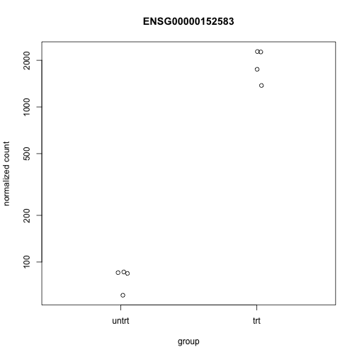

A more sophisticated plot of counts:


```r
library(ggplot2)
data <- plotCounts(dds, gene=which.min(res$padj), intgroup=c("dex","cell"), returnData=TRUE)
ggplot(data, aes(x=dex, y=count, col=cell)) +
  geom_point(position=position_jitter(width=.1,height=0)) +
  scale_y_log10()
```

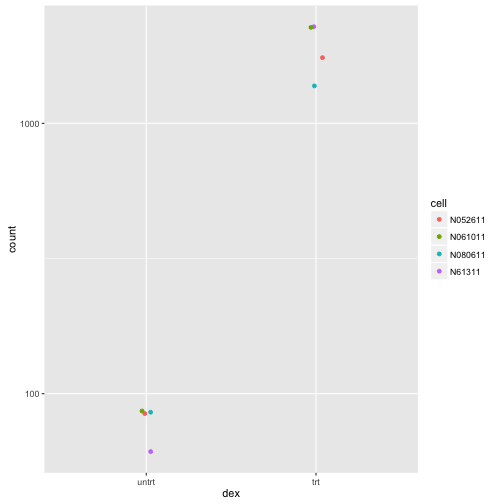

Connecting by lines shows the differences which are actually being tested by *results* given that our design includes `cell + dex`


```r
ggplot(data, aes(x=dex, y=count, col=cell, group=cell)) +
  geom_point() + geom_line() + scale_y_log10() 
```


A heatmap of the top genes:


```r
library(pheatmap)
topgenes <- head(rownames(resSort),20)
mat <- assay(rld)[topgenes,]
mat <- mat - rowMeans(mat)
df <- as.data.frame(colData(dds)[,c("dex","cell")])
pheatmap(mat, annotation_col=df)
```

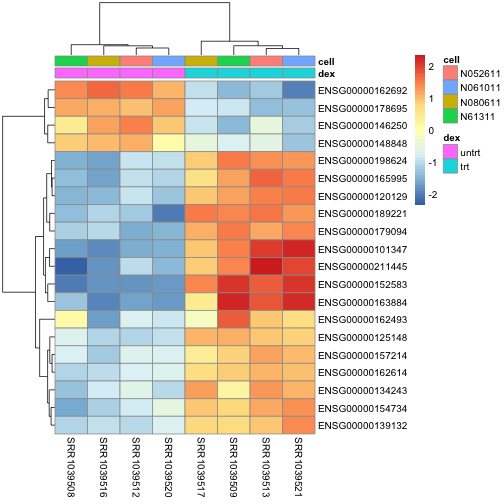

### Getting alternate annotations

We can then check the annotation of these highly significant genes:


```r
library(org.Hs.eg.db)
```

```
## Loading required package: DBI
```

```
## 
```

```r
keytypes(org.Hs.eg.db)
```

```
##  [1] "ACCNUM"       "ALIAS"        "ENSEMBL"      "ENSEMBLPROT" 
##  [5] "ENSEMBLTRANS" "ENTREZID"     "ENZYME"       "EVIDENCE"    
##  [9] "EVIDENCEALL"  "GENENAME"     "GO"           "GOALL"       
## [13] "IPI"          "MAP"          "OMIM"         "ONTOLOGY"    
## [17] "ONTOLOGYALL"  "PATH"         "PFAM"         "PMID"        
## [21] "PROSITE"      "REFSEQ"       "SYMBOL"       "UCSCKG"      
## [25] "UNIGENE"      "UNIPROT"
```

```r
anno <- select(org.Hs.eg.db, keys=topgenes,
               columns=c("SYMBOL","GENENAME"), 
               keytype="ENSEMBL")
```

```
## 'select()' returned 1:1 mapping between keys and columns
```

```r
anno[match(topgenes, anno$ENSEMBL),]
```

```
##            ENSEMBL  SYMBOL
## 1  ENSG00000152583 SPARCL1
## 2  ENSG00000165995  CACNB2
## 3  ENSG00000101347  SAMHD1
## 4  ENSG00000120129   DUSP1
## 5  ENSG00000189221    MAOA
## 6  ENSG00000211445    GPX3
## 7  ENSG00000157214  STEAP2
## 8  ENSG00000162614    NEXN
## 9  ENSG00000125148    MT2A
## 10 ENSG00000154734 ADAMTS1
## 11 ENSG00000139132    FGD4
## 12 ENSG00000162493    PDPN
## 13 ENSG00000162692   VCAM1
## 14 ENSG00000179094    PER1
## 15 ENSG00000134243   SORT1
## 16 ENSG00000163884   KLF15
## 17 ENSG00000178695  KCTD12
## 18 ENSG00000146250  PRSS35
## 19 ENSG00000198624  CCDC69
## 20 ENSG00000148848  ADAM12
##                                                     GENENAME
## 1                                       SPARC-like 1 (hevin)
## 2         calcium channel, voltage-dependent, beta 2 subunit
## 3                                 SAM domain and HD domain 1
## 4                             dual specificity phosphatase 1
## 5                                        monoamine oxidase A
## 6                                   glutathione peroxidase 3
## 7                    STEAP family member 2, metalloreductase
## 8                          nexilin (F actin binding protein)
## 9                                         metallothionein 2A
## 10 ADAM metallopeptidase with thrombospondin type 1 motif, 1
## 11                   FYVE, RhoGEF and PH domain containing 4
## 12                                                podoplanin
## 13                         vascular cell adhesion molecule 1
## 14                                  period circadian clock 1
## 15                                                sortilin 1
## 16                                    Kruppel-like factor 15
## 17    potassium channel tetramerization domain containing 12
## 18                                      protease, serine, 35
## 19                          coiled-coil domain containing 69
## 20                           ADAM metallopeptidase domain 12
```

```r
# for Bioconductor >= 3.1, easier to use mapIds() function
```

### Looking up different results tables

The `contrast` argument allows users to specify what results table should be built. See the help and examples in `?results` for more details:


```r
results(dds, contrast=c("cell","N61311","N052611"))
```

```
## log2 fold change (MAP): cell N61311 vs N052611 
## Wald test p-value: cell N61311 vs N052611 
## DataFrame with 64102 rows and 6 columns
##                  baseMean log2FoldChange     lfcSE       stat    pvalue
##                 <numeric>      <numeric> <numeric>  <numeric> <numeric>
## ENSG00000000003 708.60217    -0.20680752 0.1368030 -1.5117175 0.1306057
## ENSG00000000005   0.00000             NA        NA         NA        NA
## ENSG00000000419 520.29790    -0.06389491 0.1490723 -0.4286169 0.6682020
## ENSG00000000457 237.16304     0.06428564 0.1827151  0.3518355 0.7249617
## ENSG00000000460  57.93263     0.34319847 0.2840573  1.2082017 0.2269697
## ...                   ...            ...       ...        ...       ...
## LRG_94                  0             NA        NA         NA        NA
## LRG_96                  0             NA        NA         NA        NA
## LRG_97                  0             NA        NA         NA        NA
## LRG_98                  0             NA        NA         NA        NA
## LRG_99                  0             NA        NA         NA        NA
##                      padj
##                 <numeric>
## ENSG00000000003 0.4851668
## ENSG00000000005        NA
## ENSG00000000419 0.9153673
## ENSG00000000457 0.9334645
## ENSG00000000460 0.6280187
## ...                   ...
## LRG_94                 NA
## LRG_96                 NA
## LRG_97                 NA
## LRG_98                 NA
## LRG_99                 NA
```

### Surrogate variable analysis for RNA-seq

If we suppose that we didn't know about the different cell-lines in the experiment, but noticed some structure in the counts, we could use surrograte variable analysis (SVA) to detect this hidden structure (see PH525x Course 3 for details on the algorithm).


```r
library(sva)
```

```
## Loading required package: mgcv
```

```
## Loading required package: nlme
```

```
## 
## Attaching package: 'nlme'
```

```
## The following object is masked from 'package:Biostrings':
## 
##     collapse
```

```
## The following object is masked from 'package:IRanges':
## 
##     collapse
```

```
## This is mgcv 1.8-12. For overview type 'help("mgcv-package")'.
```

```
## Loading required package: genefilter
```

```
## 
## Attaching package: 'genefilter'
```

```
## The following object is masked from 'package:base':
## 
##     anyNA
```

```r
dat <- counts(dds, normalized=TRUE)
idx <- rowMeans(dat) > 1
dat <- dat[idx,]
mod <- model.matrix(~ dex, colData(dds))
mod0 <- model.matrix(~ 1, colData(dds))
svseq <- svaseq(dat, mod, mod0, n.sv=2)
```

```
## Number of significant surrogate variables is:  2 
## Iteration (out of 5 ):1  2  3  4  5
```

Do the surrogate variables capture the cell difference?


```r
plot(svseq$sv[,1], svseq$sv[,2], col=dds$cell, pch=16)
```


Using the surrogate variables in a *DESeq2* analysis:


```r
dds.sva <- dds
dds.sva$SV1 <- svseq$sv[,1]
dds.sva$SV2 <- svseq$sv[,2]
design(dds.sva) <- ~ SV1 + SV2 + dex
dds.sva <- DESeq(dds.sva)
```

```
## using pre-existing size factors
```

```
## estimating dispersions
```

```
## found already estimated dispersions, replacing these
```

```
## gene-wise dispersion estimates
```

```
## mean-dispersion relationship
```

```
## final dispersion estimates
```

```
## fitting model and testing
```

## Session info


```r
sessionInfo()
```

```
## R version 3.2.4 (2016-03-10)
## Platform: x86_64-apple-darwin13.4.0 (64-bit)
## Running under: OS X 10.10.5 (Yosemite)
## 
## locale:
## [1] en_US.UTF-8/en_US.UTF-8/en_US.UTF-8/C/en_US.UTF-8/en_US.UTF-8
## 
## attached base packages:
## [1] stats4    parallel  methods   stats     graphics  grDevices utils    
## [8] datasets  base     
## 
## other attached packages:
##  [1] sva_3.18.0                 genefilter_1.52.1         
##  [3] mgcv_1.8-12                nlme_3.1-126              
##  [5] org.Hs.eg.db_3.2.3         RSQLite_1.0.0             
##  [7] DBI_0.3.1                  pheatmap_1.0.8            
##  [9] ggplot2_2.1.0              hexbin_1.27.1             
## [11] vsn_3.38.0                 DESeq2_1.10.1             
## [13] RcppArmadillo_0.6.600.4.0  Rcpp_0.12.4               
## [15] rafalib_1.0.0              GenomicFeatures_1.22.13   
## [17] AnnotationDbi_1.32.3       Rsamtools_1.22.0          
## [19] Biostrings_2.38.4          XVector_0.10.0            
## [21] airway_0.104.0             SummarizedExperiment_1.0.2
## [23] Biobase_2.30.0             GenomicRanges_1.22.4      
## [25] GenomeInfoDb_1.6.3         IRanges_2.4.8             
## [27] S4Vectors_0.8.11           BiocGenerics_0.16.1       
## [29] knitr_1.12.3              
## 
## loaded via a namespace (and not attached):
##  [1] locfit_1.5-9.1          lattice_0.20-33        
##  [3] digest_0.6.9            plyr_1.8.3             
##  [5] futile.options_1.0.0    acepack_1.3-3.3        
##  [7] evaluate_0.8.3          BiocInstaller_1.20.1   
##  [9] zlibbioc_1.16.0         annotate_1.48.0        
## [11] rpart_4.1-10            Matrix_1.2-4           
## [13] preprocessCore_1.32.0   labeling_0.3           
## [15] splines_3.2.4           BiocParallel_1.4.3     
## [17] geneplotter_1.48.0      stringr_1.0.0          
## [19] foreign_0.8-66          RCurl_1.95-4.8         
## [21] biomaRt_2.26.1          munsell_0.4.3          
## [23] rtracklayer_1.30.4      nnet_7.3-12            
## [25] gridExtra_2.2.1         Hmisc_3.17-3           
## [27] XML_3.98-1.4            GenomicAlignments_1.6.3
## [29] bitops_1.0-6            grid_3.2.4             
## [31] xtable_1.8-2            gtable_0.2.0           
## [33] affy_1.48.0             magrittr_1.5           
## [35] formatR_1.3             scales_0.4.0           
## [37] stringi_1.0-1           affyio_1.40.0          
## [39] limma_3.26.9            latticeExtra_0.6-28    
## [41] futile.logger_1.4.1     Formula_1.2-1          
## [43] lambda.r_1.1.7          RColorBrewer_1.1-2     
## [45] tools_3.2.4             survival_2.38-3        
## [47] colorspace_1.2-6        cluster_2.0.3
```

## Footnotes <a name="foot"></a>

### RNA-seq introductory papers

Mortazavi A, Williams BA, McCue K, Schaeffer L, Wold B., "Mapping and quantifying mammalian transcriptomes by RNA-seq", Nat Methods. 2008.
<http://www.nature.com/nmeth/journal/v5/n7/full/nmeth.1226.html>

John C. Marioni, Christopher E. Mason, Shrikant M. Mane, Matthew Stephens, and Yoav Gilad, "RNA-seq: An assessment of technical reproducibility and comparison with gene expression arrays" Genome Res. 2008.
<http://www.ncbi.nlm.nih.gov/pmc/articles/PMC2527709/>

Trapnell C, Williams BA, Pertea G, Mortazavi AM, Kwan G, van Baren MJ, Salzberg SL, Wold B, Pachter L.,  "Transcript assembly and quantification by RNA-seq reveals unannotated transcripts and isoform switching during cell differentiation", Nature Biotechnology, 2010.
<http://www.nature.com/nbt/journal/v28/n5/full/nbt.1621.html>

### ReCount

Frazee AC, Langmead B, Leek JT. "ReCount: a multi-experiment resource of analysis-ready RNA-seq gene count datasets". BMC Bioinformatics 12:449
<http://www.ncbi.nlm.nih.gov/pubmed/22087737>

The following sections give just a few examples of the many RNA-seq differential expression software packages:

### Negative binomial count methods

The following methods are available on Bioconductor:

- **DESeq2**

Michael I Love, Simon Anders, Wolfgang Huber, "Moderated estimation of fold change and dispersion for RNA-seq data with DESeq2" Genome Biology 2014.
<http://genomebiology.com/2014/15/12/550>

- **edgeR**

Mark D. Robinson, Davis J. McCarthy, and Gordon K. Smyth, "edgeR: a Bioconductor package for differential expression analysis of digital gene expression data" Bioinformatics 2010.
<http://www.ncbi.nlm.nih.gov/pmc/articles/PMC2796818/>

- **DSS**

Hao Wu, Chi Wang, Zhijin Wu, "A new shrinkage estimator for dispersion improves differential expression detection in RNA-seq data" Biostatistics 2013.
<http://biostatistics.oxfordjournals.org/content/14/2/232>

### Variance-mean modeling followed by linear model

- **limma-voom** in the *limma* Bioconductor package. Limma also contains gene-set testing methods (see ROAST for example in the Reference Manual)

Charity W Law, Yunshun Chen, Wei Shi and Gordon K Smyth, "voom: precision weights unlock linear model analysis tools for RNA-seq read counts", Genome Biology. 2014.
<http://genomebiology.com/2014/15/2/R29>

### Resampling-based methods

- **SAMseq** in the `samr` package on CRAN

Jun Li and Robert Tibshirani, "Finding consistent patterns: A nonparametric approach for identifying differential expression in RNA-seq data", Stat Methods Med Res. 2013.
<http://smm.sagepub.com/content/22/5/519.short>

### Incorporating isoform-abundance

- **Cuffdiff** (the latest version is `Cuffdiff2`) with `cummeRbund` the accompanying Bioconductor visualization package.

Trapnell C, Hendrickson DG, Sauvageau M, Goff L, Rinn JL, Pachter L., "Differential analysis of gene regulation at transcript resolution with RNA-seq" Nat Biotechnol. 2013.
<http://www.ncbi.nlm.nih.gov/pubmed/23222703>

- **BitSeq** (Bioconductor)

Peter Glaus, Antti Honkela, and Magnus Rattray, "Identifying differentially expressed transcripts from RNA-seq data with biological variation", Bioinformatics. 2012.
<http://bioinformatics.oxfordjournals.org/content/28/13/1721>

