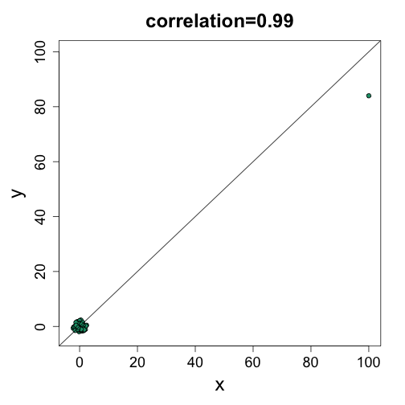
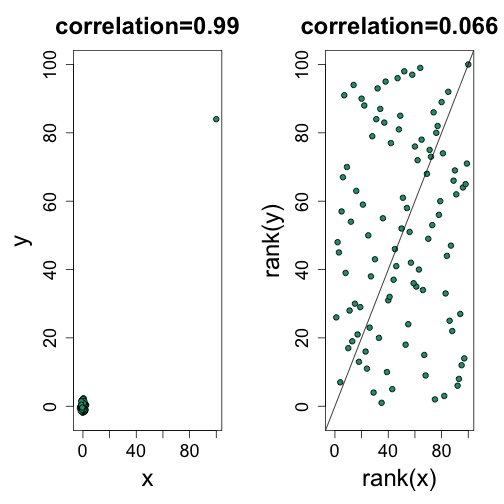
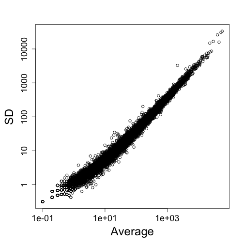
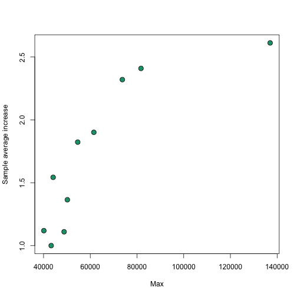
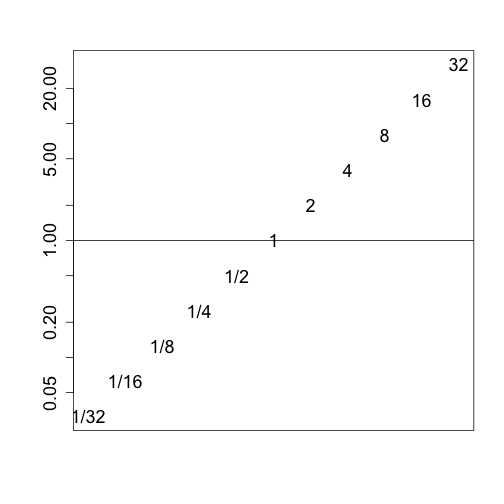

The normal apporximatiion is often useful when analyzing 
high throughput data. However, due to the complexity of the measurement devices it is also common to mistakenly  observe data points generated by an undesired process. For example, a defect on a scanner can produce a hanful of very high intensities. Thus we may have situationst that are approximated by a, for example, 99 data points from a standard normal distribution and one very large number.

```r
set.seed(1)
x = c(rnorm(100, 0, 1))  ##real distribution
x[23] <- 100  ##mistake made in 23th measurement
boxplot(x)
```

 

In statistics we refer these types of points as _outliers_. A small number of outliers can throw of an entire analysis. For example notice how this one point results in the sample mean and sample variace being very far from the 0 and 1 respectively.

```r
mean(x)
```

```
## [1] 1.108
```

```r
sd(x)
```

```
## [1] 10.03
```

The median, defined as the point having half the data larger and half the data smaller, is summary statistic that is _robust_ to outliers. Note how much close the median is to 0, the center of out actual distribution. 

```r
median(x)
```

```
## [1] 0.1684
```


The median absolute deviace (MAD) is a robust summary for the standard deviation. It is defined by computing the differences between each point and the median and taking the median of their absolute values:
$$
 1.4826 \mbox{median}\{| X_i - \mbox{median}(X_i)|\}
$$
The number $1.4826$ is a scale factor that guarantees an unbiased 
estimate of the actual center. Notice how much closer we are to one with the mad:

```r
mad(x)
```

```
## [1] 0.8857
```


## Spearman correlation
The correlation is also sensitive to outliers. Here we construct a independent list of numbers but for which a simialr mistake was made for the same entry:


```r
set.seed(1)
x = c(rnorm(100, 0, 1))  ##real distribution
x[23] <- 100  ##mistake made in 23th measurement
y = c(rnorm(100, 0, 1))  ##real distribution
y[23] <- 84  ##similar mistake made in 23th measurement
library(rafalib)
```

```
## Loading required package: RColorBrewer
```

```r
mypar(1, 1)
plot(x, y, main = paste0("correlation=", round(cor(x, y), 3)), pch = 21, bg = 1, 
    xlim = c(-3, 100), ylim = c(-3, 100))
abline(0, 1)
```

 


Following the general idea of median and mad of using quantiles, the Spearman correlation. The idea is simple: we convert to ranks an then compute correlation:

```r
mypar(1, 2)
plot(x, y, main = paste0("correlation=", round(cor(x, y), 3)), pch = 21, bg = 1, 
    xlim = c(-3, 100), ylim = c(-3, 100))
plot(rank(x), rank(y), main = paste0("correlation=", round(cor(x, y, method = "spearman"), 
    3)), pch = 21, bg = 1, xlim = c(-3, 100), ylim = c(-3, 100))
abline(0, 1)
```

 


So if these statistics are robust to outliers, why would we ever use the non-robust version? In general, if we know there are outliers then median and mad are recommended over the mean and standard devtiaion conterparts. However, in the inference modules we learn of an example in which robust statistics are less powerful than the non-robust versions.

We also note that there is a [large statistical literature](#foot) on Robust Statistics that go far beyond the median and the mad.

## Transformations

### Mean-variance relationship

In microarrays and RNAseq data we observe strong variance dependence on mean.

```r
if (!file.exists("bottomly_eset.RData")) download.file("http://bowtie-bio.sourceforge.net/recount/ExpressionSets/bottomly_eset.RData", 
    "bottomly_eset.RData")
load("bottomly_eset.RData")
library("Biobase")
```

```
## Loading required package: BiocGenerics
## Loading required package: methods
## Loading required package: parallel
## 
## Attaching package: 'BiocGenerics'
## 
## The following objects are masked from 'package:parallel':
## 
##     clusterApply, clusterApplyLB, clusterCall, clusterEvalQ,
##     clusterExport, clusterMap, parApply, parCapply, parLapply,
##     parLapplyLB, parRapply, parSapply, parSapplyLB
## 
## The following object is masked from 'package:stats':
## 
##     xtabs
## 
## The following objects are masked from 'package:base':
## 
##     anyDuplicated, append, as.data.frame, as.vector, cbind,
##     colnames, do.call, duplicated, eval, evalq, Filter, Find, get,
##     intersect, is.unsorted, lapply, Map, mapply, match, mget,
##     order, paste, pmax, pmax.int, pmin, pmin.int, Position, rank,
##     rbind, Reduce, rep.int, rownames, sapply, setdiff, sort,
##     table, tapply, union, unique, unlist
## 
## Welcome to Bioconductor
## 
##     Vignettes contain introductory material; view with
##     'browseVignettes()'. To cite Bioconductor, see
##     'citation("Biobase")', and for packages 'citation("pkgname")'.
```

```r
ind <- which(pData(bottomly.eset)$strain == "C57BL/6J")
Y <- exprs(bottomly.eset)[, ind]
avgs <- rowMeans(Y)
sds <- genefilter::rowSds(Y)
mypar(1, 1)
splot(avgs, sds, log = "xy", subset = which(avgs > 0), xlab = "Average", ylab = "SD")
```

 


This means that the larger values, vary the most. If we need to compute a mean to, say, normalize, it will be highly sensitive to the variation of the max:

```r
maxs <- apply(Y, 2, max)
sampleavgs <- colMeans(Y)
plot(maxs, sampleavgs/min(sampleavgs), xlab = "Max", ylab = "Sample average increase", 
    pch = 21, bg = 1, cex = 1.5)
```

 

The log transformation can remove the strong dependence.


```r
lY <- log2(Y + 0.5)
lavgs <- rowMeans(lY)
lsds <- genefilter::rowSds(lY)
splot(lavgs, lsds, xlab = "Average of log counts", ylab = "SD of log counts")
```

 


```r
lsampleavgs <- colMeans(lY)
plot(maxs, sampleavgs/min(sampleavgs), xlab = "Max", ylab = "Sample average increase", 
    bg = 1, pch = 21, cex = 1.5)
points(maxs, lsampleavgs/min(lsampleavgs), xlab = "Max", ylab = "Sample average", 
    bg = 2, pch = 21, cex = 1.5)
legend("topleft", c("Original", "Log"), pch = 16, col = 1:2, box.lwd = 0)
```

 


### Symmetry of log ratios

The log transformation is also commonly used because fold changes are the most widely used quantification of interest. Note that a fold change of 100 can be a ratio of 100/1 or 1/100. However, 1/100 is much closer to 1 (no fold change) than 100: ratios are not symmetric about 1.

```r
x = 2^seq(1, 5)
y = c(rev(1/x), 1, x)
Names = c(paste0("1/", rev(x)), 1, x)
mypar(1, 1)
plot(seq(along = y), y, xlab = "", ylab = "", type = "n", xaxt = "n")
text(seq(along = y), y, Names, cex = 1.5)
abline(h = 1)
```

 

```r
plot(seq(along = y), y, xlab = "", ylab = "", type = "n", log = "y", xaxt = "n")
text(seq(along = y), y, Names, cex = 1.5)
abline(h = 1)
```

 


## Footnotes
<a name="foot"></a>

### Robust statistics

- *Robust Statistics*, Peter. J. Huber and Elvezio M. Ronchetti, Wiley, 2009.
- *Introduction to Robust Estimation and Hypothesis Testing*, Rand R. Wilcox, 2012.
- *Robust Statistics: The Approach Based on Influence Functions*, Frank R. Hampel, Elvezio M. Ronchetti, Peter J. Rousseeuw, Werner A. Stahel


