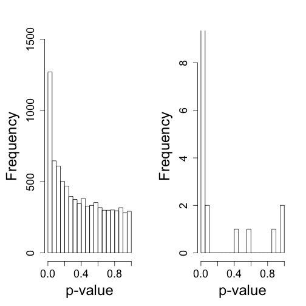
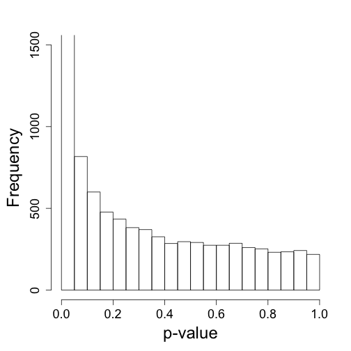
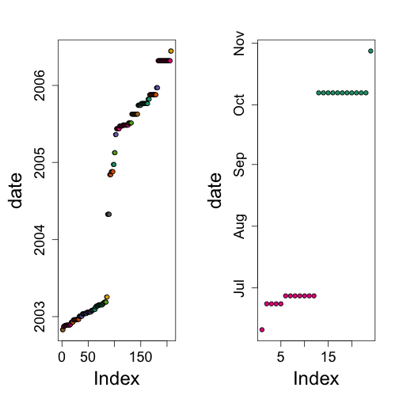
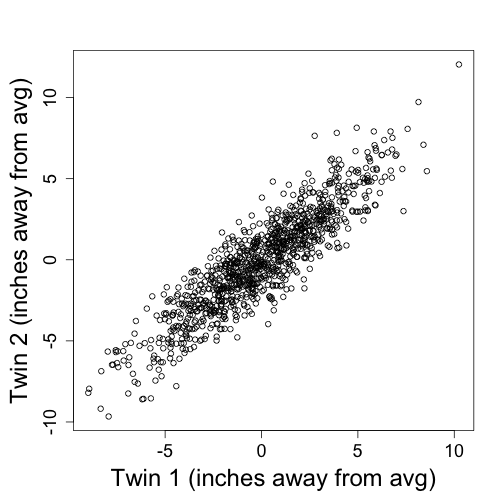
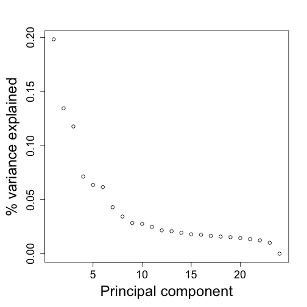
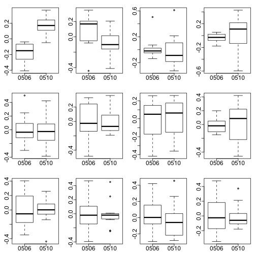
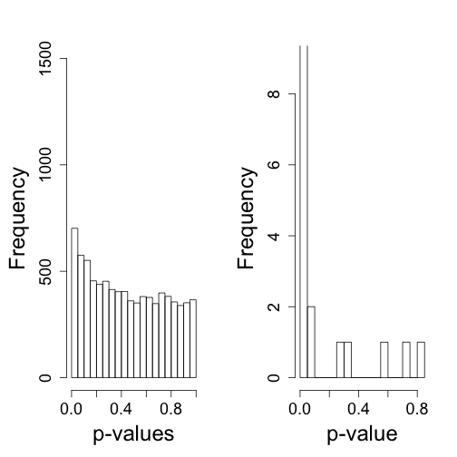

To illustrate how we can adjust for batch effects using statistcal methods, we will create a data example in which the outcome of interest is confounded with batch but not completely. We will also select a outcome for which we have an expectation of what genes should be differentially expressed. Namely, we make sex the outcome of interest and expect genes on the Y chromosome to be differentially expressed. Note that we may also see genes from the X chromosome as differentially expressed as some escape X inactivation. 

We start by finding the genes on the Y chromosome.

```r
library(rafalib)
```

```
## Loading required package: RColorBrewer
```

```r
library(dagdata)
library(Biobase)
```

```
## Loading required package: BiocGenerics
## Loading required package: methods
## Loading required package: parallel
## 
## Attaching package: 'BiocGenerics'
## 
## The following objects are masked from 'package:parallel':
## 
##     clusterApply, clusterApplyLB, clusterCall, clusterEvalQ,
##     clusterExport, clusterMap, parApply, parCapply, parLapply,
##     parLapplyLB, parRapply, parSapply, parSapplyLB
## 
## The following object is masked from 'package:stats':
## 
##     xtabs
## 
## The following objects are masked from 'package:base':
## 
##     anyDuplicated, append, as.data.frame, as.vector, cbind,
##     colnames, do.call, duplicated, eval, evalq, Filter, Find, get,
##     intersect, is.unsorted, lapply, Map, mapply, match, mget,
##     order, paste, pmax, pmax.int, pmin, pmin.int, Position, rank,
##     rbind, Reduce, rep.int, rownames, sapply, setdiff, sort,
##     table, tapply, union, unique, unlist
## 
## Welcome to Bioconductor
## 
##     Vignettes contain introductory material; view with
##     'browseVignettes()'. To cite Bioconductor, see
##     'citation("Biobase")', and for packages 'citation("pkgname")'.
```

```r
library(genefilter)
```

```
## 
## Attaching package: 'genefilter'
## 
## The following object is masked from 'package:base':
## 
##     anyNA
```

```r
data(GSE5859)
library(hgfocus.db)  ##get the gene chromosome
```

```
## Loading required package: AnnotationDbi
## Loading required package: GenomeInfoDb
## Loading required package: org.Hs.eg.db
## Loading required package: DBI
```

```r
chr <- mget(featureNames(e), hgfocusCHRLOC)
chr <- sapply(chr, function(x) {
    tmp <- names(x[1])
    ifelse(is.null(tmp), NA, paste0("chr", tmp))
})
y <- colMeans(exprs(e)[which(chr == "chrY"), ])
sex <- ifelse(y < 4.5, "F", "M")
```


Now we select samples so that sex and month of hybridization are confounded. 

```r
batch <- format(pData(e)$date, "%y%m")
ind <- which(batch %in% c("0506", "0510"))
set.seed(1)
N <- 12
N1 <- 3
M <- 12
M1 <- 9
ind <- c(sample(which(batch == "0506" & sex == "F"), N1), sample(which(batch == 
    "0510" & sex == "F"), N - N1), sample(which(batch == "0506" & sex == "M"), 
    M1), sample(which(batch == "0510" & sex == "M"), M - M1))
table(batch[ind], sex[ind])
```

```
##       
##        F M
##   0506 3 9
##   0510 9 3
```


To illustrate the confounding we will pick some genes to show in a heatmap plot. We pick all Y chromosome genes, some genes that we see correlate with batch, and then some randomly selected genes.


```r
set.seed(1)
tt <- genefilter::rowttests(exprs(e)[, ind], factor(batch[ind]))
ind1 <- which(chr == "chrY")  ##real differences
ind2 <- setdiff(c(order(tt$dm)[1:25], order(-tt$dm)[1:25]), ind1)
ind0 <- setdiff(sample(seq(along = tt$dm), 50), c(ind2, ind1))
geneindex <- c(ind2, ind0, ind1)
mat <- exprs(e)[geneindex, ind]
mat <- mat - rowMeans(mat)  #;mat[mat>3]<-3;mat[mat< -3]<- -3
icolors <- rev(brewer.pal(11, "RdYlBu"))
mypar(1, 1)
image(t(mat), xaxt = "n", yaxt = "n", col = icolors)
```

 


So what follows is like the analysis we would do in practice. We don't know there is a batch and we are interested in finding genes that are different between males and females. We start by computing t-statistics and p-values comparing males and females. We use histograms to notice the problem introduced by the batch.

The batch effect adjustment methods are best described with the linear models so we start by writing down the linear more for this particular case:


```r
dat <- exprs(e)[, ind]
X <- sex[ind]  ## the covariate
Z <- batch[ind]
tt <- genefilter::rowttests(dat, factor(X))
HLIM <- c(0, 1500)
mypar(1, 2)
hist(tt$p[!chr %in% c("chrX", "chrY")], nc = 20, xlab = "p-value", ylim = HLIM, 
    main = "")
```

```
## Warning: Name partially matched in data frame
```

```r
hist(tt$p[chr %in% c("chrY")], nc = 20, xlab = "p-value", ylim = c(0, 9), main = "")
```

```
## Warning: Name partially matched in data frame
```

 


## Combat

Here we show how to implement Combat. 


```r
library(sva)
```

```
## Loading required package: corpcor
## Loading required package: mgcv
## Loading required package: nlme
## This is mgcv 1.7-29. For overview type 'help("mgcv-package")'.
```

```r
mod <- model.matrix(~X)
cleandat <- ComBat(dat, Z, mod)
```

```
## Found 2 batches
## Found 1  categorical covariate(s)
## Standardizing Data across genes
## Fitting L/S model and finding priors
## Finding parametric adjustments
## Adjusting the Data
```

```r
tt <- genefilter::rowttests(cleandat, factor(X))
mypar(1, 1)
hist(tt$p[!chr %in% c("chrX", "chrY")], nc = 20, xlab = "p-value", ylim = HLIM, 
    main = "")
```

```
## Warning: Name partially matched in data frame
```

 

```r
hist(tt$p[chr %in% c("chrY")], nc = 20, xlab = "p-value", ylim = c(0, 9), main = "")
```

```
## Warning: Name partially matched in data frame
```

 


But what exactly is a batch?

```r
times <- (pData(e)$date)
mypar(1, 2)
o = order(times)
plot(times[o], pch = 21, bg = as.fumeric(batch)[o], ylab = "date")
o = order(times[ind])
plot(times[ind][o], pch = 21, bg = as.fumeric(batch)[ind][o], ylab = "date")
```

 


## Principal component analysis and Singular value decomposition

We have measurements for $m$ genes and $n$ samples in a matrix $Y_{m\times n}$. Suppose we 
suspect that a batch effect is responsible for most the variability. We know that some samples fall in one batch and the rest in an other, but we don't know which sample is in which batch. Can we discover the batch? If we assume that many genes will have a different average in batch compared to the other then we can quantify this problem as searching for the separation that makes many of these differences in average large. TO simplify and illustrate further assume $n/2$ samples are in one batch and $n/2$ in the other but we dont know whcih. Can we find the separation?

Assume the gene in row $i$ is affected by batch. Then 
$$
(Y_{i1}, \dots, Y_{in}) (v_1,\dots,v_n) = \sum_{i=1}^n v_i Y_{in}'
$$
with each $v_i$ either $1/(n/2)$ or $-1/(n/2)$ will give us the average difference between each batch for gene $i$, call it $m_i$. Because we think the batch effect many genes then we want to find the vector $v=(v_1\dots,v_n)$ that maximizes the variace of $m_1,\dots,m_n$.

There is actually a nice mathematical result that can help us find this vector. In fact, if we let $v$ be any vector with standard deviation 1, then the $v$ that maximizes the variance of $Y_i v$ is called the first _principal component_ directions or eigen vector. The vectors of "differences" $Y_i v$, $i=1,\dots,n$ is the first principal component and below we will refer to it as $v_1$ 

Now, suppose we think there is more unwanted variability affecting several genes. We can subtract the first principal component from $Y_{m \times n}$, $r_{m\times n}=Y_{m \times n} - Y_{m \times n} v_1 v_1'$ we can then find the vector $v_2$ that results in the most variable vector  $r_{m\times n} v_2$. We continue this way until to obtain $n$ eigen vectors $V_{n\times n} = (v_1,\dots v_n)$. 

## Singular value decomposition (SVD)

The SVD is a very powerful mathematical result that gives us an algorithm to write a matrix in the following way:

$
Y_{m \times n} = U_{m\ times n} D_{n \times n} V’_{n \times n}
$

With the columns of $V$ the matrix with columns the eigen vectors defined above. The matrices $U$ and $V$ are _orthogonal_ meaning that 
with $U_i'U_i=1$ and $U_i'U_i$=0 where $U_i$ and $U_j$ are $i$th and $j$th columns of 1. 

Notice this matrix:
$$
Y_{m\times n} V = U_{m \times n} D_{n\times n}
$$
has the principal coponents as columns and that the standard deviation of the $i$ principal component is  $D_{i,i}/n$:
$$
(Y_{m\times n} V)'(Y_{m\times n} V) = D_{n\times n} U'_{m\times n} U_{m\times n} = D^2_{n\times n}
$$

## Example
Let's consider a simple example. Suppose we have the heights of identical twin pairs in an $m\times 2$ matrix. We are asked to 


```r
library(MASS)
```

```
## 
## Attaching package: 'MASS'
## 
## The following object is masked from 'package:AnnotationDbi':
## 
##     select
## 
## The following object is masked from 'package:genefilter':
## 
##     area
```

```r
set.seed(1)
y = mvrnorm(1000, c(0, 0), 3^2 * matrix(c(1, 0.9, 0.9, 1), 2, 2))
mypar(1, 1)
plot(y, xlab = "Twin 1 (inches away from avg)", ylab = "Twin 2 (inches away from avg)")
```

 


Transmitting the two heights seems inefficient given how correlated they. If we tranmist the pricipal components instead we save money. Let's see how:


```r
s = svd(y)
plot(s$u[, 1] * s$d[1], s$u[, 2] * s$d[2], ylim = range(s$u[, 1] * s$d[1]), 
    xlab = "First PC", ylab = "Second PC")
```

 


## SVA


```r
s <- svd(dat - rowMeans(dat))
mypar(1, 1)
o <- order(Z)
plot(s$v[o, 1], pch = 21, cex = 1.25, bg = as.fumeric(Z)[o], ylab = "First eigenvector", 
    xaxt = "n", xlab = "")
legend("topleft", c("batch 1", "batch 2"), col = 1:2, lty = 1, box.lwd = 0)
```

 

```r

mypar(1, 1)
plot(s$d^2/sum(s$d^2), ylab = "% variance explained", xlab = "Principal component")
```

 

```r

mypar2(3, 4)
for (i in 1:12) boxplot(split(s$v[, i], Z))
```

 

```r

times <- (pData(e)$date)
day <- as.numeric(times[ind])
day <- day - min(day)
for (i in 1:12) boxplot(split(s$v[, i], day))
```

 

```r


D <- s$d
D[1:6] <- 0  ##take out first 2
cleandat <- sweep(s$u, 2, D, "*") %*% t(s$v)
tt <- rowttests(cleandat, factor(X))
mypar(1, 2)
hist(tt$p[!chr %in% c("chrX", "chrY")], nc = 20, xlab = "p-value", ylim = HLIM, 
    main = "")
```

```
## Warning: Name partially matched in data frame
```

```r
hist(tt$p[chr %in% c("chrY")], nc = 20, xlab = "p-value", ylim = c(0, 9), main = "")
```

```
## Warning: Name partially matched in data frame
```

 


```r
library(limma)
```

```
## 
## Attaching package: 'limma'
## 
## The following object is masked from 'package:BiocGenerics':
## 
##     plotMA
```

```r
svafit <- sva(dat, mod)
```

```
## Number of significant surrogate variables is:  5 
## Iteration (out of 5 ):1  2  3  4  5
```

```r
svaX <- model.matrix(~X + svafit$sv)
lmfit <- lmFit(dat, svaX)
tt <- lmfit$coef[, 2] * sqrt(lmfit$df.residual)/(2 * lmfit$sigma)
mypar(1, 2)
pval <- 2 * (1 - pt(abs(tt), lmfit$df.residual[1]))
hist(pval[!chr %in% c("chrX", "chrY")], xlab = "p-values", ylim = HLIM, main = "")
hist(pval[chr %in% c("chrY")], nc = 20, xlab = "p-value", ylim = c(0, 9), main = "")
```

 


Decompose the data

```r
Batch <- lmfit$coef[geneindex, 3:7] %*% t(svaX[, 3:7])
Signal <- lmfit$coef[geneindex, 1:2] %*% t(svaX[, 1:2])
error <- mat - Signal - Batch
## demean for plot
Signal <- Signal - rowMeans(Signal)
mat <- mat - rowMeans(mat)
mypar(1, 4, mar = c(2.75, 4.5, 2.6, 1.1))
image(t(mat), col = icolors, zlim = c(-5, 5), xaxt = "n", yaxt = "n")
image(t(Signal), col = icolors, zlim = c(-5, 5), xaxt = "n", yaxt = "n")
image(t(Batch), col = icolors, zlim = c(-5, 5), xaxt = "n", yaxt = "n")
image(t(error), col = icolors, zlim = c(-5, 5), xaxt = "n", yaxt = "n")
```

 


