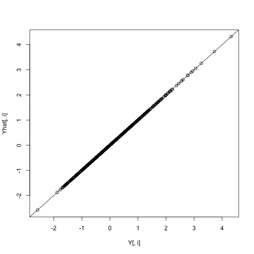
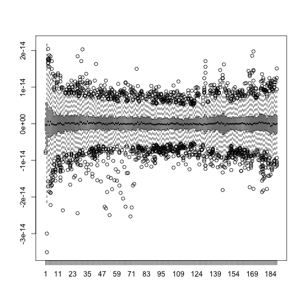
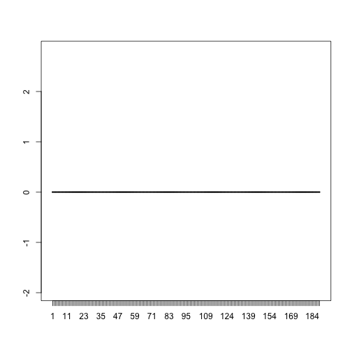
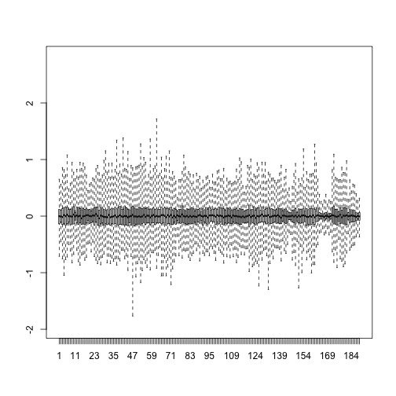

# Introduction
The main mathematical result we use to achieve dimension reduction is the singular value decomposition (SVD).
We will cover the SVD in more detail in a later section. Here we give an overview that is necessary to understand multidimensional scaling. 

# Singular Value Decomposition

The main result SVD provides is that we can write an $$m \times n$$ matrix $$\mathbf{Y}$$ as

$$\mathbf{Y = UDV^\top}$$


With:

* $$\mathbf{U}$$ is an $$m\times n$$ orthogonal matrix
* $$\mathbf{V}$$ is an $$n\times n$$ orthogonal matrix
* $$\mathbf{D}$$ is an $$n\times n$$ diagonal matrix

and with the special property that the variability (sum of squares to be precise) of the columns of $$\mathbf{VD}$$ and $$\mathbf{UD}$$ are decreasing. We will see how this  particular property turns out to be quite useful. 

If, for example, there are colinear columns the then  $$\mathbf{UD}$$ will include several columns with no variability. This can be seen like this

```r
x <- rnorm(100)
y <- rnorm(100)
z <- cbind(x,x,x,y,y)
SVD <- svd(z)
round(SVD$d,2)
```

```
## [1] 14.75 14.22  0.00  0.00  0.00
```
In this case we can reconstruct `z` with just 2 columns:


```r
newz <- SVD$u[,1:2] %*% diag(SVD$d[1:2]) %*% t(SVD$v[,1:2])
max(abs(newz-z))
```

```
## [1] 4.57967e-15
```

# How is this useful?

It is not immediately obvious how incredibly useful the SVD can be. Let's consider some examples.

First let's compute the SVD on the gene expression table we have been working with. We will take a subset so that computations are faster.

```r
library(tissuesGeneExpression)
data(tissuesGeneExpression)
set.seed(1)
ind <- sample(nrow(e),500)
Y <- t(apply(e[ind,],1,scale)) #standardize data for illustration
```

The `svd` command returns the three matrices (only the diagonal entries are returned for $$D$$)

```r
s <- svd(Y)
U <- s$u
V <- s$v
D <- diag(s$d) ##turn it into a matrix
```

First note that we can in fact reconstruct y


```r
Yhat <- U %*% D %*% t(V)
resid <- Y - Yhat
max(abs(resid))
```

```
## [1] 3.508305e-14
```

```r
i <- sample(ncol(Y),1)
plot(Y[,i],Yhat[,i])
abline(0,1)
```

 

```r
boxplot(resid)
```

 

If we look at the sum of squares of $$\mathbf{UD}$$ we see that the last few are quite small. 


```r
plot(s$d)
```

 

So what happens if we remove the last column?

```r
k <- ncol(Y)-4
Yhat <- U[,1:k] %*% D[1:k,1:k] %*% t(V[,1:k])
resid <- Y - Yhat 
Range <- quantile(Y,c(0.01,0.99))
boxplot(resid,ylim=Range,range=0)
```

 

From looking at $$d$$, we can see that in this particular dataset we can obtain a good approximation keeping only 94 columns. The following plots are useful for seeing how much of the variability is explained by each column:


```r
plot(s$d^2/sum(s$d^2)*100,ylab="Percent variability explained")
```

 
We can also make cumulative plot


```r
plot(cumsum(s$d^2)/sum(s$d^2)*100,ylab="Percent variability explained",ylim=c(0,100),type="l")
```

 


```r
k <- 94
Yhat <- U[,1:k] %*% D[1:k,1:k] %*% t(V[,1:k])
resid <- Y - Yhat
boxplot(resid,ylim=Range,range=0)
```

 

Therefore, by using only half as many dimensions we retain most of the variability in our data:


```r
var(as.vector(resid))/var(as.vector(Y))
```

```
## [1] 0.04180834
```

We say that we explain 96% of the variability.

Note that we can predict this from $$D$$:

```r
1-sum(s$d[1:k]^2)/sum(s$d^2)
```

```
## [1] 0.04180834
```


# Highly correlated data

To help understand how the SVD does not that for two highly correlated columns, the second column adds very little "information" to the first.

For example:


```r
m <- 100
n <- 2
x <- rnorm(m)
e <- rnorm(n*m,0,0.01)
Y <- cbind(x,x)+e
cor(Y)
```

```
##           x         x
## x 1.0000000 0.9998767
## x 0.9998767 1.0000000
```

Reporting `rowMeans(Y)` provides almost the same information as $$Y$$. This turns out the be the information in the first column on $$U$$. And in this case we explain almost all the variability with just this first column:


```r
d <- svd(Y)$d
d[1]^2/sum(d^2)
```

```
## [1] 0.9999387
```

In cases with many correlated columns we can achieve great dimension reduction:


```r
m <- 100
n <- 25
x <- rnorm(m)
e <- rnorm(n*m,0,0.01)
Y <- replicate(n,x)+e
d <- svd(Y)$d
d[1]^2/sum(d^2)
```

```
## [1] 0.9998915
```


